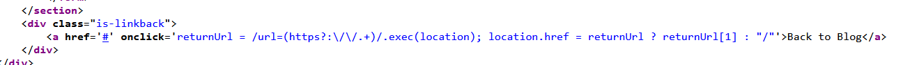
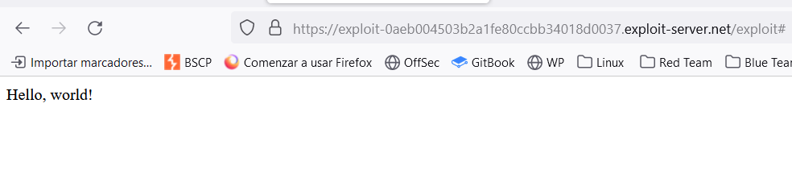

The blog post page contains the following link, which returns to the home page of the blog:
`<a href='#' onclick='returnURL' = /url=(https?:\/\/.+)/.exec(location); if(returnUrl)location.href = returnUrl[1];else location.href = "/"'>Back to Blog</a>`

The `url` parameter contains an open redirection vulnerability that allows an attacker to change the `href` value, and therefore, where the "Back to blog" link takes the user.

We can see that, from `location`, it is extracting the payload that goes **after the `/url=` and after `https:`**, and saves that as the variable to point it in the redirection -> OPEN REDIRECTION as we control the variable that is going to be the page that is in the redirection.

We can craft something like this:
`https://YOUR-LAB-ID.web-security-academy.net/post?postId=4&url=https://YOUR-EXPLOIT-SERVER-ID.exploit-server.net/`

And the redirection would be performed.
The URL that we have to craft:

And clicking it redirects to our exploit server:
