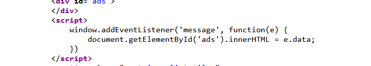
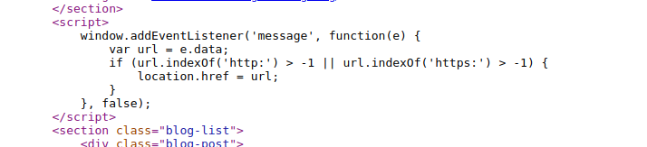
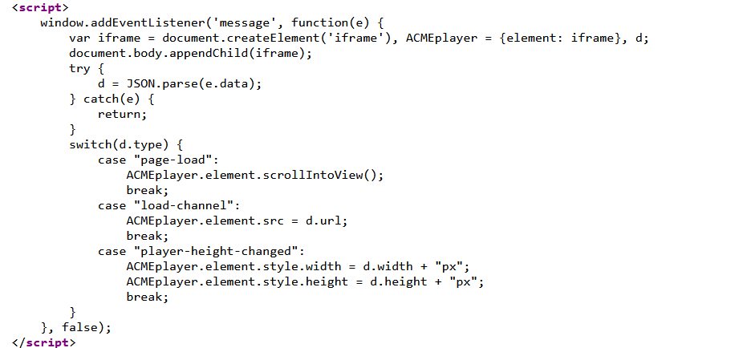

How to solve this lab:
1. Notice that the home page contains an `addEventListener()` call that listens for a web message:

3. Go to the exploit server and add the following `iframe` to the body. Remember to add your own lab ID:
    
    `<iframe src="https://YOUR-LAB-ID.web-security-academy.net/" onload="this.contentWindow.postMessage('','*')">`
3. Store the exploit and deliver it to the victim.

When the `iframe` loads, the `postMessage()` method sends a web message to the home page. The event listener, which is intended to serve ads, takes the content of the web message and inserts it into the `div` with the ID `ads`. However, in this case it inserts our `img` tag, which contains an invalid `src` attribute. This throws an error, which causes the `onerror` event handler to execute our payload.

Here we have a modified version of the eventListener that check if the function contains http: or https:

We can still bypass this with the following payload:
`<iframe src="https://YOUR-LAB-ID.web-security-academy.net/" onload="this.contentWindow.postMessage('javascript:print()//http:','*')">`
This script sends a web message containing an arbitrary JavaScript payload, along with the string "http:". The second argument specifies that any targetOrigin is allowed for the web message.
When the iframe loads, the postMessage() method sends the JavaScript payload to the main page. The event listener spots the "http:" string and proceeds to send the payload to the location.href sink, where the print() function is called.

We can see that our function has http: but it is commented (but it has http:, so the indexOf function will just parse the string and verify if it is there).

Here is a much more enhanced version where the eventListener has different use cases:

The steps for solving it:

1. Notice that the home page contains an event listener that listens for a web message. This event listener expects a string that is parsed using `JSON.parse()`. In the JavaScript, we can see that the event listener expects a `type` property and that the `load-channel` case of the `switch` statement changes the `iframe src` attribute.
2. Go to the exploit server and add the following `iframe` to the body, remembering to replace `YOUR-LAB-ID` with your lab ID:
`<iframe src=https://YOUR-LAB-ID.web-security-academy.net/ onload='this.contentWindow.postMessage("{\"type\":\"load-channel\",\"url\":\"javascript:print()\"}","*")'>`
1. Store the exploit and deliver it to the victim.

When the `iframe` we constructed loads, the `postMessage()` method sends a web message to the home page with the type `load-channel`. The event listener receives the message and parses it using `JSON.parse()` before sending it to the `switch`.

The `switch` triggers the `load-channel` case, which assigns the `url` property of the message to the `src` attribute of the `ACMEplayer.element` `iframe`. However, in this case, the `url` property of the message actually contains our JavaScript payload.

As the second argument specifies that any `targetOrigin` is allowed for the web message, and the event handler does not contain any form of origin check, the payload is set as the `src` of the `ACMEplayer.element` `iframe`. The `print()` function is called when the victim loads the page in their browser.