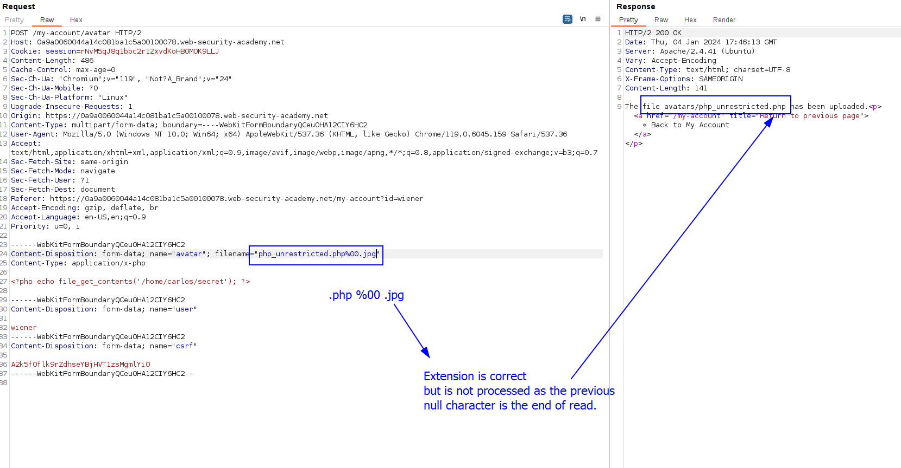

# What are file upload vulnerabilities?
File upload vulnerabilities occur when a web server allows users to upload files without sufficiently validating things about the uploaded file like the **name, the contents or the size.**

Failing to properly enforce restrictions on these could mean that even a basic image upload function can be used to upload arbitrary and potentially dangerous files instead. This could even include server-side script files that enable remote code execution.

In some cases, the act of uploading the file is in itself enough to cause damage. Other attacks may be needed a follow-up HTTP request for the file, typically to trigger its execution by the server.

# What is the impact of file upload vulnerabilities?
The impact of these vulnerabilities generally depends on two key factors:
- The aspect of the file that is improperly validated (it can validate the size but maybe not the extension)
- What restrictions are imposed on the file once it has been successfully uploaded.

In the worst case scenario, the file's type isn't validated properly, and the server configuration allows certain types of file (such as `.php` and `.jsp`) to be executed as code. In this case, an attacker could potentially upload a server-side code file that functions as a web shell, effectively granting them full control over the server.

If the filename isn't validated properly, this could allow an attacker to overwrite critical files simply by uploading a file with the same name. If the server is also vulnerable to [directory traversal](https://portswigger.net/web-security/file-path-traversal), this could mean attackers are even able to upload files to unanticipated locations.

Failing to make sure that the size of the file falls within expected thresholds could also enable a form of denial-of-service (DoS) attack, whereby the attacker fills the available disk space.

# How do web servers handle requests for static files?

Before we look at how to exploit file upload vulnerabilities, it's important that you have a basic understanding of how servers handle requests for static files.

Historically, websites consisted almost entirely of static files that would be served to users when requested. As a result, the path of each request could be mapped 1:1 with the hierarchy of directories and files on the server's filesystem. Nowadays, websites are increasingly dynamic and the path of a request often has no direct relationship to the filesystem at all. Nevertheless, web servers still deal with requests for some static files, including stylesheets, images, and so on.

The process for handling these static files is still largely the same. At some point, the server parses the path in the request to identify the file extension. It then uses this to determine the type of the file being requested, typically by comparing it to a list of preconfigured mappings between extensions and MIME types. What happens next depends on the file type and the server's configuration.

- If this file type is non-executable, such as an image or a static HTML page, the server may just send the file's contents to the client in an HTTP response.
- If the file type is executable, such as a PHP file, **and** the server is configured to execute files of this type, it will assign variables based on the headers and parameters in the HTTP request before running the script. The resulting output may then be sent to the client in an HTTP response.
- If the file type is executable, but the server **is not** configured to execute files of this type, it will generally respond with an error. However, in some cases, the contents of the file may still be served to the client as plain text. Such misconfigurations can occasionally be exploited to leak source code and other sensitive information. You can see an [example](https://portswigger.net/web-security/information-disclosure/exploiting#source-code-disclosure-via-backup-files) of this in our [information disclosure](https://portswigger.net/web-security/information-disclosure) learning materials.

# Exploiting unrestricted file uploads to deploy a web shell
The worst case scenario is when a server allows uploading files with no restriction AND executing them. This allows us to upload a file that, when executed, allows us to execute any command in the server.

This means you can read and write arbitrary files, exfiltrate sensitive data, even use the server to pivot attacks against both internal infrastructure and other servers outside the network. For example, the following PHP one-liner could be used to read arbitrary files from the server's filesystem:

`<?php echo file_get_contents('/path/to/target/file'); ?>`

Once uploaded, sending a request for this malicious file will return the target file's contents in the response.

Here is a lab that exploits an unrestricted file upload: [unrestricted_file_upload_no_filter](labs/unrestricted_file_upload_no_filter.md)
# Exploiting flawed validation of file uploads
In the wild, pages are not completely free from protection but the included protections are not robust and can be bypassed.
## Flawed file type validation
When submitting HTML forms, the browser typically sends the provided data in a `POST` request with the content type `application/x-www-form-url-encoded`. This is fine for sending simple text like your name or address. However, it isn't suitable for sending large amounts of binary data, such as an entire image file or a PDF document. In this case, the content type `multipart/form-data` is preferred.

Consider a form containing fields for uploading an image, providing a description of it, and entering your username. Submitting such a form might result in a request that looks something like this:

`POST /images HTTP/1.1 Host: normal-website.com Content-Length: 12345 Content-Type: multipart/form-data; boundary=---------------------------012345678901234567890123456 ---------------------------012345678901234567890123456 Content-Disposition: form-data; name="image"; filename="example.jpg" Content-Type: image/jpeg [...binary content of example.jpg...] ---------------------------012345678901234567890123456 Content-Disposition: form-data; name="description" This is an interesting description of my image. ---------------------------012345678901234567890123456 Content-Disposition: form-data; name="username" wiener ---------------------------012345678901234567890123456--`

As you can see, the message body is split into separate parts for each of the form's inputs. Each part contains a `Content-Disposition` header, which provides some basic information about the input field it relates to. These individual parts may also contain their own `Content-Type` header, which tells the server the MIME type of the data that was submitted using this input.

One way that websites may attempt to validate file uploads is to check that this input-specific `Content-Type` header matches an expected MIME type. If the server is only expecting image files, for example, it may only allow types like `image/jpeg` and `image/png`. Problems can arise when the value of this header is implicitly trusted by the server. If no further validation is performed to check whether the contents of the file actually match the supposed MIME type, this defense can be easily bypassed using tools like Burp Repeater.

Here is a lab that covers this bypass, of the `Content-Type` header: [content_type_bypass](labs/content_type_bypass.md)


# Preventing file execution in user-accessible directories
While it's clearly better to prevent dangerous file types being uploaded in the first place, the second line of defense is to stop the server from executing any scripts that do slip through the net.

As a precaution, servers generally only run scripts whose MIME type they have been explicitly configured to execute. Otherwise, they may just return some kind of error message or, in some cases, serve the contents of the file as plain text instead:

This behavior is potentially interesting in its own right, as it may provide a way to leak source code, but it nullifies any attempt to create a web shell.

**This kind of configuration often differs between directories**. A directory to which user-supplied files are uploaded **will likely have much stricter controls than other locations on the filesystem that are assumed to be out of reach for end users**. If you can find a way to upload a script to a different directory that's not supposed to contain user-supplied files, the server may execute your script after all.

```http
GET /static/exploit.php?command=id HTTP/1.1
Host: normal-website.com


HTTP/1.1 200 OK
Content-Type: text/plain
Content-Length: 39

<?php echo system($_GET['command']); ?>
```

Therefore, an attack path is to upload our file to a place that has execution rights. As a good tip, web servers often use the `filename` field in `multipart/form-data` requests to determine the name and location where the file should be saved. 

This attack is contemplated in the lab: [content_type_bypass](labs/content_type_bypass.md)


# Bypassing the blacklist of dangerous file types
One of the most common ways of preventing users from uploading malicious scripts is to blacklist potentially dangerous file extensions like `.php`. 

Such blacklists can sometimes be bypassed by using lesser known, alternative file extensions that may still be executable, such as `.php5`, `.shtml`, and so on. These are files with the same utility as the commonly blacklisted files but they are not often blacklisted.

## Overriding the server configuration
As we discussed in the previous section, servers typically won't execute files unless they have been configured to do so.
For example, before an Apache server will execute PHP files requested by a client, developers might have to add the following directives to their `/etc/apache2/apache2.conf` file:

`LoadModule php_module /usr/lib/apache2/modules/libphp.so AddType application/x-httpd-php .php`

Many servers also allow developers to create** special configuration files within individual directories** in order to override or add to one or more of the global settings. Apache servers, for example, will load a directory-specific configuration from a file called `.htaccess` if one is present.

Similarly, developers can make directory-specific configuration on IIS servers using a `web.config` file. This might include directives such as the following, which in this case allows JSON files to be served to users:

`<staticContent> <mimeMap fileExtension=".json" mimeType="application/json" /> </staticContent>`

Web servers use these kinds of configuration files when present, but you're not normally allowed to access them using HTTP requests. However, you may occasionally find servers that fail to stop you from uploading your own malicious configuration file. In this case, even if the file extension you need is blacklisted, you may be able to trick the server into mapping an arbitrary, custom file extension to an executable MIME type. 

Here is a lab that creates a `.htaccess` file that binds an arbitrary extension to the PHP file type so an arbitrary extension can be uploaded and executed: [extension_blacklist_bypass_htaccess](labs/extension_blacklist_bypass_htaccess.md)
# Obfuscating file extensions
Even the most exhaustive blacklists can potentially be bypassed using classic obfuscation techniques. Let's say the validation code is case sensitive and fails to recognize that `exploit.pHp` is in fact a `.php` file.
If the code that subsequently maps the file extension to a MIME type is **not** case sensitive, this discrepancy allows you to sneak malicious PHP files past validation that may eventually be executed by the server.

You can also achieve similar results using the following techniques:
- Provide multiple extensions. Depending on the algorithm used to parse the filename, the following file may be interpreted as either a PHP file or JPG image: `exploit.php.jpg`
- Add trailing characters. Some components will strip or ignore trailing whitespaces, dots, and suchlike: `exploit.php.`
- Try using the URL encoding (or double URL encoding) for dots, forward slashes, and backward slashes. If the value isn't decoded when validating the file extension, but is later decoded server-side, this can also allow you to upload malicious files that would otherwise be blocked: `exploit%2Ephp`
- Add semicolons or URL-encoded null byte characters before the file extension. If validation is written in a high-level language like PHP or Java, but the server processes the file using lower-level functions in C/C++, for example, this can cause discrepancies in what is treated as the end of the filename: `exploit.asp;.jpg` or `exploit.asp%00.jpg`
- Try using multibyte unicode characters, which may be converted to null bytes and dots after unicode conversion or normalization. Sequences like `xC0 x2E`, `xC4 xAE` or `xC0 xAE` may be translated to `x2E` if the filename parsed as a UTF-8 string, but then converted to ASCII characters before being used in a path.
- 
Other defenses involve stripping or replacing dangerous extensions to prevent the file from being executed. If this transformation isn't applied recursively, you can position the prohibited string in such a way that removing it still leaves behind a valid file extension. For example, consider what happens if you strip `.php` from the following filename:
`exploit.p.phphp`

This is just a small selection of the many ways it's possible to obfuscate file extensions.

For example, in the following lab, the server accepted only files ending in `.jpg`, so we added .jpg at the end. But previously,we added `.php%00`, so when the internal application processes the file, it only reads until `.php`, and not the `.jpg` extension, bypassing the extension type.


