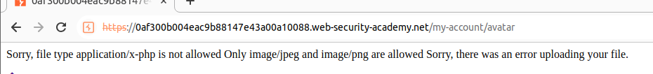
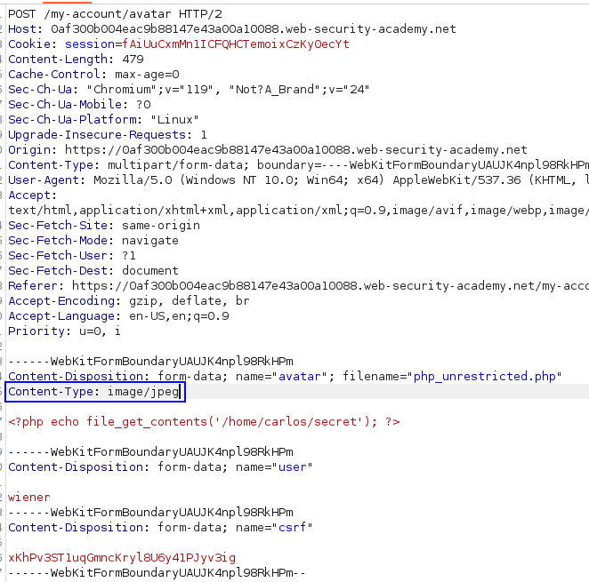
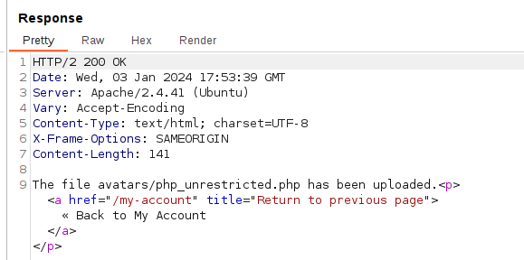
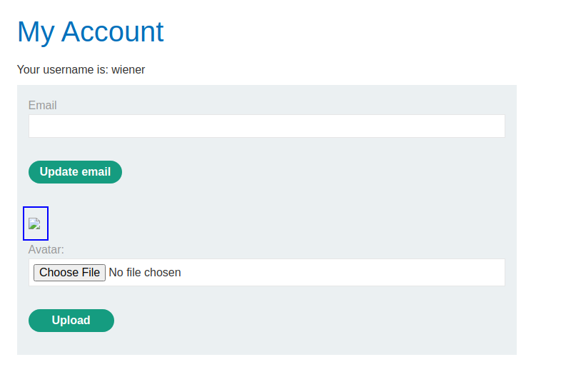
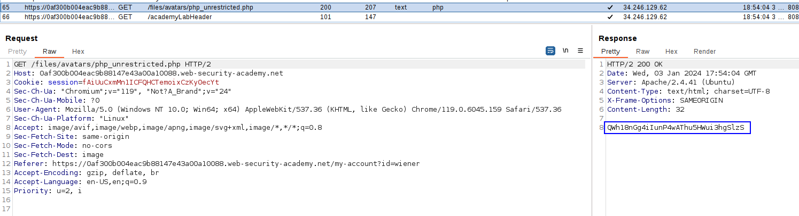

The server just validates if the filetype declared in the `Content-Type` header is either JPG or PNG, but does not actually validate if the content of the uploaded file matches with this header. 
We can upload our malicious file and modify the `Content-Type` header of our file to match with JPG or PNG so the server just validates that, and accepts our file.

This is the file that we will try to upload:
`<?php echo file_get_contents('/home/carlos/secret'); ?>`
When uploading the file, we have the error:

But we can just go to the request, and modify the content of the file type to one of those files:

We changed it to image/jpeg, and forward the request:

We can see that it now has been rendered. Let's make the server load the file by visiting our profile picture:

The underlying request performed shows us the code:
