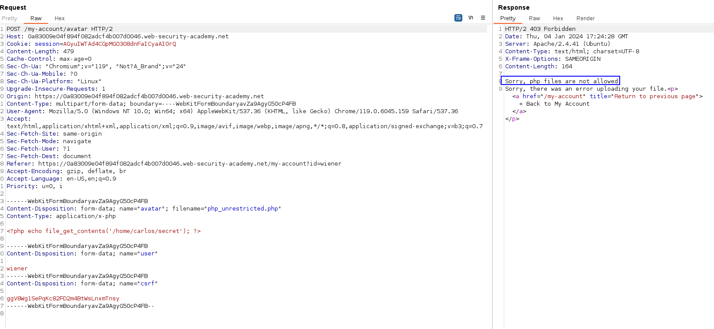
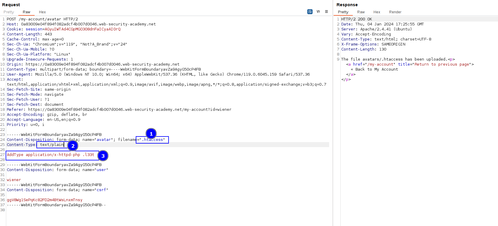
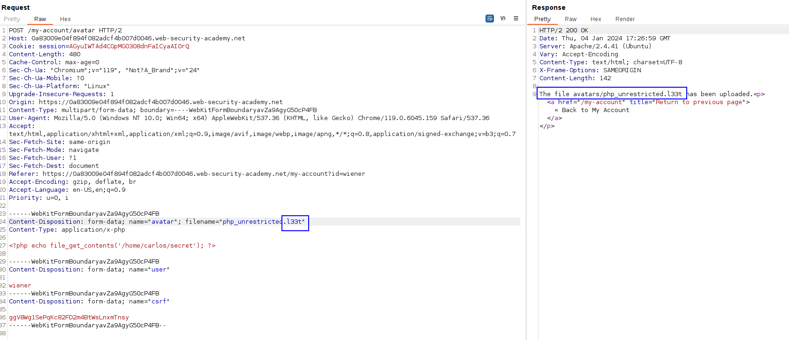
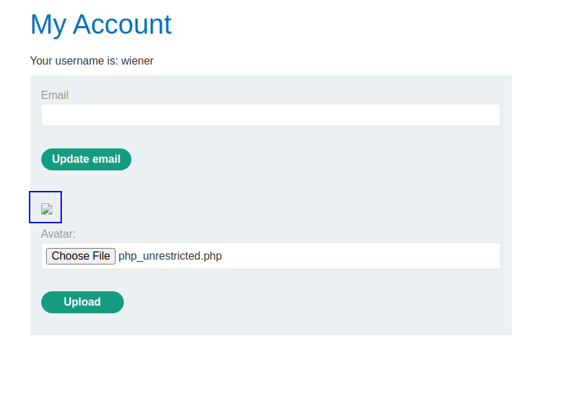
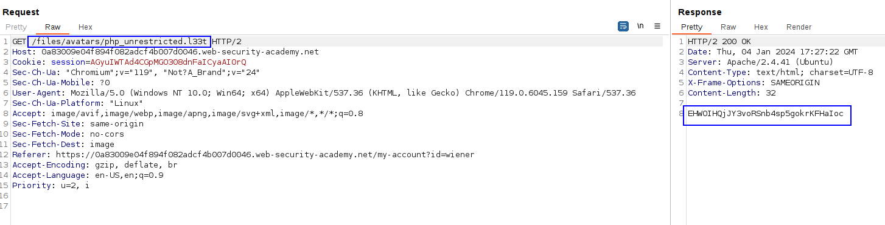

First, we will need to create a PHP file called `.htaccess` that will be executed and when executed, it will map an arbitrary extension to the PHP filetype and allow it.

The file will contain the following:
`AddType application/x-httpd-php .l33t`

This maps the x-httpd-php to the .l33t extension.

If we try to upload the typical malicious PHP file,we get an error:

This is because of the extension.
We will make the binding of an arbitrary extension (.l33t) to the MIME type of PHP executable. As this extension is not blocked, the server will accept it, and as it is an executable mime type, will execute it.

Let's upload the file with the binding:

This will upload a file in the `.htaccess` location with that binding and as text. The server will treat this as a configuration file.

Now if we try to upload our malicious file with the .l33t extension, it is allowed and the server will execute it because of the .htaccess file binding.

Now, let's visit the file so it gets executed.

We can see that, besides being a `.l33t` file, it gets executed with the PHP interpreter:

