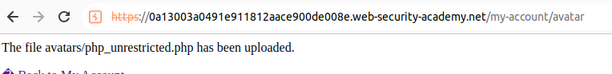
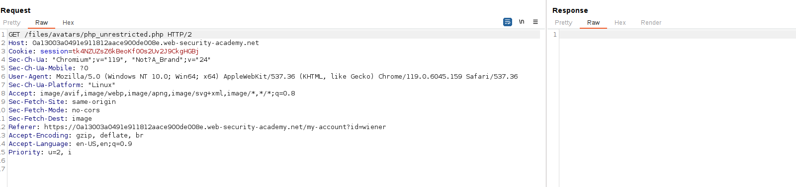
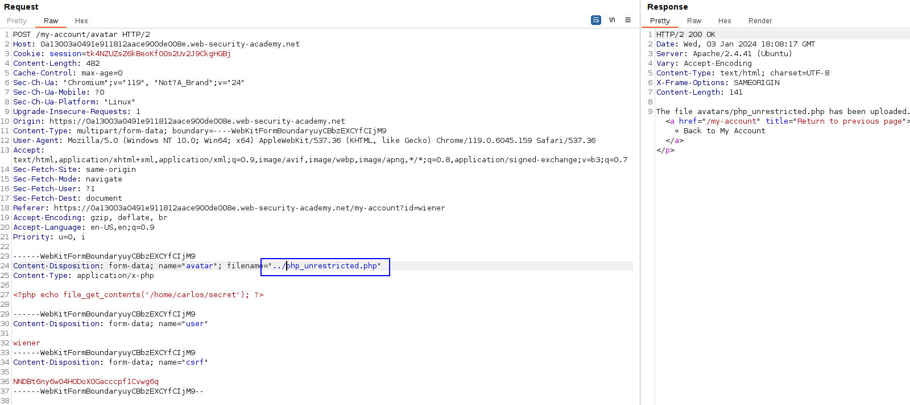
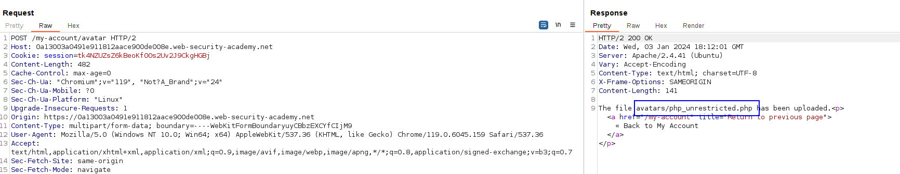
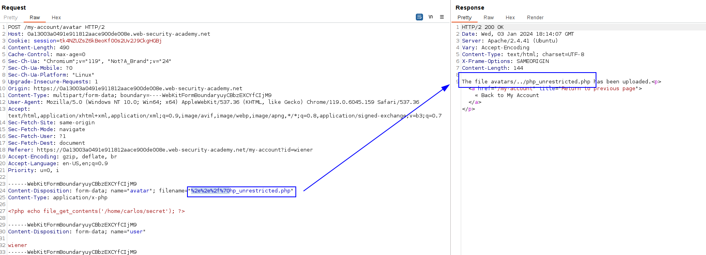
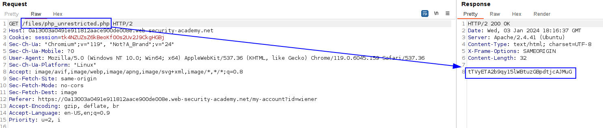

If we upload the file like always, we can:

But, when visiting the file, it is not executed:

We need to upload the file in a different place. As a tip in the labs, web servers often use the `filename` field in `multipart/form-data` requests to determine the name and location where the file should be saved. 

Let's modify that field when uploading the file:

But we can see that the file is uploaded in the same route:

We might have to encode the file. Let's URL encode the file:

And now visit it:

Lab solved.

