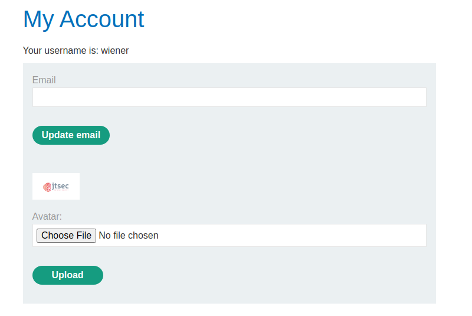
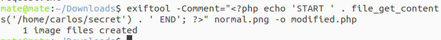

In this lab, it is impossible to upload anything that is not a JPG file as the server is performing validations like the header and footer of the file.

Let's upload a normal image file:

When checking the request for the image, this is what the server responds:

We can see that it displays a lot of information about the image. Let's use the `exiftool` tool to create an image with PHP code, to see if it gets rendered:
`exiftool -Comment="<?php echo 'START ' . file_get_contents('/home/carlos/secret') . ' END'; ?>" <YOUR-INPUT-IMAGE>.jpg -o polyglot.php`

We can check the properties of the image and see the new Comment metadata:

Let's upload it and search for START, as we indeed added START and END as searching canaries.

We can see that the PHP code was rendered as between START and END the command is not there, but the result of it.
