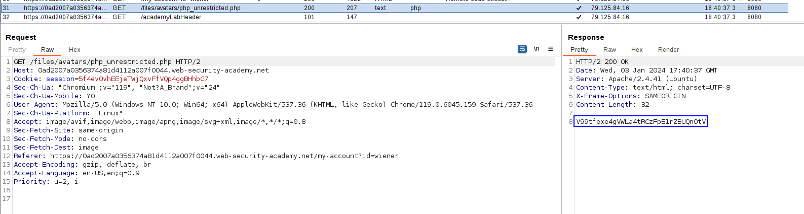

Unrestircted file upload with no filter. 
We just upload a PHP file that, when executed, exfiltrates the contents of the desired file.

Here is the option to upload a file:

It is expected to be an image, but let's upload the following PHP file:
`<?php echo file_get_contents('/home/carlos/secret'); ?>`

We upload the file:

Now, the file does not get automatically executed. We need to find the route where it is and ask for it, or just force the page to load the file. When visiting our profile picture, this script is being executed:

Now, let's see the request performed for that file:

We can do this because the resource is being loaded. If it is not loaded by the website, we would have to look for it.

A more versatile web shell may look something like this:

`<?php echo system($_GET['command']); ?>`

This script enables you to pass an arbitrary system command via a query parameter as follows:
`GET /example/exploit.php?command=id HTTP/1.1`

## Flawed validation of the file's contents
Instead of implicitly trusting the `Content-Type` specified in a request, more secure servers try to verify that the contents of the file actually match what is expected.

In the case of an image upload function, the server might try to verify certain intrinsic properties of an image, such as its dimensions. If you try uploading a PHP script, for example, it won't have any dimensions at all. Therefore, the server can deduce that it can't possibly be an image, and reject the upload accordingly.

Similarly, certain file types may always contain a specific sequence of bytes in their header or footer. These can be used like a fingerprint or signature to determine whether the contents match the expected type. For example, JPEG files always begin with the bytes `FF D8 FF`.

This is a much more robust way of validating the file type, but even this isn't foolproof. Using special tools, such as ExifTool, it can be trivial to create a polyglot JPEG file containing the malicious code in the metadata of the image. If the PHP is executed when processing these metadata, RCE can be archieved.

Here is a lab that covers the upload of a file containing PHP code in the description of the image, obtaining RCE:
