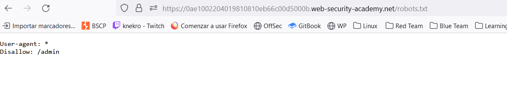
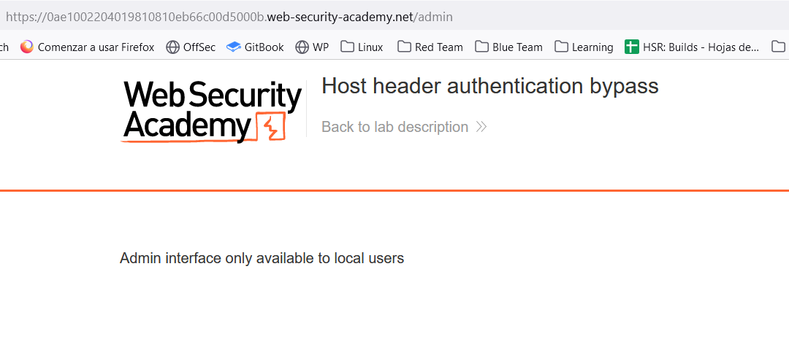
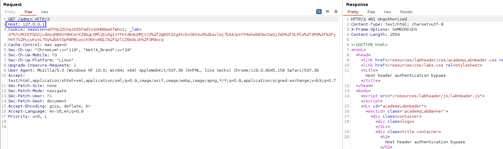
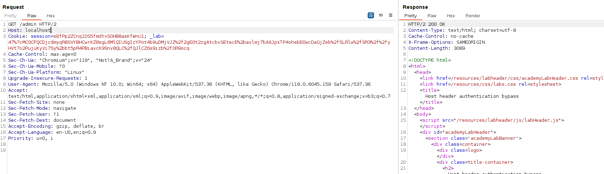
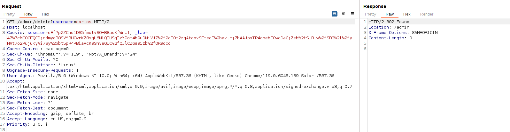

First, we do not see anything exploitable but we can do the classic of visiting `/robots.txt`:

We can see that `/admin` endpoint is disallowed.
If we try to visit it, we get the following error:

We can try to simulate a local user by performing this request but spoofing that we are in the intranet. How do we do that? Well, we can try to modify the `Host` header:

But it is not valid as we still get a 401.
We can try to specify `localhost` instead of the IP address, as this field is commonly a name instead of an IP.
And bingo! We spoofed the request like if we did it internally:

Now just delete the user `carlos`:

