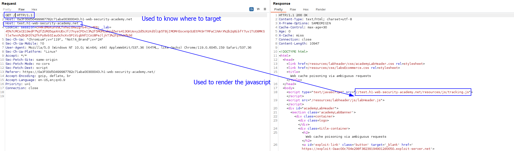

A [cache_poisoning](../../cache_poisoning/cache_poisoning.md) attack that uses the Host header as the reflect vector.
In the typical site of cache poisoning, `/resources/js/tracking.js`, we can see that we can manipulate this header but manipulating it results in a 504 gateway timeout as the website does not know where to connect:

We can try to add 2 headers of this type, the first header being correct, so the website knows where to go, and see if the second header of this type gets reflected by the website:

We can see that, with 2 Host headers and with the first one being valid, the page loads and stores the infromation on a cache, but there is nothing reflected.
If we do this same thing but in the `/` directory, we can actually see the second Host header reflected:

We now have the typical cache attack. We will modify the second `Host` header so it points to our exploit server and will store a malicious javascript in the exploit server:

