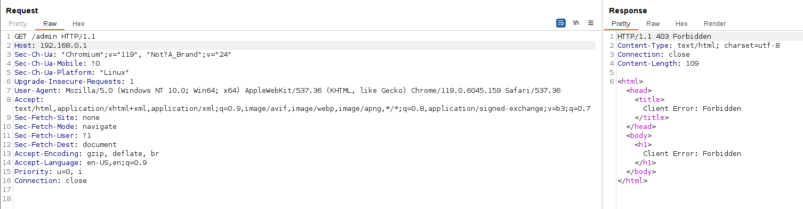
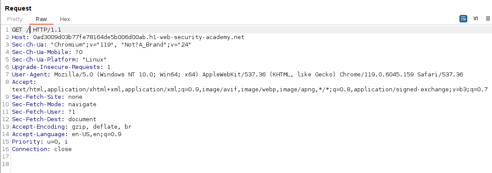
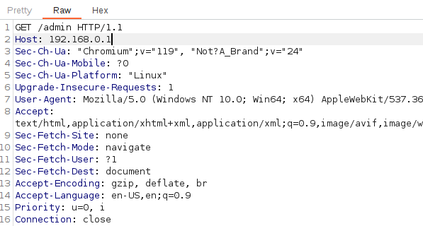
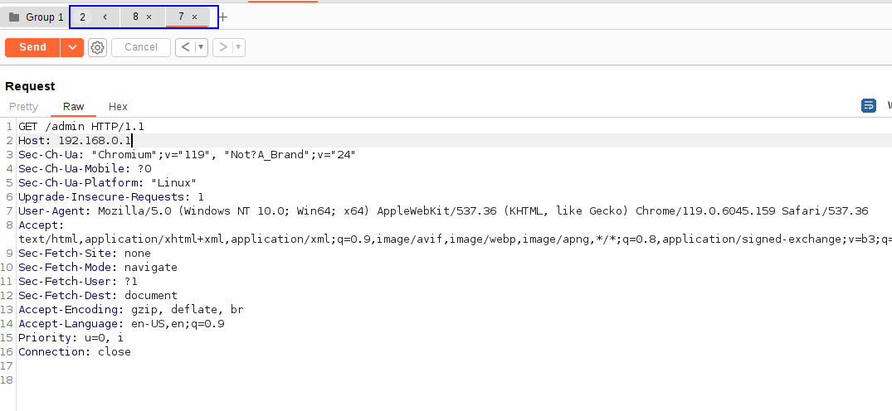
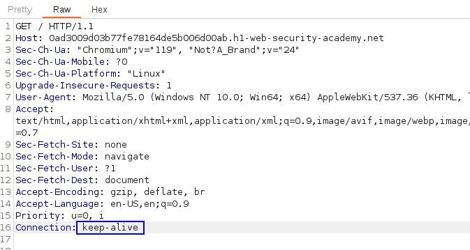
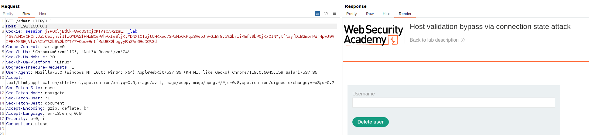
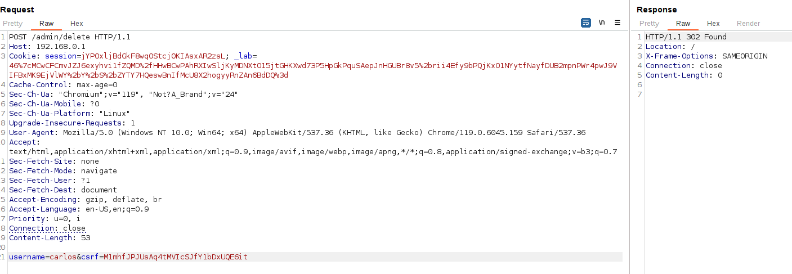

This lab is vulnerable to routing-based [SSRF](https://portswigger.net/web-security/ssrf) via the Host header. 
Although the front-end server may initially appear to perform robust validation of the Host header, **it makes assumptions about all requests on a connection based on the first request it receives.**

The admin panel is at 192.168.0.1.

If we try to access /admin with Host header 192.168.0.1, we get a Forbidden message:

We have to perform a connection with the website so the first connection contains the typical Host header, so the website saves the status of the connection, and then modify the value of the Host header once the connection has been stablished as the verification is only made at the connection startup.

For this, we first need the normal request in a tab:

We duplicate this tab and modify the tab to perform the request to /admin with the modified Host header to 192.168.0.1:

We add these two tabs to a tab group:

And then we change the "Send" method to "Send group in sequence (single connection)", so first a request to / with the normal Host header is performed and within the connection, a second request to /admin with the modified Host hedader is performed, bypassing the validation as the request is inside the created connection.
We must also change the value of the `Connection` header of the first request to `keep-alive`:

When sending the request group, if we go to the response of the second request (for the admin panel), we now get a 200 OK response, telling us that we have effectively bypassed the verification by sending two requests in the same connection, and the first request being valid:

We now just delete the user carlos.

