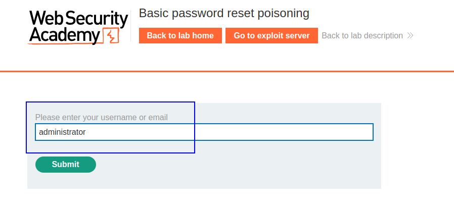
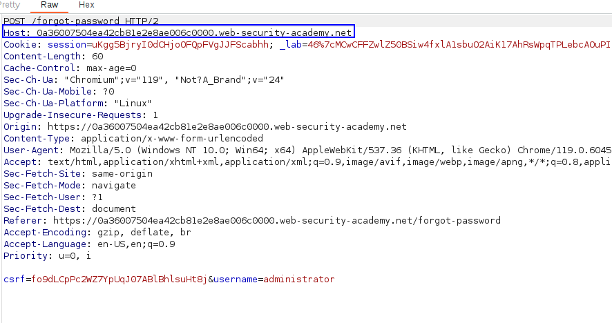
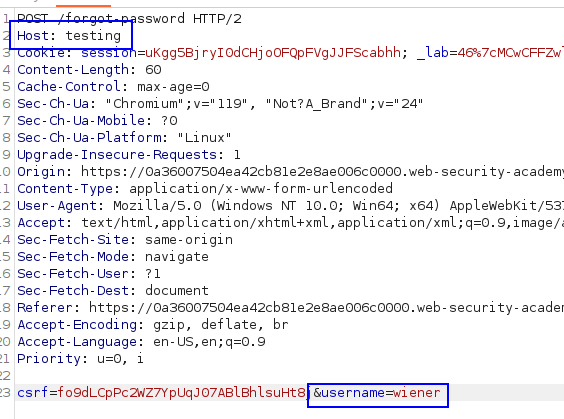
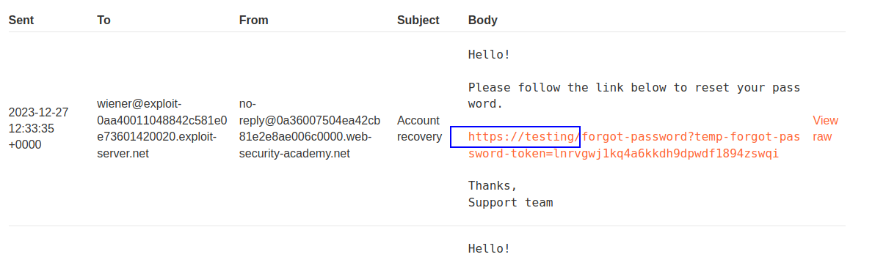
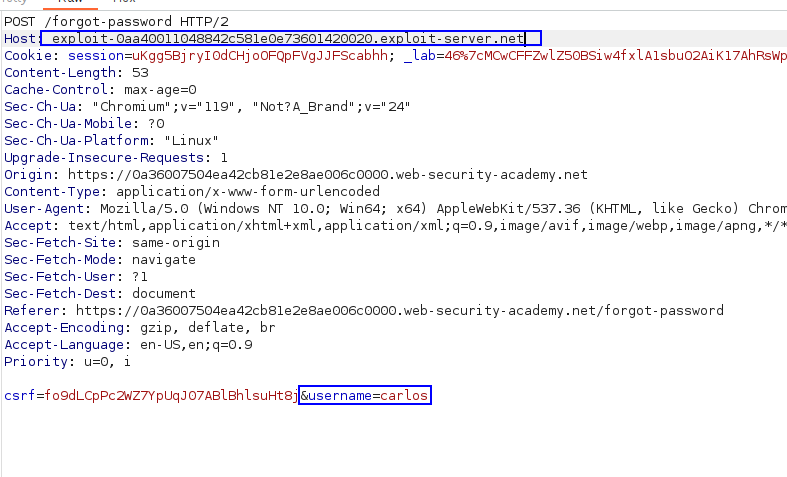
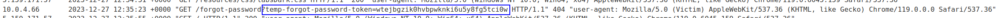
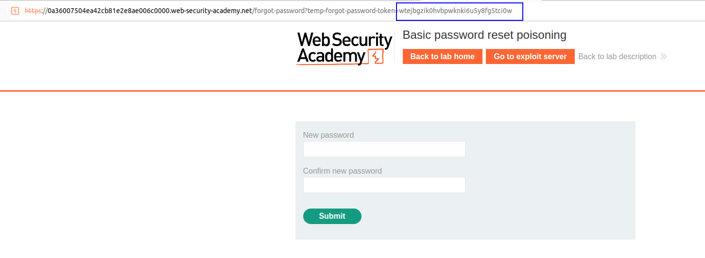
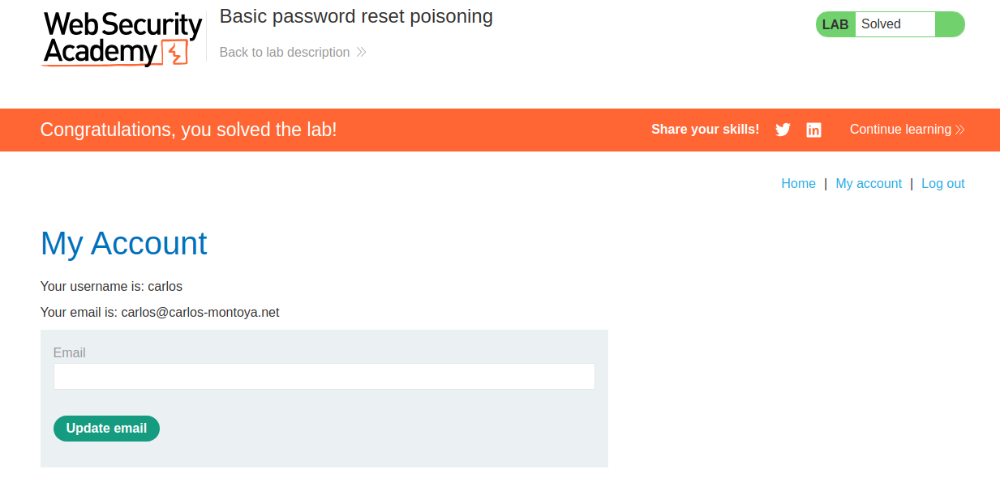

We have the "I forgot password" functionality:

We are going to intercept the request:

We can try to modify the `Host` header so this request is targeted to our domain.
Let's try with a single string:

We receive, on wiener's mail, a link to change password with the custom host header:

That means that, if we send a mail to `carlos` to reset the password with our exploit server as the host, and `carlos` clicks on the link, we will get the `temp-forgot-password-token` attached to the request, which can be used to change the password.

Let's do it:

Carlos will click on this link, as the lab says that carlos will click on any links, and we will get one request to our exploit server leaking the token:

Now we can craft a real password reset using this token, which will reset the password for carlos:

After login in as carlos with the new changed password, we finish the lab:

