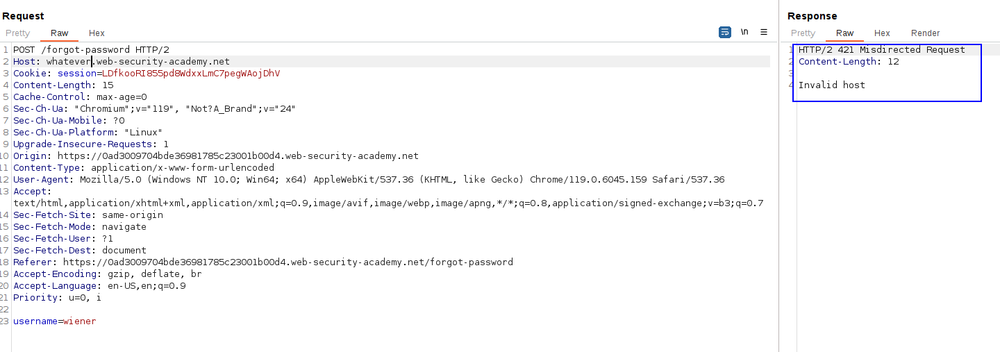

This is the same concept as apprentice, but now there is middleware, which means that the vulnerable host header is not the `Host` common header, but one of the additional headers.

In this case, it is the `X-Forwarded-Host` header.

Here is the normal request for the "Forgot password" functionality:

We can try to modify this header, but we get an error:

We are going to scan other headers that can be valid to craft this attack. Starting with the typical, `X-Forwarded-Host` header:
We have a 200 OK by adding this header and specifying a value:

So we know the server accepts it. Let's see our inbox:

We can see that we created the same injection as before. We now have to specify our exploit server address as the `X-Forwarded-Host` header, specify Carlos as the user. Carlos will click on the link and we will get the password reset token for Carlos.

Carlos clicked on the link, and we got the token in our server:

We can use this to reset his password and end the lab.
