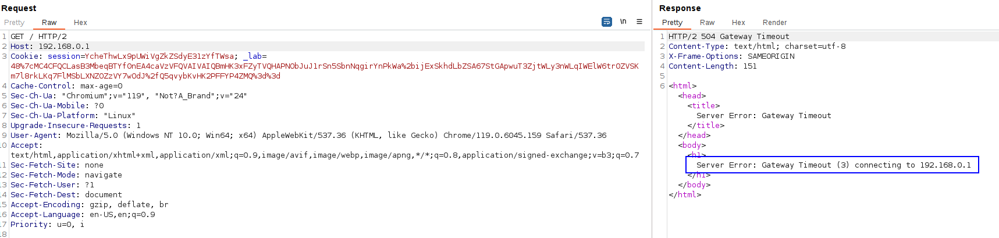
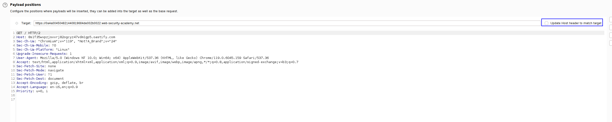
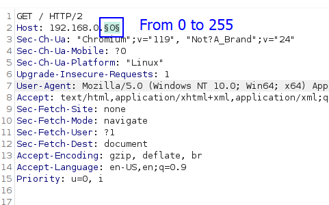
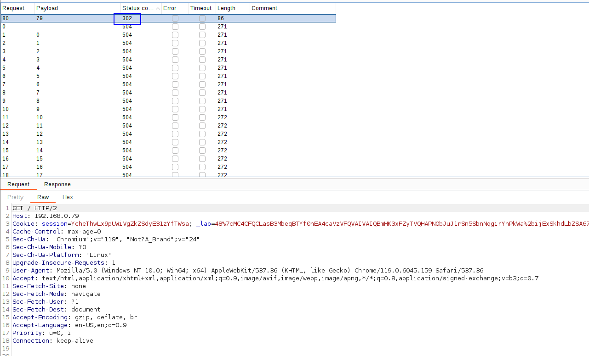
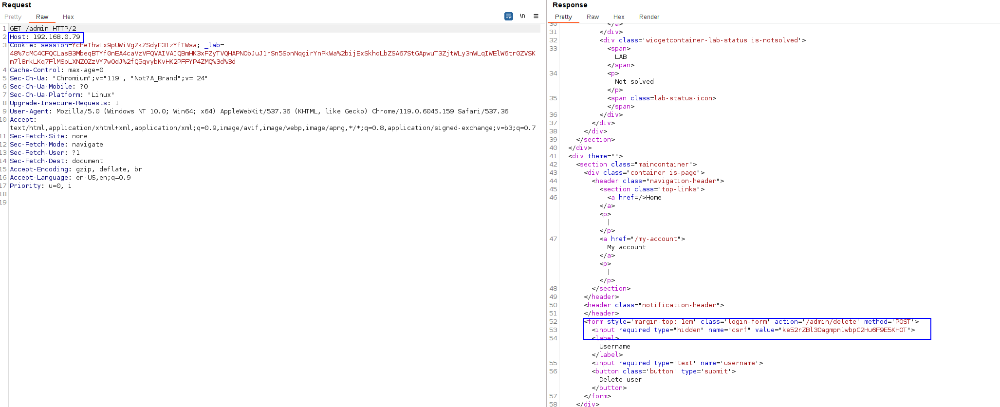
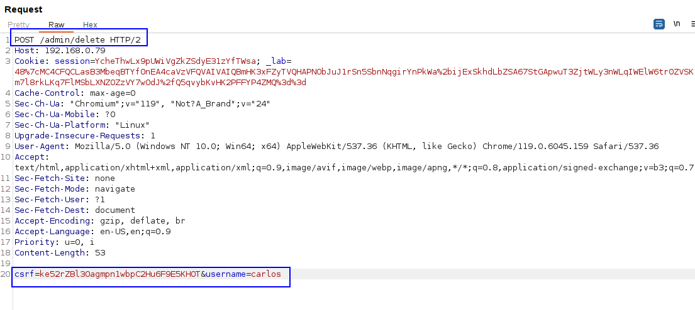

First, we need to see where if we have SSRF in the Host header. The lab says that there is an internal admin panel locatd in the `192.168.0.0/24`, so we will just perform a network scan using this header.

For example, when specifying 192.168.0.1, we get his response: 

Let's scan the whole /24 network.

First, we have to deselect the "Update Host header to match target" option: 

Then, we will just change the payload to the following IP: 

And check the responses. We can see that on 192.168.0.79, we get a 302 to /admin:

Let's send this request to the repeater and ask for /admin instead of /. Let's see the response:

We can see that there is a button to delete the admin, that needs a csrf token for the request to be completed. Let's change the method to POST and specify the user and the CSRF token as the POST parameters:

This way, we solved the lab.

