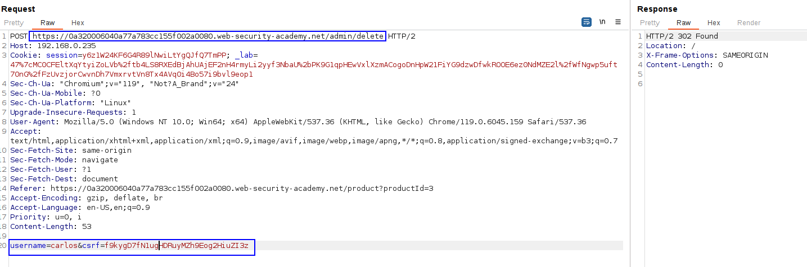

The flawed request consists in the following technique:
1. Attach the whole absolute URL (`https://YOUR-LAB-ID.web-security-academy.net/`) in the GET request line:
`GET https://YOUR-LAB-ID.web-security-academy.net/

This way, we indicate where we want to target the request and we can modify the `Host` header without making the middleware or the website to not know where to target it.
The next step would be modifying the `Host` request as we do in all the labs.

In this lab, we can see that if we modify the Host header, we get a forbidden response:

We can't enumerate which IP is correct as this technique is forbidden.

Therefore, we can apply the technique of modifying the GET line to GET https://0a320006040a77a783cc155f002a0080.web-security-academy.net, to check if it maybe validates the URL in the request line:

We can see that now we get a gateway timeout and we can enumerate as before, as now it is validating the URL in the request line. Let's do what we did in [routing_based_ssrf](routing_based_ssrf.md).

We can see that in .235 we have a response:

A redirect to /admin. Let's ask for /admin:

And just craft the request to delete the user carlos with the CSRF token:

This way, we solve the lab.
