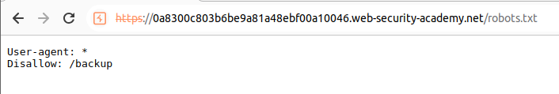
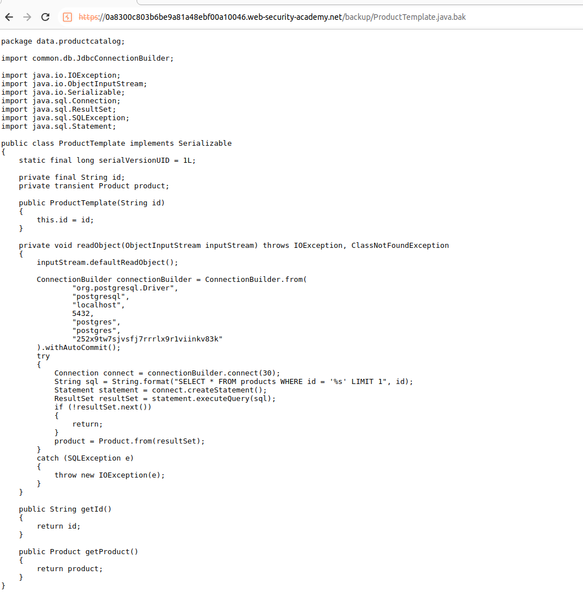

This lab leaks its source code via backup files in a hidden directory. To solve the lab, identify and submit the database password, which is hard-coded in the leaked source code.

The first step is to visit the `robots.txt` file. This will leak us a debug directory:

In `/backup` directory we can see the existence of a file: 

Let's analyze this file. This file basically contains a hardcoded database connection and also a SQL query that seems vulnerable to SQLi (although that is not what they ask). As they ask for the credentials, just submit them:
