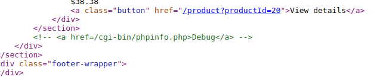
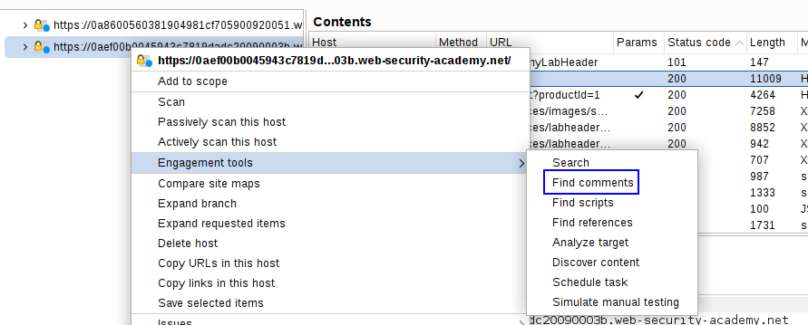
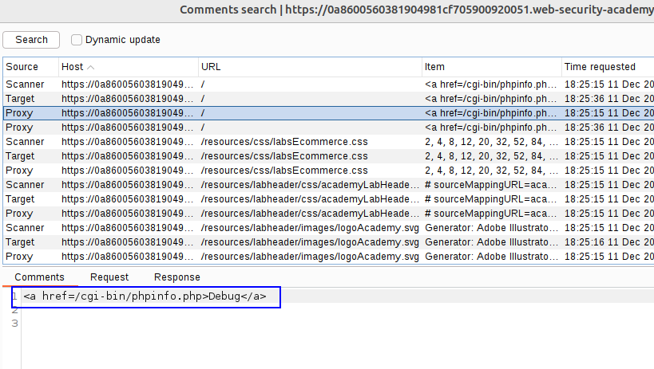
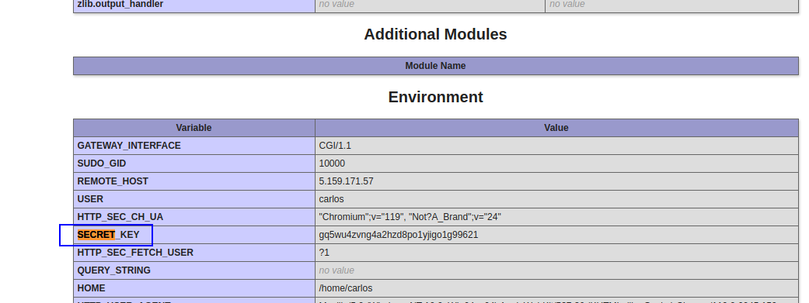

In this lab, we will look for leaked information in the commented code of the website.

We can look for the code of the website or use a Burp Suite functionality to get specific code comments.

We can't see anything in the webpage:

But if we look into the website code we can see this:

This leak us the location of the phpinfo file.

But we can see the comments in the Site map:

Let's visit that route and look for the SECRET_KEY variable:

Introducing this key leads to the completion of the lab.
