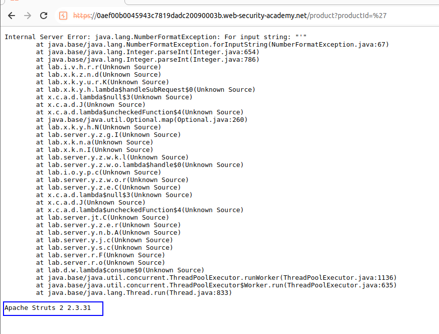
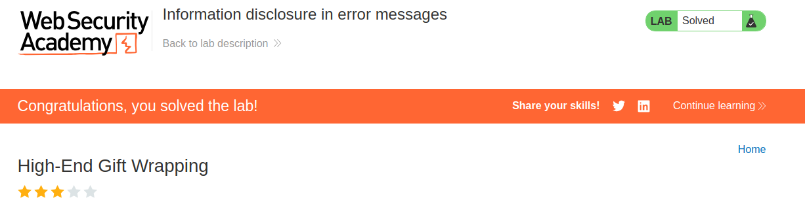

This lab's verbose error messages reveal that it is using a vulnerable version of a third-party framework. To solve the lab, obtain and submit the version number of this framework.

We can choose a product with `productId`:

Let's add a quote instead of a number, for example:

This leaked us a lot of classes and methods, but also the version of Apache, which was the objective of the lab.
