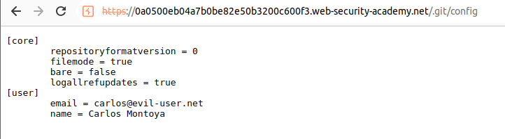

We just visit the `/.git` folder and we can see that we have access to it:

Let's inspect the `<logs>` section, that tells us that the admin password has been removed from `config`:

We can see in `config` that the password does not exist:

Let's download the whole .git folder and use the git commands to see the log of the commits and then check the information of the commit changes:

We can see the leaked admin password and we can log in and delete carlos:

