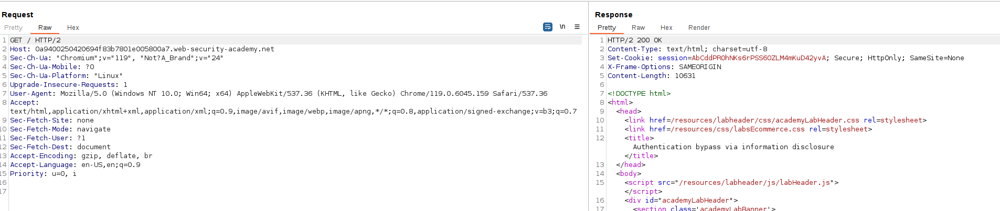
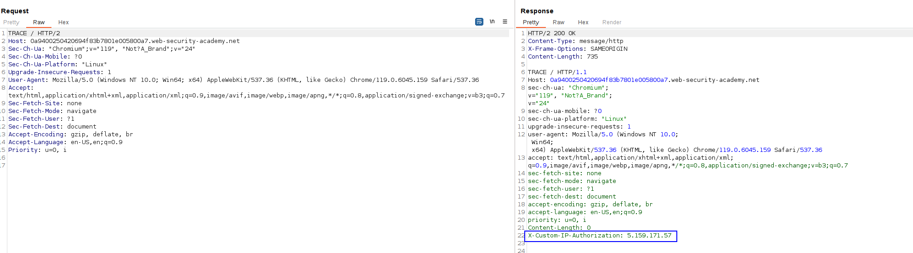
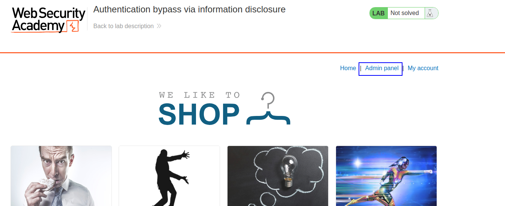
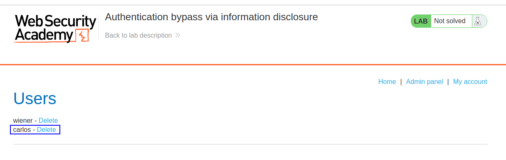

This lab's administration interface has an authentication bypass vulnerability, but it is impractical to exploit without knowledge of a custom HTTP header used by the front-end.

To solve the lab, obtain the header name then use it to bypass the lab's authentication. Access the admin interface and delete the user `carlos`.

You can log in to your own account using the following credentials: `wiener:peter`

This is the common GET request to the webpage:

But we change the GET request to TRACE to see the headers received by the backend:

We can see an interesting header there. Let's attach that header to our requests, but we see that it is not interesting.
What if we change the IP from the IP of that header to 127.0.0.1, like if the IP was from inside the backend?

Well, we can see that we get an Admin panel:

And we just delete `carlos`:
