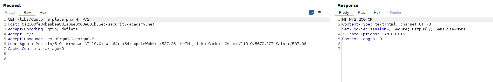
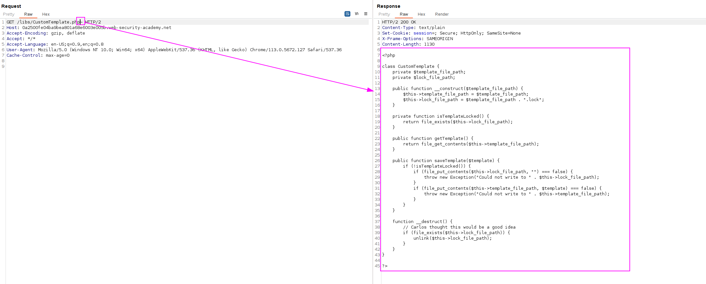
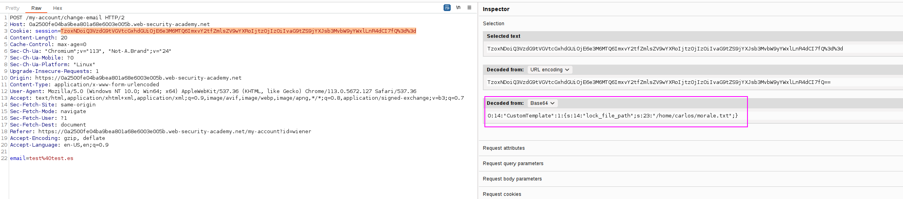
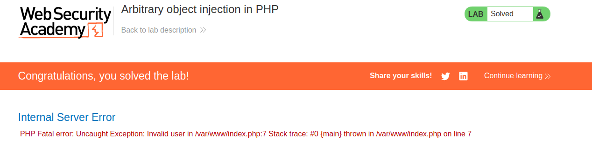

First, I learnt that I could obtain the source code of a PHP file adding a tilde (`~`) at the end. This is to retrieve information about a file in the webpage.

Here we do not retrieve the file:

But adding a tilde we do: 

Reading this code, we can see that the function `__destruct` is a magic method, as it starts with __. This will invoke the `unlink()` method in on the `lock_file_path` attribute, which will delete the file on this path.

In order to delete the file that we want, therefore, we know that the file to delete will be `lock_file_path` and we will specify `/home/carlos/morale.txt` as the file.

Now, we will send this type of object, as we know its structure, the application will not check if it is an user and will just initialize it and process it, and then destruct it. 
We will create the `CustomTemplate` file with the parameter needed in `__construct`:
`O:14:"CustomTemplate":1:{s:14:"lock_file_path";s:23:"/home/carlos/morale.txt";}`

And we will send this as the cookie:

This will give an error but will solve the lab, as the application will try to execute methods from the `user` class but we provided a `CustomTemplate` object, but the damage is done as the application did not detect which was the object and initialized the object anyways, so the magic methods from `__construct` and `__destruct` were called before giving this error and the damage was done. Then, the error appeared.

