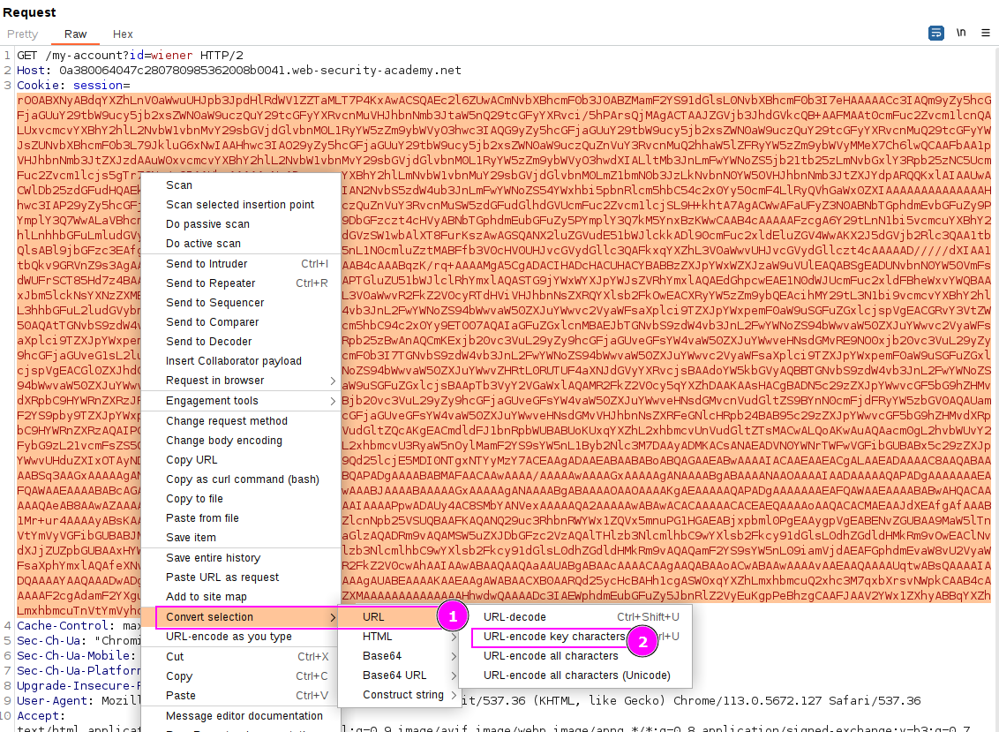
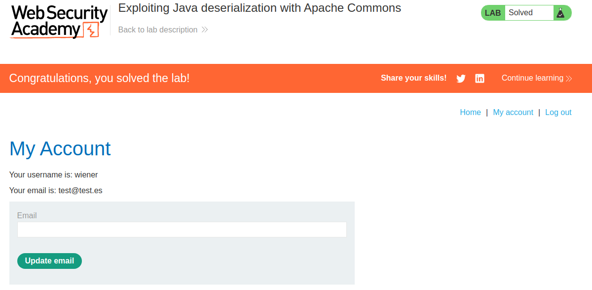

This lab uses a serialization-based session mechanism and loads the Apache Commons Collection library.

We can exploit this lab using pre-built gadget chains, which we will build using the `ysoserial` tool.
With `ysoserial`, we will generate a malicious serialized object containing a Remote Code Execution payload that will delete `/home/carlos/morale.txt` file. As we know the framework which we are working with (Apache Commons), we don't need the source code and we can try with the serialization object created with `ysoserial`. Remember that the gadget chain is already in the code, and we are inserting a payload that will trigger this chain into Remote Code Execution.

First, we download the tool. After that, we execute the following command to remove the desired file and specify the Apache Commons framework:

`java --add-opens=java.xml/com.sun.org.apache.xalan.internal.xsltc.trax=ALL-UNNAMED --add-opens=java.xml/com.sun.org.apache.xalan.internal.xsltc.runtime=ALL-UNNAMED --add-opens=java.base/java.net=ALL-UNNAMED --add-opens=java.base/java.util=ALL-UNNAMED -jar ysoserial-all.jar CommonsCollections4 'rm /home/carlos/morale.txt' | base64 -w 0 `

With this command we will generate a base64 payload (the cookie is in base64) that will contain an object that will trigger RCE with the specified command. Let's attach the object to the request AND url-encode key characters:

This returns us the completion of the lab:

