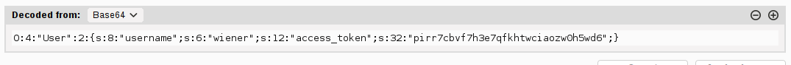
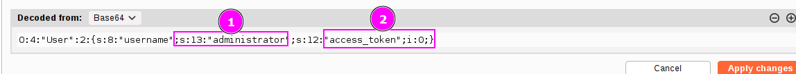
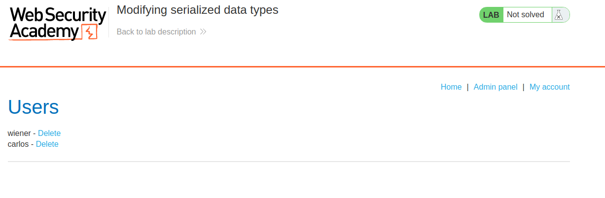
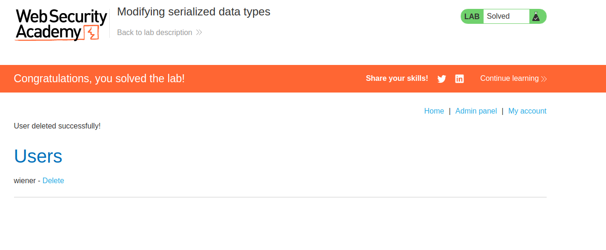

In PHP, we saw that a `string` that does not start with a number is treated as the number `0`, therefore, this comparation:
`anystringthatdoesnotstartwitnumber == 0` 

is always true.

We have the following serialized object in the application:

This is containing an access token. We can detect that the language is PHP and the access token is declared as a string `s:32:value`. 

If the verification in the source code is something like this:
`if access_token_provided ==  $access_token  then OK` 

And if the administrator access token does not start with a number (we don't know it), we can send a `i:0` (an integer with value 0) and the verification will be true. We would be authenticated as administrators but without knowing the access token.

This is what I did: 

Sending this modified cookie leads us to be administrators profile: 

We can now delete the user:
