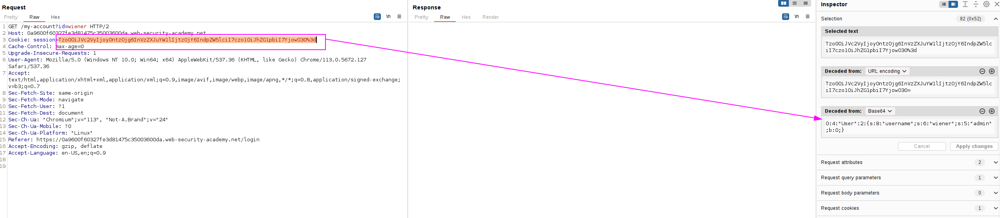
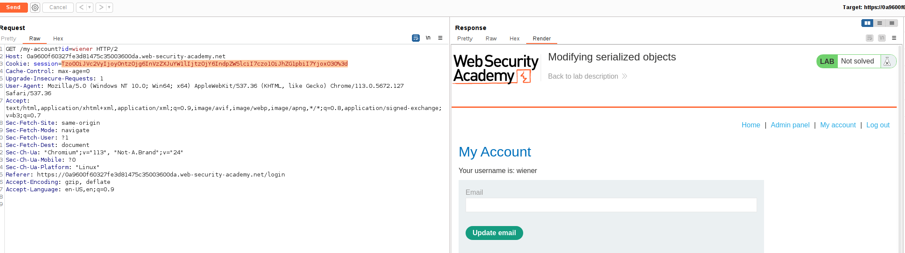
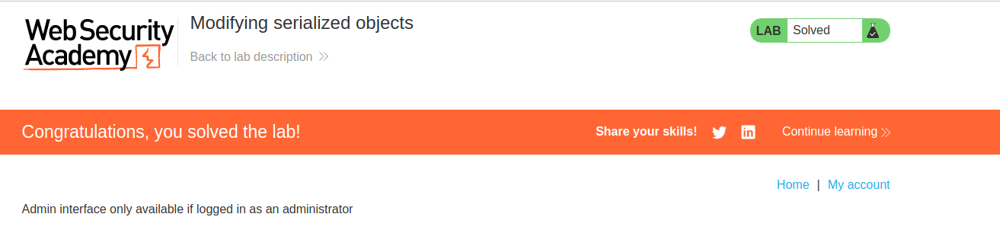

We have our user information attached as a cookie. The cookie is encoded in Base64 and contains a serialized object:

We can see that the flag "admin" has a value of 0. We are going to modify this cookie and send "1" on this field.

We can now see the "Admin panel":

And delete "carlos":

