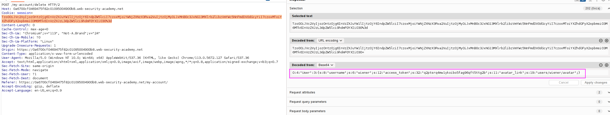

We have an option to delete our account. Let's see the request that is being sent:

We have to delete the `/home/carlos/morale.txt`, which is 23 characters long. We will modify `avatar_link` accordingly:

Applying the changes and sending this requests solves the lab:

