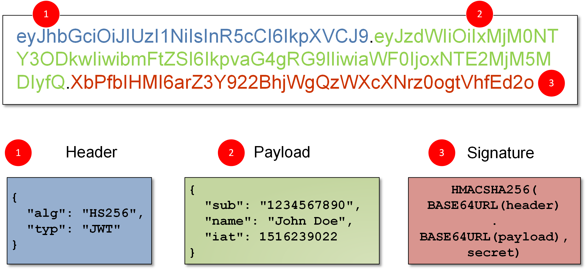

JWTs is the nomenclature for JSON Web tokens. This tokens are commonly used in authentication, session management and access control mechanisms (aka. give me your token and I will tell you what rights do you have).

# What are JWTs
JSON web tokens or jwts, are a **standardized format** for sending **cryptographically signed** JSON data between signed. This means that the data is not readable by everyone and it is also non-modifiable, as a signature exists.
JWTs can contain any kind of data, but they are usually common to send "claims" of users as part of authentication and sessions. This means that the common usage (and the one tested in BSCP) is this one.
The good thing about JWTs is that **all the session information data is stored inside this JWT and the client can manage this token by sending it to the server.** This means that the server does not need to store information about user's sessions, therefore, being a popular choice for highly distributed websites, where users need to interact seamlessly with multiple back-end servers.

# JWT format
A JWT consists of **3 parts, always 3 parts, separated by a dot.** These parts are the **header, the payload and the signature. This is an example of JWT:**



The **header and payload fields (the two first ones)** of a JWT are just **base64 url-encoded JSON objects**. 

The header contains metadata about the token itself, like the algorithm used for signing (look at the image!).
The payload contains the "claims" of the user, like, who is authenticating, its roles, etc. This is why the information does not need to be stored in servers, because it's inside this field. All the claims of the user are in this field, and cannot be easily modified as there is a signature. Obviously, an user could **base64 decode this part of the token, and then modify the information, but as the signature will change and won't match the embedded signature of the JWT.**
Talking about the signature, the server that issues the token **generates the signatrure by hashing the header and the payload (the first two fields).** This hash is sometimes also encrypted. The thing is that, in this process, a signing key is used, which is unknown by the user. This allows the server to only modify the information, and the user has to present it, but cannot modify it as the signature would change and a private, unknown key is needed in order to regenerate it.
This way, the servers know when the user is tampering with the JWTs, by **verifying the signature**.

This is basically what is said in BSCP: 
- As the signature is directly derived from the rest of the token, changing a single byte of the header or payload results in a mismatched signature.
- Without knowing the server's secret signing key, it shouldn't be possible to generate the correct signature for a given header or payload.

# JWT vs JWS vs JWE
The JWT specification is very limited and we often use the JWT word when we are in reality talking about a JWS. 
JWT only defines a format for representing information "claims" as a JSON object that can be transferred between two parties. This JWT structure **is extended by both the JWS (JSON Web Signature) and JSON Web Encryption (JWE)**. 

Normally, a JWT token is a JWS or JWE token, but we use JWT because it is more common to use this word. In reality, JWT almost always mean a **JWS token**. JWEs are very similar, **except that the actual contents of the token are encrypted rather than just encoded.******

**Note:** For simplicity, throughout these materials, JWT refers **primarily to JWS tokens**, although some of the vulnerabilities described **may also apply to JWE tokens.**

# How to attack JWTs
JWT attacks involve an user modifying this JWT and sending it to the server in order to archieve a malicious goal, like impersonating another user, elevating its rights, etc. Typically, this goal is to bypass authentication and [access controls](https://portswigger.net/web-security/access-control) by impersonating another user who has already been authenticated.

## And why is this possible?
This vulnerabilities are possible due to **bad token handling within the application. The JWT contains a signature, but that doesn't mean that the server is ALWAYS validating that signature. What if the signature is not validated at all? An attacker could just change the payload data and the JWT would be valid. This is why it is possible.**

Obviously, JWTs are made to be flexible, and allow developers to decide what implementation to use for its application. These implementation flaws usually mean that the signature of the JWT is not verified properly, and an attacker could tamper with the values passed to the application by modifying the token's payload.

Other thing that is important is that tokens are signed, but this means that they are key-dependant. ¿What is the key is disclosed or weak? If this key is leaked in some way, or can be guessed or brute-forced, an attacker can generate a valid signature for any arbitrary token, compromising the entire mechanism.

# How to manage JWTs in Burp Suite
Please refer to [jwt_extension_installation_and_usage](jwt_extension_installation_and_usage.md) for this section.

# Exploting flawed JWT signature verification

By design, servers do not store information regarding JWT as the intention of JWT is to avoid this. Instead, each token is an entirely self-contained entity. 
This has several advantages, but also introduces a problem: The server does not know anything about the **original contents of the token**, or even what the original signature was. There is nothing to stop an attacker from making arbitrary changes to the rest of the token, and if the signature is not checked, making these changes successful.

Here is a practical example, for better understanding. Imagine a JWT with the following claims:

`{ "username": "carlos", "isAdmin": false }`

If the server uses the "username" field of the JWT to identify the user, an attacker might modify this field to impersonate other logged-in users. Same for the "isAdmin" field, if this field is set to true, it might say that the user has administrative privileges and can be a vector for privilege scalation.

## Topic: Accepting arbitrary signatures

JWT libraries often provide one method for verifying token and another that just decodes the token. For example, the Node.js library called `jsonwebtoken` has `verify()` and `decode()`.

Developers might use this libraries in an insecure way, for example, passing incoming tokens into the decode method, and not verifying its signature. The JWT token could be arbitrairly modified and the server would accept it, as it is just decoding it and not verifying it.

Lab that covers this topic: [labs/no_signature_verification_bypass](labs/no_signature_verification_bypass.md)

## Topic: Accepting null signature tokens

Among other things, the JWT header contains an `alg` parameter. This tells the server which algorithm was used to sign the token and, therefore, which algorithm it needs to use when verifying the signature. Remember that the server does not store information of these tokens, so this information needs to be included in the token so the server can know what to do. Here is an example of a signature header:

`{ "alg": "HS256", "typ": "JWT" }`

This is inherently flawed because the server has no option but to implicitly trust user-controllable input from the token which, at this point, hasn't been verified at all. In other words, an attacker can directly influence how the server checks whether the token is trustworthy.

JWTs can be signed using a range of different algorithms, but can also be left unsigned. In this case, the `alg` parameter is set to `none`, which indicates a so-called "unsecured JWT". Due to the obvious dangers of this, servers usually reject tokens with no signature. However, as this kind of filtering relies on string parsing, you can sometimes bypass these filters using classic obfuscation techniques, such as mixed capitalization and unexpected encodings.

> It is important to note that, even if the token is unsigned, the payload must still terminate with a trailing dot. 

## Topic: Bruteforcing the secret keys used to generate the JWT signature

Signing algorithms, like HS256 (HMAC + SHA256) use an arbitrary string as the secret key. In order to protect all the JWT scheme of the application, the key should not be fragile, weak, bruteforceable or easily guessed. Otherwise, creating a crafted JWT would be easy, as it would just consist in analyzing the JWT structure, creating a JWT and signing it as if the server would do it.

Sometimes the keys used are easy, or leaked, or copied from internet examples, so there might be a chance that an attacker bruteforces the server's secret using a wordlist of well-known secrets.

To bruteforce the JWT, just use hashcat.

### Bruteforcing JWT signature using Hashcat
We obviously need a valid JWT in order to check if our secret key is valid. And also a wordlist of secrets. Let´s use the recommended wordlist for the BSCP, also attached in this folder.

The command to bruteforce a JWT using hashcat is this one (16500 is the mode to crack JWT):
``hashcat -a 0 -m 16500 <jwt> <wordlist>``

Once we discover the secret key, we can use this key to craft the signature of the JWT. Inserting the secret key into the JWT Burp Suite plugin automatically calcules the signature for us.

Lab that covers this topic: [labs/weak_signing_key_cracking_and_crafting](labs/weak_signing_key_cracking_and_crafting.md)

# JWT header parameter injections
According to the [RFC 7515](https://datatracker.ietf.org/doc/html/rfc7515), the "alg" header parameter is the only header which is mandatory.
But this is not often the only header included, and there are more headers that can be interesting:

- `jwk` (**JSON Web Key**) - Provides an **embedded JSON object** representing the key.
- `jku` (**JSON Web Key Set URL**) - Provides a **URL from which servers can fetch a set of keys** containing the **correct key**.
- `kid` (**Key ID**) - Provides an ID that servers can use to identify the **correct key in cases where there are multiple keys to choose from**. Depending on the format of the key, this may have a matching `kid` parameter.

As we can see, these parameters are used to tell the server WHICH KEY TO USE when verifying the signature. But this opens a new opportunity: **use our own arbitrary key, rather than the specified ones (in the cases that the server does not validate the origin of the keys, for example).**

## Injecting self-signed JWTs via the "jwk" parameter
The JWS specification in [RFC 7515](https://datatracker.ietf.org/doc/html/rfc7515) describes an **optional** jwk header, already described, which servers can use to embed their public key directly within the token itself, in JWK format.

Servers **should only use a whitelist of public keys to verify JWT** signatures. But, as always, this might not work and servers might use any key that is embedded in the `jwk` parameter.

Therefore, the attack path would be to sign a modified JWT using our own RSA private key, and then embed our **RSA public key in the `jwk` header. If the server does not verify the RSA key that is introduced and compares it with the whitelist, it will just see if the public key decrypts the JWT, and, as we signed it with the private key that matches the public key, the signing will be verified.**

Lab that covers this topic: [labs/jwk_header_bypass](labs/jwk_header_bypass.md)

## Injecting self/signed JWTs via the "jku" parameter
This is similar to the previous injection, but instead of embedding public keys into this parameter, some servers are vulnerable to the `jku` parameter.
The `jku` parameter is another parameter that allows to specify a URL containing the key. This way, the server does not get the public key directly from the token (as happens with the jwk) but visits the URL specified in the `jku`. More secure websites will only fetch keys from trusted domains, but we can sometime bypass the URL parsing and make the server fetch our key.

JWK Sets like this are sometimes exposed publicly via a standard endpoint, such as `/.well-known/jwks.json`.

Lab that covers this topic: [labs/jku_header_bypass](labs/jku_header_bypass.md)

# JWT Authentication bypass via `kid` header path traversal

We already saw that the optional `kid` parameters provides the server an ID. This Key ID (kid) tells servers **which key to use in case of being multiple keys to choose from.**
The server can simply look for the JWK with the same key as the token, but the thing is that the JWS specification does not define a concrete structure for the ID, it is just an arbitrary string. it could be key1, key2, or whatever, even the name of a databse or a file.

This parameter can be also vulnerable to **directory traversal**, and an attacker could potentially force the server to use an arbitrary file of the filesystem as the verification key. **This attack is dangerous even more if the server supports signed tokens with a symmetric algorithm, as the attacker could just sign the token with a key that is stored in a file and specified in the `kid` header.  

What is very common is just signing the token with an empty string, as it is still a valid token (it is just not signed). This is done by making the `kid` parameter have the value of `/dev/null` in Linux, for example. Therefore, the server will look at an empty string and will verify the signature with an empty string (therefore, not verifying it at all)

Lab that covers this topic: [labs/kid_header_bypass](labs/kid_header_bypass.md)

# Other interesting JWT parameters
There are other JWT headers that can be interesting, although they are not covered in the lab.

- The first one is the `cty`, or content type. This is to declare a media type for the content in the JWT payload. As we can see this is not close to session management, but other JWT usages.
If you have find a way to bypass signature verification, and change the `cty` header to specify `application/x-java-serialized-object` instead `text-xml`, you can inject code, or something similar.

- `x5c` (X.509 Certificate Chain) - Sometimes used to pass the X.509 public key certificate or certificate chain of the key used to digitally sign the JWT. This header parameter can be used to inject self-signed certificates, similar to the [https://portswigger.net/web-security/jwt > injecting-self-signed-jwts-via-the-jwk-parameter](https://portswigger.net/web-security/jwt#injecting-self-signed-jwts-via-the-jwk-parameter) attacks discussed above. Due to the complexity of the X.509 format and its extensions, parsing these certificates can also introduce vulnerabilities. Details of these attacks are beyond the scope of these materials, but for more details, check out [CVE-2017-2800](https://talosintelligence.com/vulnerability_reports/TALOS-2017-0293) and [CVE-2018-2633](https://mbechler.github.io/2018/01/20/Java-CVE-2018-2633)

# JWT algorithm confusion
We have talked about a lot of the headers of JWT and performed an attack for nearly all of them, but... What if you change the header that specifies the type of algorithm that is used to sign the token, and change it for another algorithm? This is known as an algorithm confusion attack.

Algorithm confussion attacks occur when an attacker is able to force the server to verify the signature of the JWT using a different algorithm than the intended by the website developers. If this case is not handed properly, this may enable attackers to forge valid JWTs containing arbitrary values without needing to know the server's secret signing key.

## Symmetric vs assymetric algorithms
We have seen that JWTs can be signed using a range of different algorithms, and some of these as HS256, use a symmetric key. This means that that key is used to **sign and also to verify the token.**

Other algorithms, like RS256 (RSA +  SHA256), use an assymetric key pair.

## How does algorithm confusion works
Sometimes, the implementation of JWT libraries is bad. Many libraries provide a single method of verifying signatures, and these methods rely on the `alg` parameter of the token's header to determine the type of verification to perform.

The following pseudo-code is an example of what the `verify()` function might look in a JWT library:

```python
function verify(token, secretOrPublicKey){ 
algorithm = token.getAlgHeader(); 
if(algorithm == "RS256"){ 
	// Use the provided key as an RSA public key } 
else if (algorithm == "HS256"){ 
	// Use the provided key as an HMAC secret key } 
}
```

Problems arise when developers that use this method **assume that it will exclusively handle 
JWTs signed with RS256, and they always pass a fixed public key into the method, like this:**

```python
publicKey = <public-key-of-server>; 
token = request.getCookie("session");
verify(token, publicKey);`
```

In this case, if the server receives a token **signed using a symmetric algorithm like HS256, the verify() method will treat the public key as an HMAC secret, and use it to verify the signature.**
An attacker could just use the public key of the server to resign this token, and specify the HS256 method, so the server will use its public key to verify the signature and it will match.
I know this sounds a bit complicated to understand, but the idea is that, sometimes, developers **overtrust that the algorithm of the JWT that are going to be sent is always RS256**, and hardcode the "validate the JWT with the public key" operation in the code. An attacker can change the algorithm to "HS256, sign the token with the key, and the server will perform the "validate the JWT with the public key" operation, as it is hardcoded. The thing is that the attacker specified RS256, which is a symmetric algorithm, and therefore, the signature and verification will match.

> Note: The public key you use to sign the token must be **absolutely identical to the public key stored on the server**. This includes using the **same format** (such as X.509 PEM) and **preserving any non-printing characters like newlines.** In practice, you may need to experiment with different formatting in order for this attack to work.

This attack is a bit larger than the others explained as requires some preparation. Here are the high-level steps:
1. [https://portswigger.net/web-security/jwt/algorithm-confusion > step-1-obtain-the-server-s-public-key](https://portswigger.net/web-security/jwt/algorithm-confusion#step-1-obtain-the-server-s-public-key)
2. [https://portswigger.net/web-security/jwt/algorithm-confusion > step-2-convert-the-public-key-to-a-suitable-format](https://portswigger.net/web-security/jwt/algorithm-confusion#step-2-convert-the-public-key-to-a-suitable-format)
3. [https://portswigger.net/web-security/jwt/algorithm-confusion > step-3-modify-your-jwt](https://portswigger.net/web-security/jwt/algorithm-confusion#step-3-modify-your-jwt) with a modified payload and the `alg` header set to `HS256`.
4. [https://portswigger.net/web-security/jwt/algorithm-confusion > step-4-sign-the-jwt-using-the-public-key](https://portswigger.net/web-security/jwt/algorithm-confusion#step-4-sign-the-jwt-using-the-public-key), using the public key as the secret.

These steps are covered in [labs/algorithm_confussion_bypass](labs/algorithm_confussion_bypass.md)