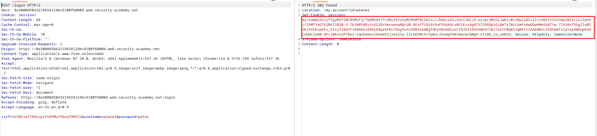
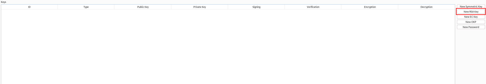
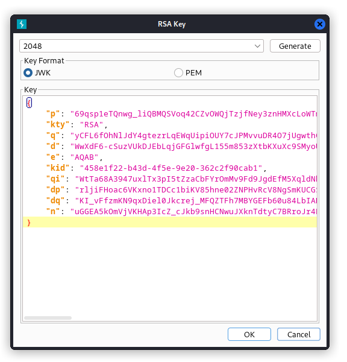
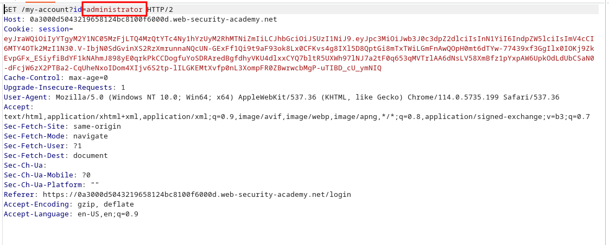
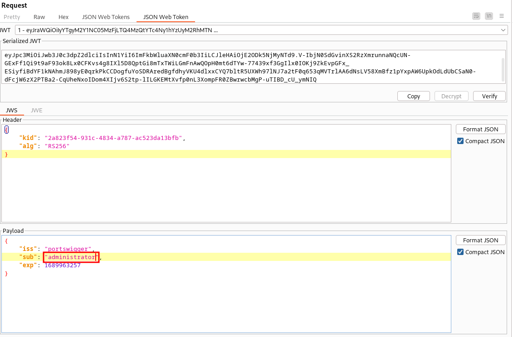
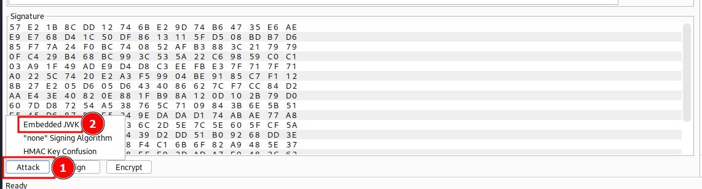
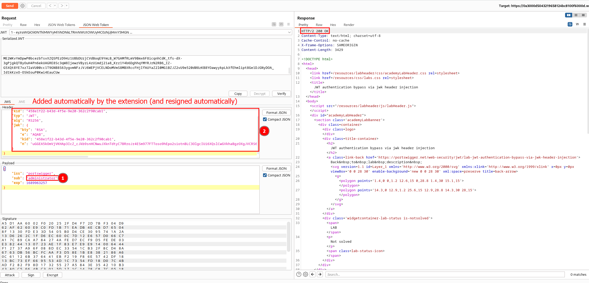
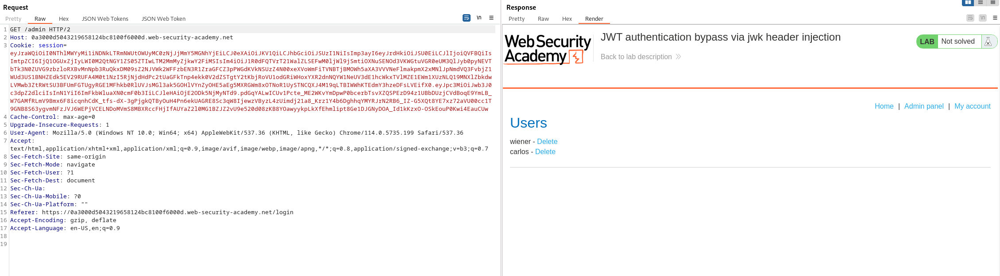
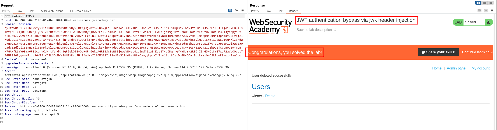

# Lab description
This lab covers the [../main > Injecting self-signed JWTs via the "jwk" parameter](../main#Injecting%20self-signed%20JWTs%20via%20the%20"jwk"%20parameter) section.
The idea is that the JWT that the server gives to us has the `jwk` parameter, with a public key. The server **does not check if the public key in this extension comes from a trusted source, and just tries to use it to decrypt the JWT.**

The steps that are going to be performed are:
1. Get a valid JWT, with this extension.
2. Craft a self-signed RSA key.
3. Use the private key **to sign the JWT**. Use the public key to attach it to the JWT.
4. Modify the fields of the JWT arbitrairly, e.g., administrator user.
5. Send the JWT.
6. Profit

# Writeup
Let's obtain a valid JWT by logging as the `wiener:peter` user:

Let's generate a RSA key pair, in the "JWT Editor Keys" section of Burp Suite:

We go back to the repeater, where we have a GET request waiting for us to display the profile. We must modify the profile to /administrator:

And now go to the "JSON Web Token" tab, and modify it to claim to be the user "administrator":

The last step is to add the public key as the `jwk` extension and resign this token. Let's do it, by clicking in the "Attack" button and selecting "Embedded JWK":

Select the RSA key that we generated and just send the request to the server:

We can see that the server accepted this public key and just used it to decrypt the JWT that was resigned with the private key. As always, we go to the `admin` panel:

And just delete the "carlos" user:

