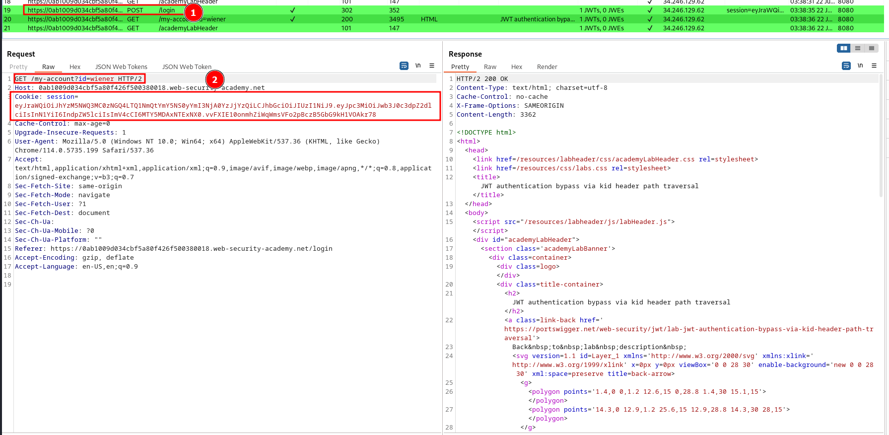
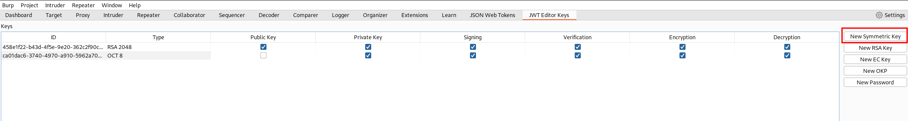
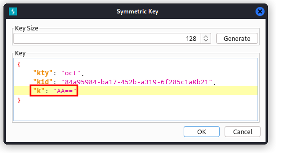
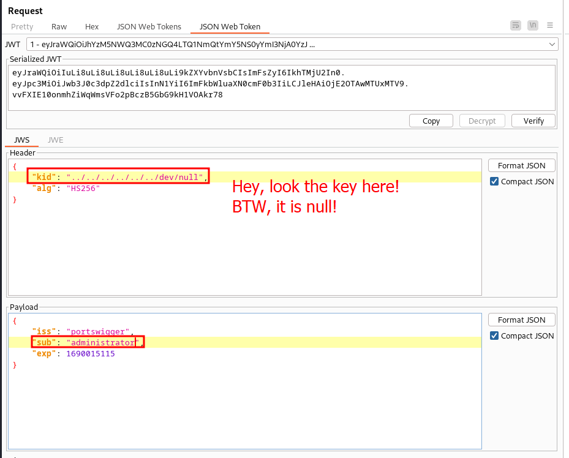
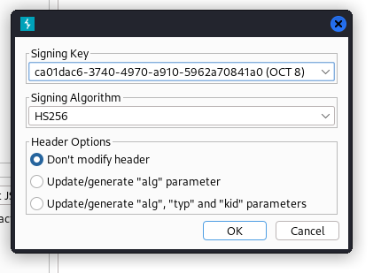
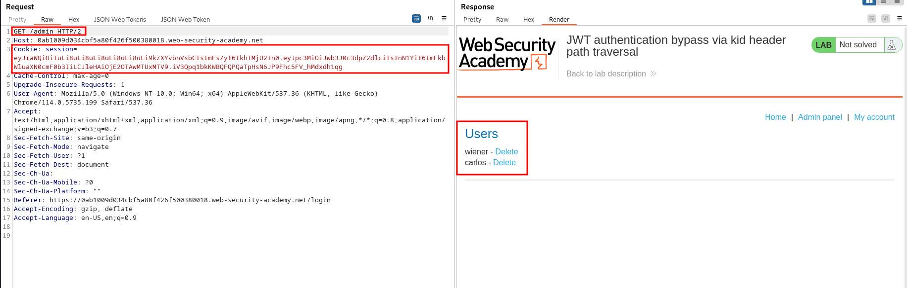
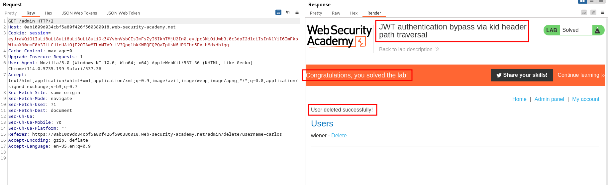

# Lab description
This lab covers the topic of [../main > JWT Authentication bypass via `kid` header path traversal](../main#JWT%20Authentication%20bypass%20via%20`kid`%20header%20path%20traversal).

The idea is that the server uses the `kid` optional parameter of the token to look for a local file containing a key that will be used to validate the signature.
We are going to:
1. Extract a valid JWT.
2. Change the JWT as we want. 
3. Specify `/dev/null` as the `kid` parameter, so the server will use that file to verify the signature of the token. That file is empty, therefore the key will be null.
4. We resign the JWT with a null key so it matches the verification that will be made by the server with the `kid` trick pointing to `/dev/null`.
5. Profit

# Writeup
As always, logging in with `wiener:peter` gives us a valid JWT:

We are going to create a symmetric key with the `k` parameter as the null byte, this is, `AA==`. For that, go to the JWT Editor Keys section of Burp Suite and create a new symmetric key:

Click on "generate" but on the generated key change the `k` parameter to the null byte: `AA==`:

Signing with this key will be equal to **not signing the JWT at all :)**.

Let's modify the JWT so the `kid` parameter is equal to a null string, for that, `/dev/null` is a good candidate. In the lab we know the server is a Linux server, so this file exists. Let's change the parameter:

We specify several backslashes as we don't know the current working directory of the server and we want to go to the root folder and then go up until `/dev/null.`
This token would not be valid as the server will verify the signature with a null signature, but the token IS SIGNED as we obtained a VALID ONE. We have to resign it **with our null key:**

Lastly, changing the endpoint to `/admin`, we get a 200 OK, indicating that the server is validating the JWT with this file:

As always, delete the user carlos:

