# Lab description

Link: [this](https://portswigger.net/web-security/jwt/lab-jwt-authentication-bypass-via-unverified-signature)

This lab consists in one of the techniques explained in [../main](../main.md): [../main > Accepting arbitrary signatures](../main#Accepting%20arbitrary%20signatures). 
This lab uses a JWT-based mechanism to handle sessions, but we know that the server **does not verify the signature of any JWTs that it receives**.

How to solve the lab: Modify the session token to gain access to the admin panel at `/admin`, then delete the user `carlos`.

# Writeup

First, we can access to our account page with the basic credentials, wiener:peter.

If we look at the HTTP history, the server gives us a cookie that is, indeed, a JWT with our user information. This cookie is given to us AFTER performing the login correctly.
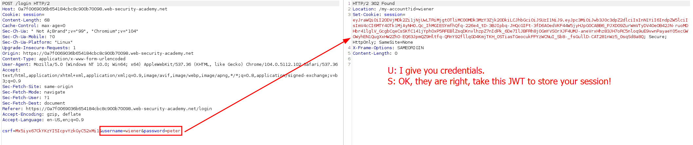

When inspecting the JWT that the server has given to us (remember: base64decode), the JWT is this:
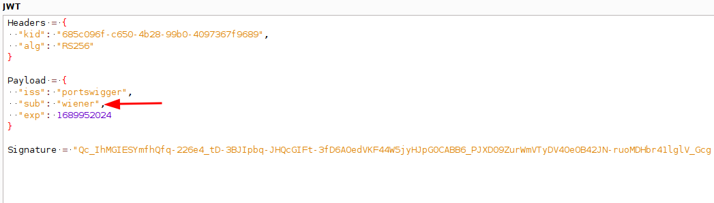

Here is our user, so the server knows we are Wiener because this JWT contains this information. The attack of this lab consists in changing the user to administrator (no need to change the algorithm to "None", but i did it on purpose. It is not needed!)

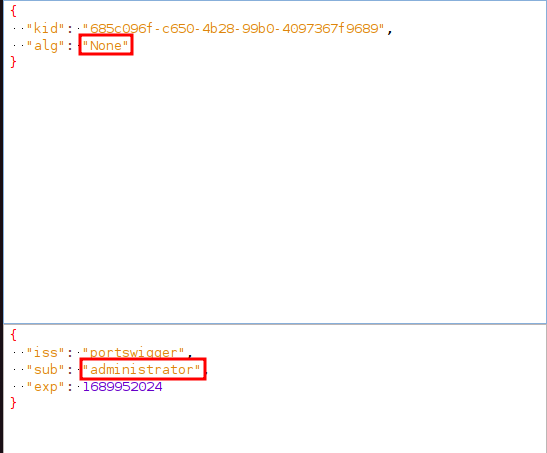

The thing is that we also need to change the request to get the details of the administrator account, so we modify the cookie but also the request:

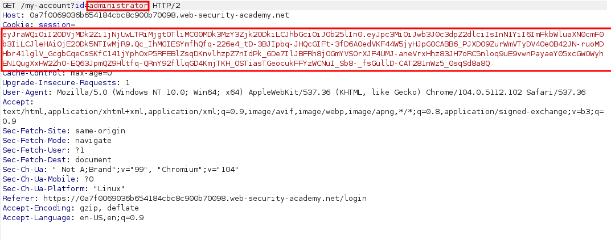
Now, we send the request and we receive a 200 OK, telling us that the server thinks we are an administrator!
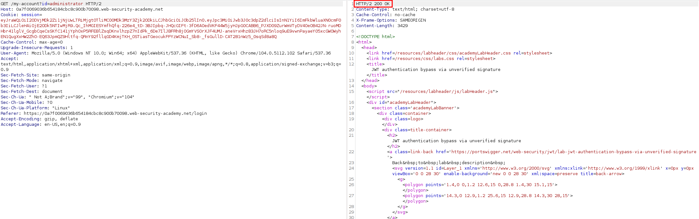

By rendering the response, we can see that there is an "Admin panel":
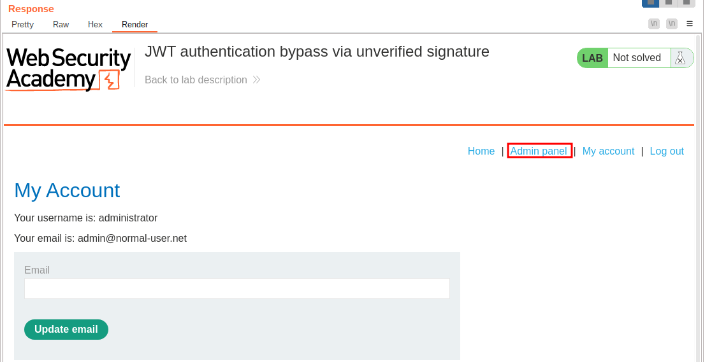

We need to go through that. For that, analyzing the **code of the response, we know the endpoint:**
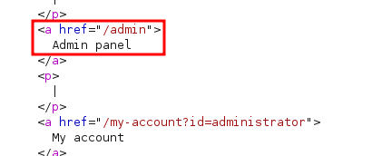

Thanks, **href friend**. Let's change the request, maintaining the modified JWT and sending a GET to /admin:
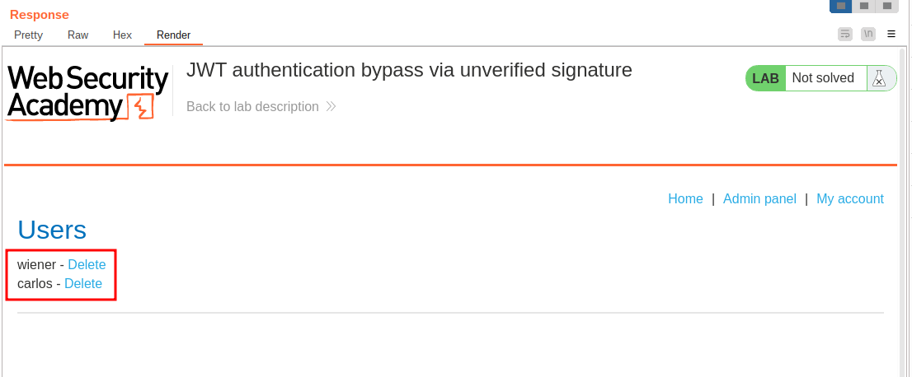

We are finally in this panel and, again, by reading the source code of the page we know how to delete carlos:
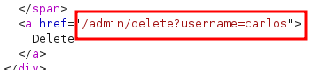

Crafting a request to this endpoint as the administrator, leads us to the operation being completed and the lab solved. 
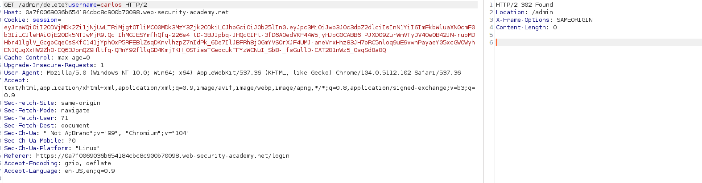

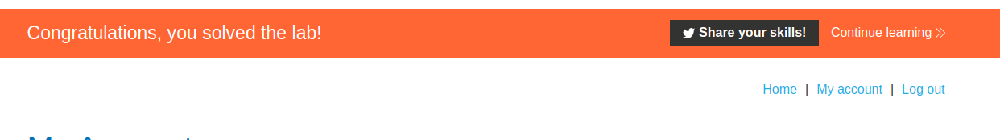

Indeed, checking again the users, shows that carlos is not now with us:

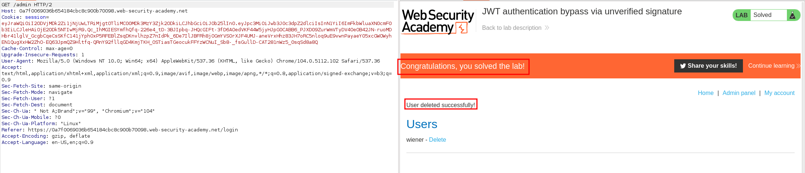

