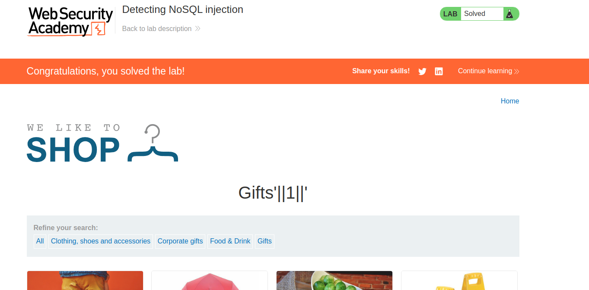

Here is the page that probably contains a NoSQL query:

Introducing a single quote breaks the query, which leads to this error which tells us that it is a MongoDB database:

Now, we have to display the unreleased products. Let's try to not display any product with an AND opeator with null and X:
`Gifts' && 0 && 'x`

Now, we can display ALL of the products with an expression that always evaluates to TRUE.
This can be a valid expression, appending an OR to the following conditions so the part of the query that says "UNRELEASED=FALSE" is optional:
`Gifts'||1||'`

We solved the lab.
