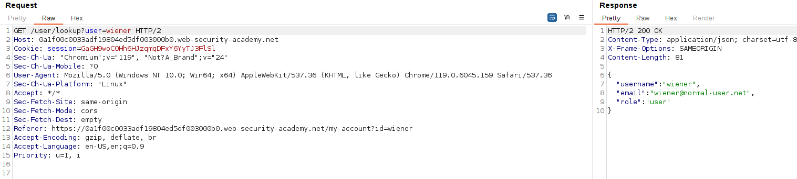
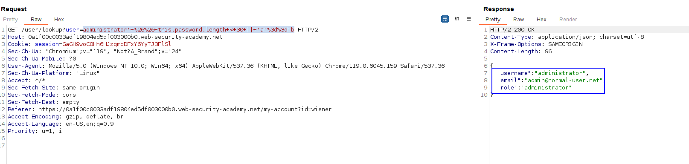
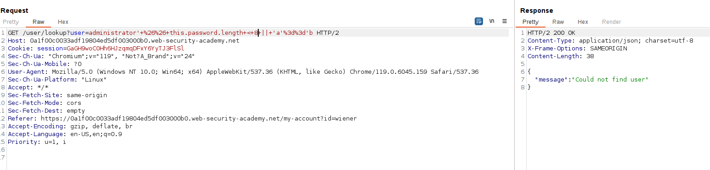
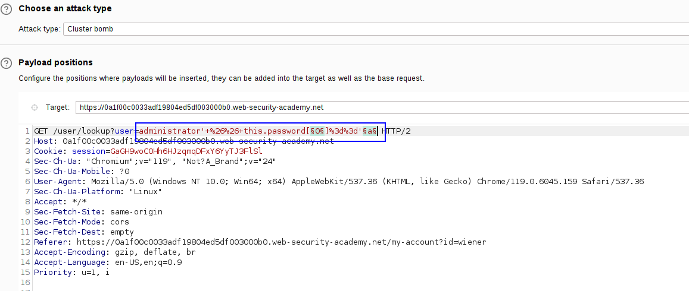
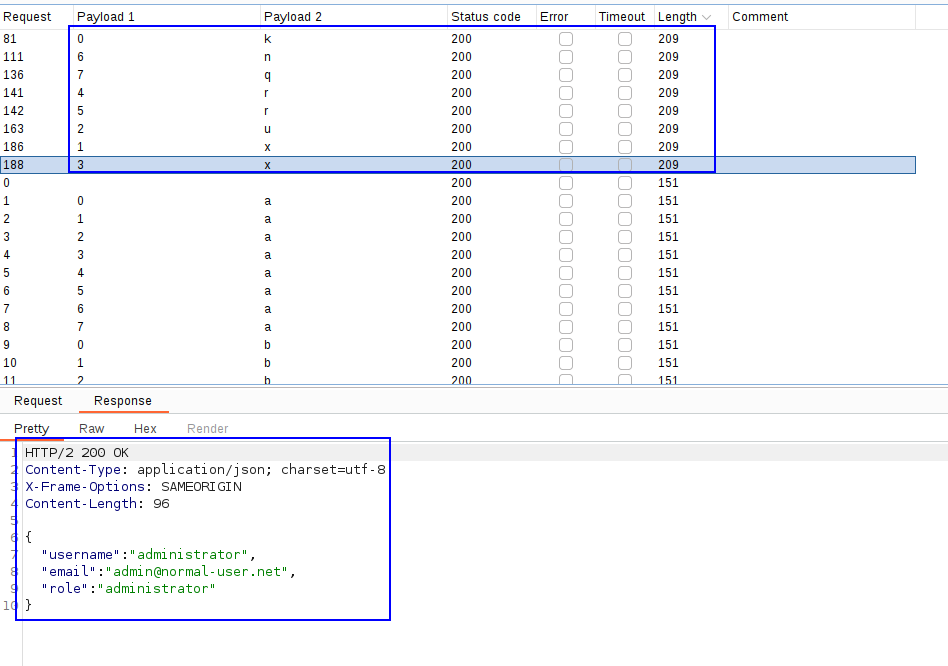
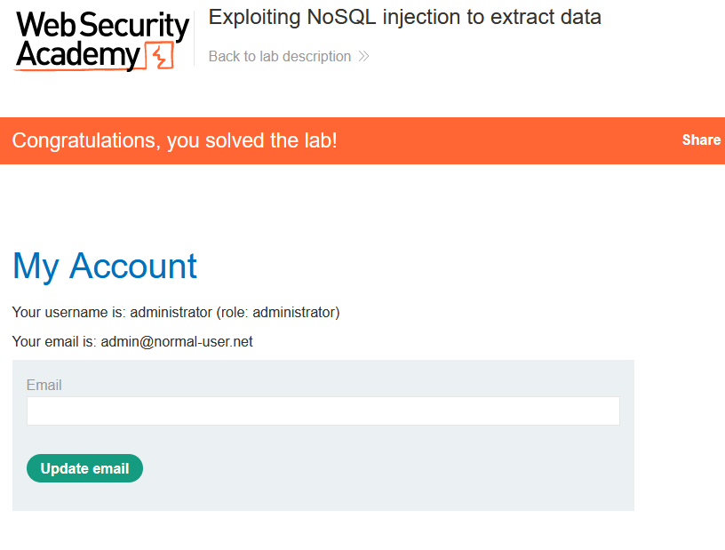

We are going to manipulate a query in the website to extract the data of the administrator user.

When you log in, a background request is performed to see the role of each user:

This is probably performing some request like:
`SELECTrole, email, username FROM users WHERE username=$user`
We can try to append an AND operator so it only displays information about the user when our condition is true. 

As when performing SQL injections, let's try to first guess the length of the password. For that, we can use the following query:
`administrator'+%26%26+this.password.length+<+30+||+'a'%3d%3d'b`

We can see that the password is less than 30 characters. Changing the number leads us to guess that the password is 8 characters, as with less than 8, we get that there are no users:

So, the password is 8 character length.
Now, we can just perform a cluster bomb attack:
`' && this.password[POSITION]=='CHARACTER'`.
In the request, it is finally:
`administrator'+%26%26+this.password[§0§]%3d%3d'§a§ `

Sending the attack leads us to some of the responses being of different length and retrieving the data, as all of the responses are 200 OK we cannot filter by status code but by length:

With this, we have the password of the administrator user.
