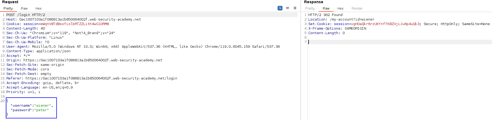
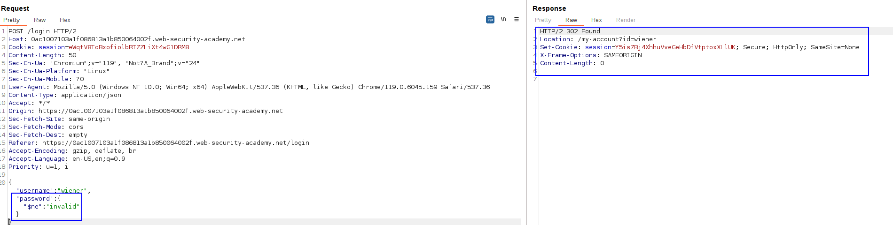
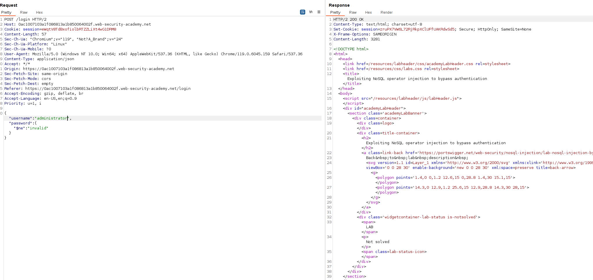
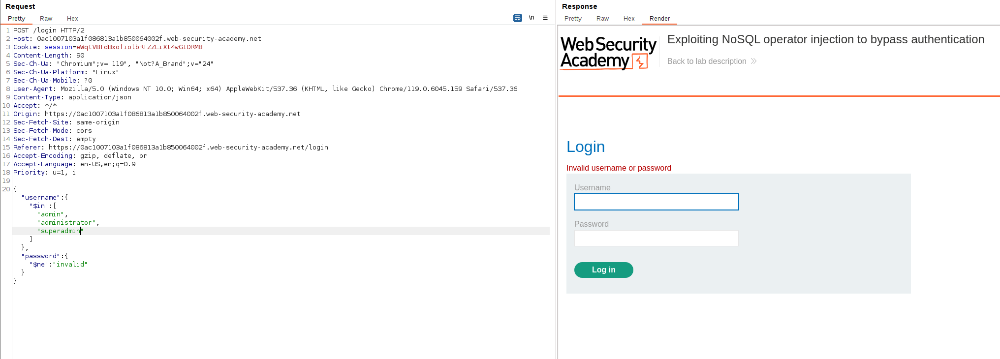
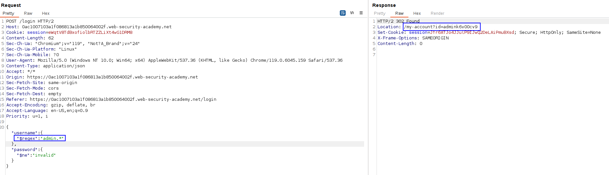
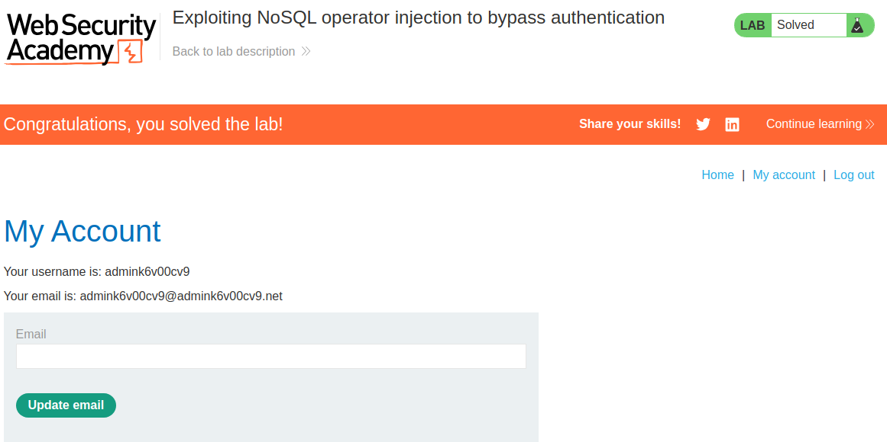

The login functionality for this lab is powered by a MongoDB NoSQL database. It is vulnerable to [NoSQL injection](https://portswigger.net/web-security/nosql-injection) using MongoDB operators.

Let's see the login request:

As it is a JSON format, we can expect some kind of NoSQL injection.
Let's try to use the operators. For example, let's put wiener as the username but try to guess the password with the following operator:
`{"$ne":"invalid"}`

We can enter with our user without knowing the credentials, as the operator worked. It returned the first ocurrence row where the user is wiener AND the password field is not invalid, which obviously is our password field.

Let's just change the username to administrator to get a session cookie of him:

It does not work, as it says that the username or the password is invalid. Maybe we need to guess the username? Let's try the following operator: 
`{"$in":["admin", "administrator", "superadmin"]}`

but it does not work. Let's change the "invalid" type for the password for just an empty string, but it does not work. We need to guess the real administrator username. 
**We learned that we can use Regex to retrieve information in our queries, so we can perform a Regex to obtain the username:**
`{"$regex":"admin.*"}`. This means, admin concatenated with whatever string.

This actually worked, and indeed, we discovered the real administrator user, which is admink6v00cv9:

