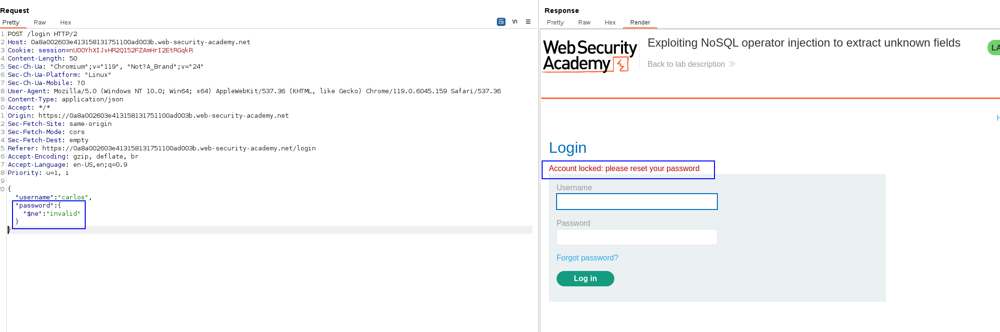
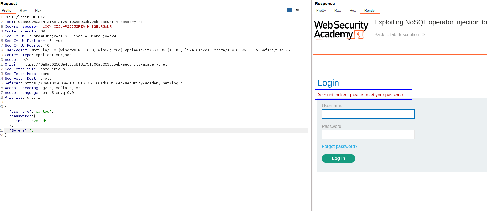
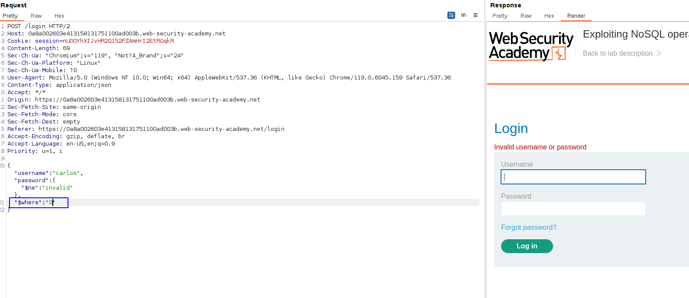
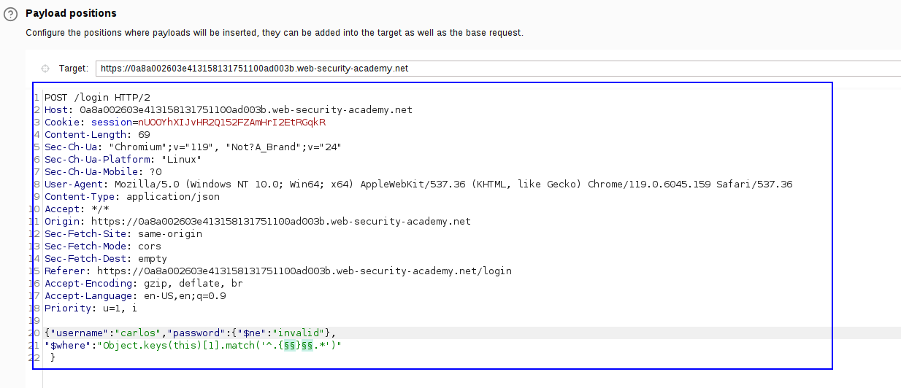
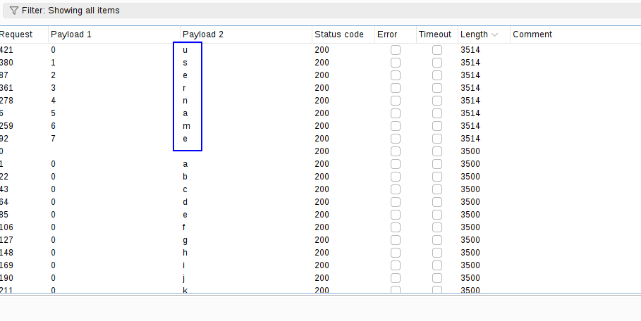
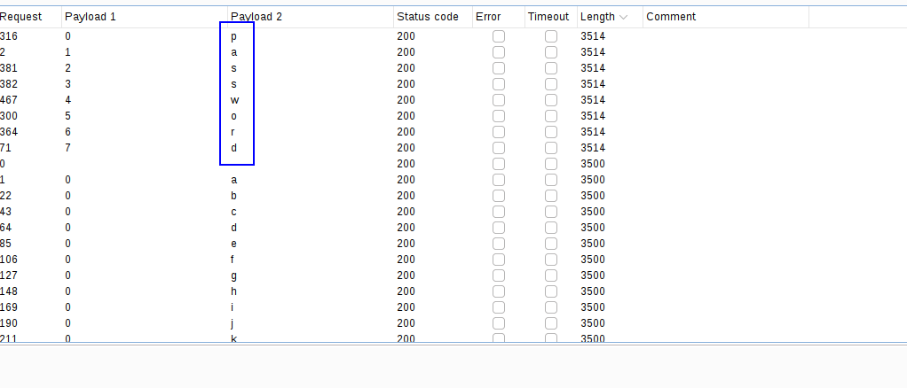
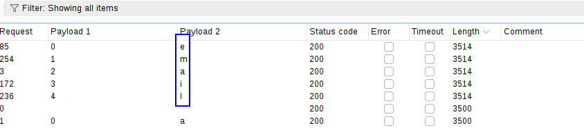

If we try to use the operators to bypass the login of the user `carlos`, we get the following error:

This means that we need to reset the password of the user.
We need to inject a new field in the JSON to discover the fields of the database. For that, we try with an always TRUE and always FALSE payload and check the response.

Always true with `"$where": "1"`: 

Always false with `"$where": "0"`

We can inject a new field to identify the fields on the user object:
`"$where":"Object.keys(this)[1].match('^.{}.*')"`

We need to add two payload positions. The first identifies the character position number, and the second identifies the character itself: `"$where":"Object.keys(this)[1].match('^.{§§}§§.*')"`.

Making a cluster bomb to discover the fields of the first parameter of the user object. The cluster bomb is 0-20 and alphanumeric characters.

We discover that the first parameter of the user object is username:

Let's look for the second parameter:
`"$where":"Object.keys(this)[2].match('^.{§§}§§.*')"`
Which tells us that is password:

Let's look for the third one:
