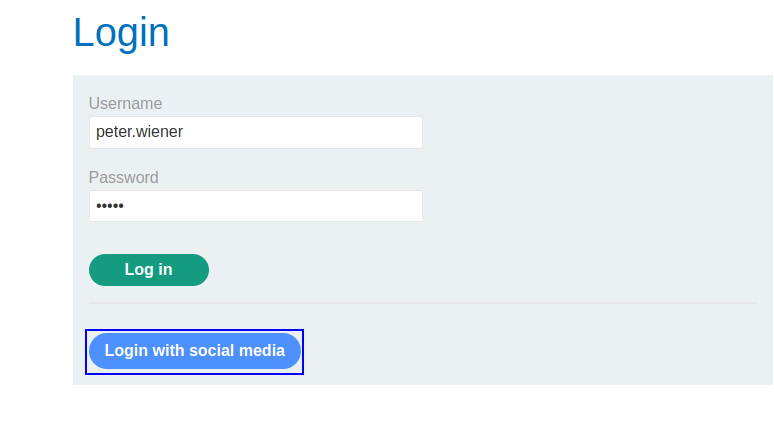
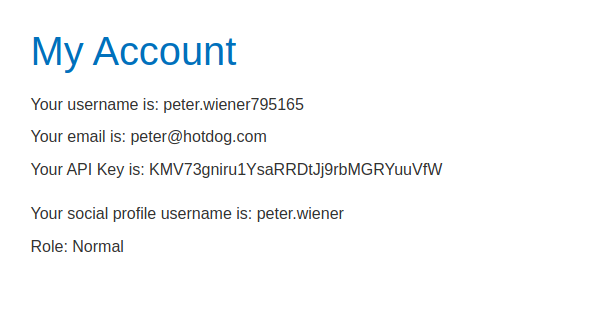
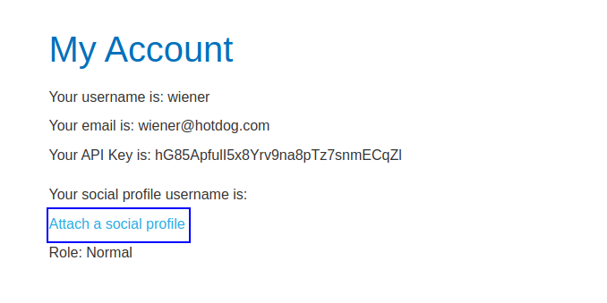
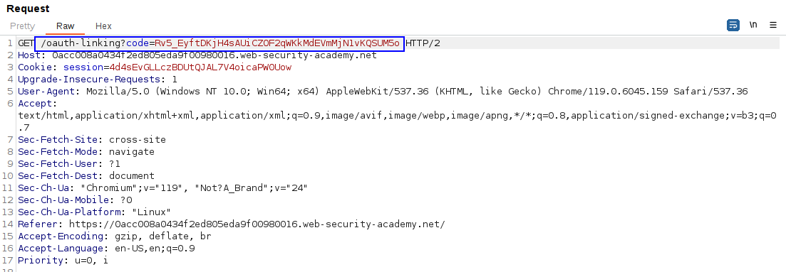
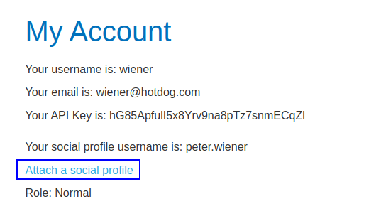
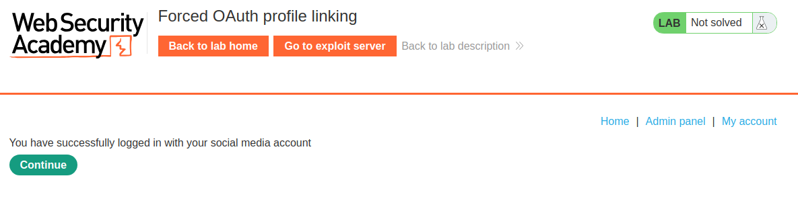

This lab has an option to attach a socia media profile so that you can log in via OAuth instead the normal username and password.
The problem is that the OAuth implementation is weak, and an user can access other user's accounts.

We have an option to log in with social media:

And after logging in with social media account:

This option is not exploitable. 
We first have to log in with our normal credentials and attach a social profile:

This action has a vulnerable request, the request to link both account:

This request, when sent, bounds the account that is being logged into with the account that generated the code. As it has no `state` parameter, we can force the user to perform the request, as a CSRF attack. 

We can log in with our account with normal credentials and intercept the request to attach the social profile:

When the request to link the application appears, we have to copy this link and drop the request (as it is only one use).

We can embed the page in an iframe:
`<iframe src="https://0acc008a0434f2ed805eda9f00980016.web-security-academy.net/oauth-linking?code=vD665BZM6dtlC0vcaqJaehLkl1_otVlX_CXu9D6P6Wa"></iframe>`

The victim will click on this link and finish the binding of its account (administrator) to our normal account (wiener). 
Therefore, when clicking to log in with the social media account, we log in with the administrator account:

