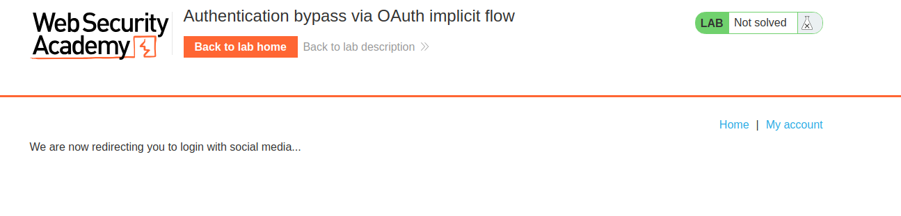
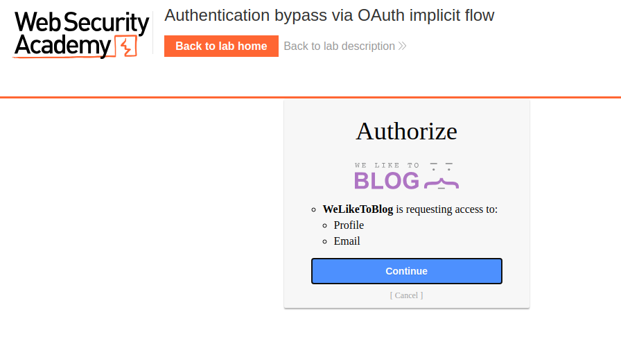
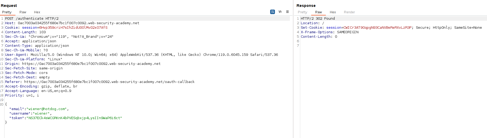
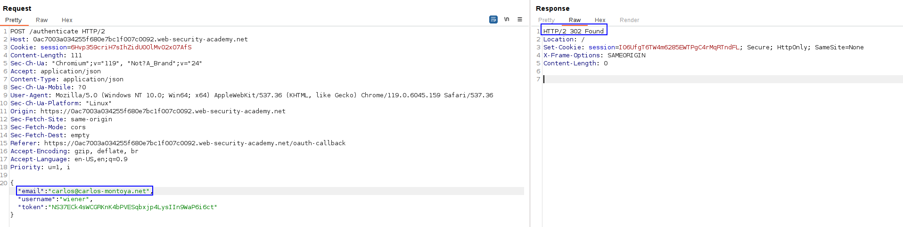
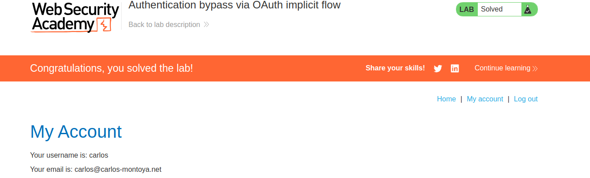

We will exploit the OAuth flow used for authenticating an user, as this framework is not designed for authentication.

First, we log in with our credentials and inspect the requests that are being performed:

This redirects us to another page, where we can log in. After logging in with our credentials, our page asks for resources:

There is one of the requests that contain information about the user:

We can see our user token. We can try to use **our token to ask for resources for other user, e.g., from carlos. We know his email, so we are going to ask for his data:**

