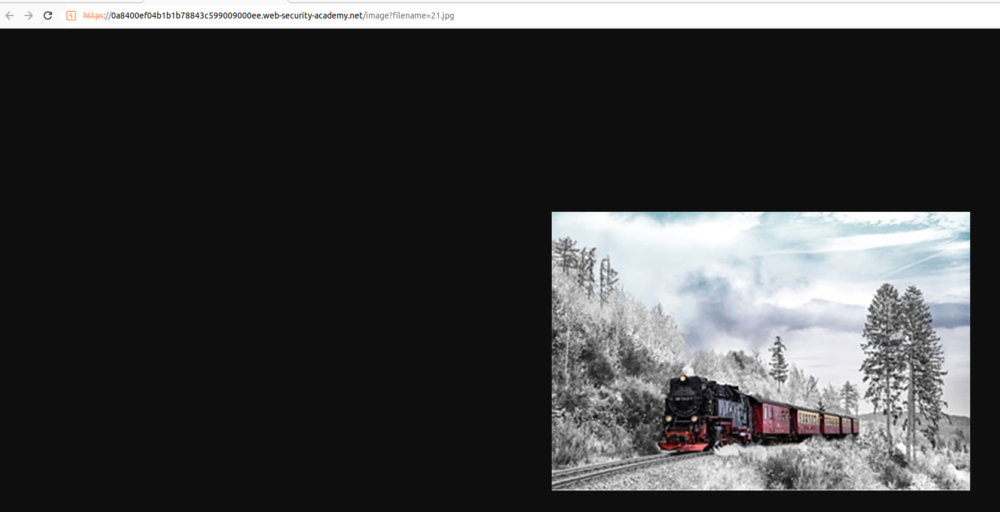
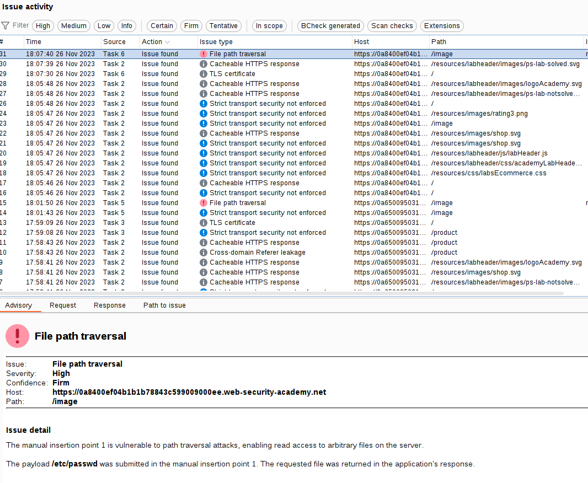
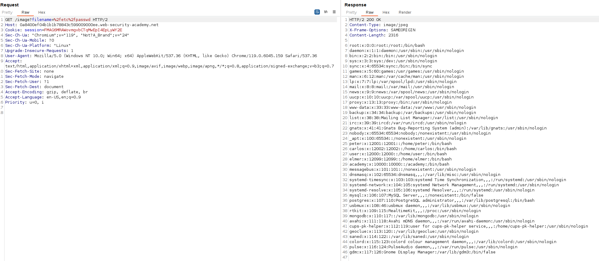

We are going to bypass the defense mechanism of the server by adding an absolute route to the path.

The vulnerable point might be in the images:

Scanning with Burp Suite, we get that indeed that point is vulnerable to path traversal:

We can see that the exploit used is the absolute route, `/etc/passwd`, without a traversal payload:

