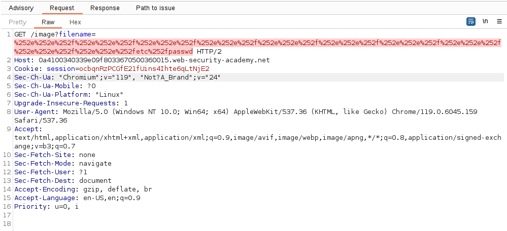
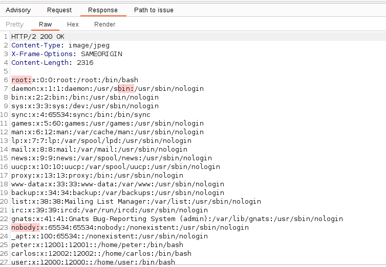

This is the double encoding technique, which consists in encoding first the payload (`../`) and then the `%` resultant from encoding these payloads.
Step 1: `../` to `%2e%2e%2f`
Step 2: `%2e%2e%2f` to `%252e%252e%252f`

This way we can bypass the technique:
