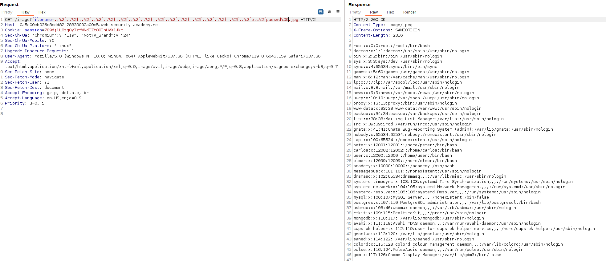

If the website has a verification that the file must end in `.png` or certain format, we can send the following type of payload: `..%2f..%2f..%2f..%2f..%2f..%2f..%2f..%2f..%2f..%2f..%2f..%2f..%2f..%2f..%2f..%2fetc%2fpasswd%00.jpg`

This way, the server will check that the request ends with `.jpg` or the desired format, but the null character will make this string not be proccessed inside the backend.

Here we can see the lab being solved with this payload:

