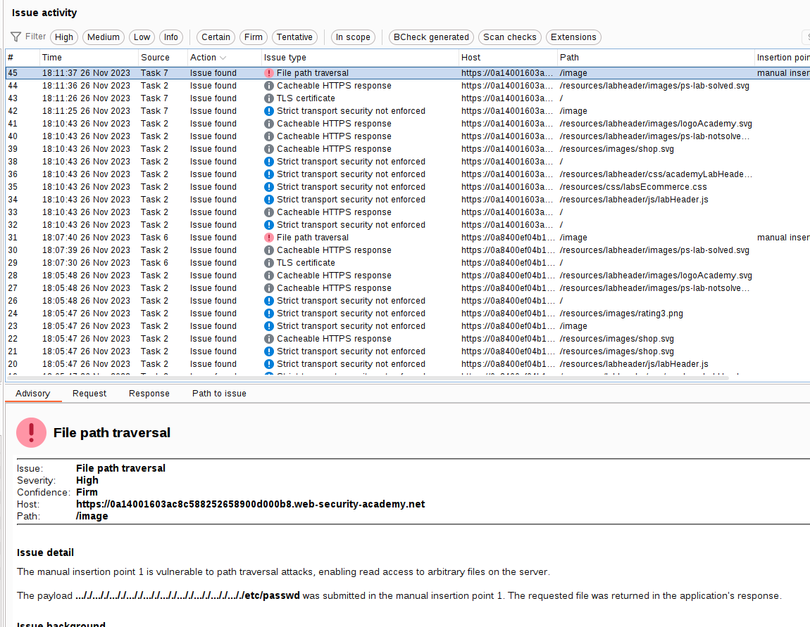
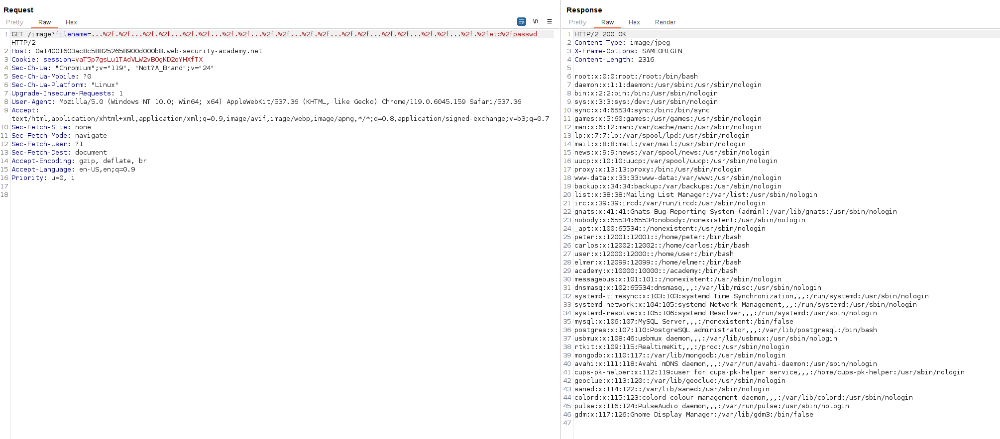

The website strips path traversal sequences from the user-supplied filename, **but the strip operation is not recursive and therefore, we can exploit this.**

Here is the possible vulnerable point, in an image:

We can see that the Burp Suite scanner used a payload that includes the stripping bypass mechanism:

If the program strips `../`, the payload uses `....//` (double the characters) and bypasses this mechanism, as the program will take `....//` and convert it into `../`, which is still a valid payload, and therefore, the attack is still performed.

