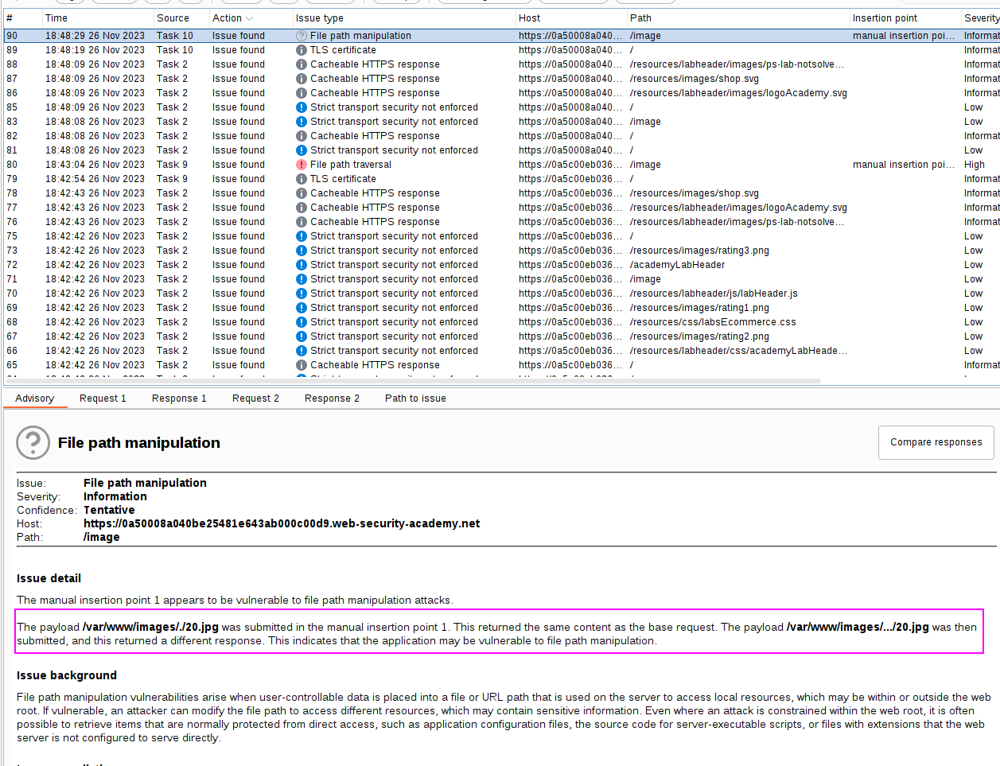
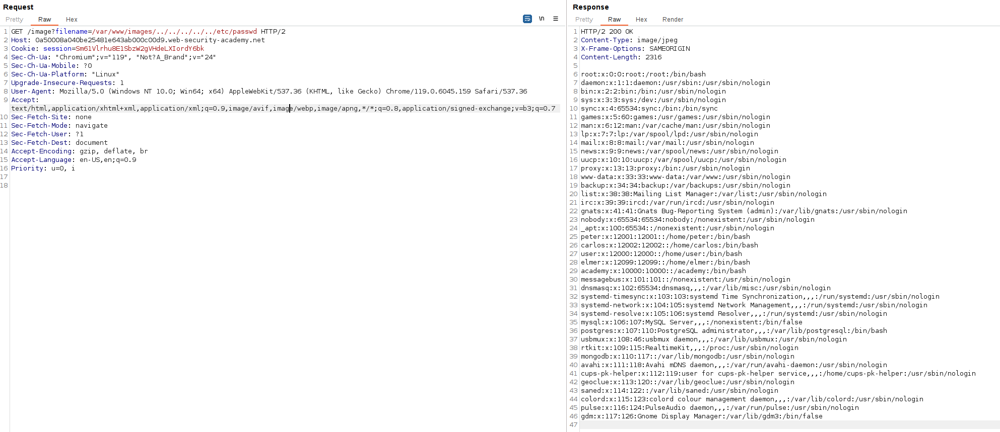

This lab contains a [path traversal](https://portswigger.net/web-security/file-path-traversal) vulnerability in the display of product images.

The application transmits the full file path via a request parameter, and validates that the supplied path starts with the expected folder.

The validation that the server is performing is that the starting request parameter is `/var/www/images`, so our payloads must start by that.

Burp Suite scanner does not detect this payload, but detects a file path manipulation:

We can specify `/var/www/images/../../../../../../../etc/passwd` and our payload will work, as the verification will be performed by the server and it will be correct.

Testing this payload:

I did not even need to URL encode this parameter.