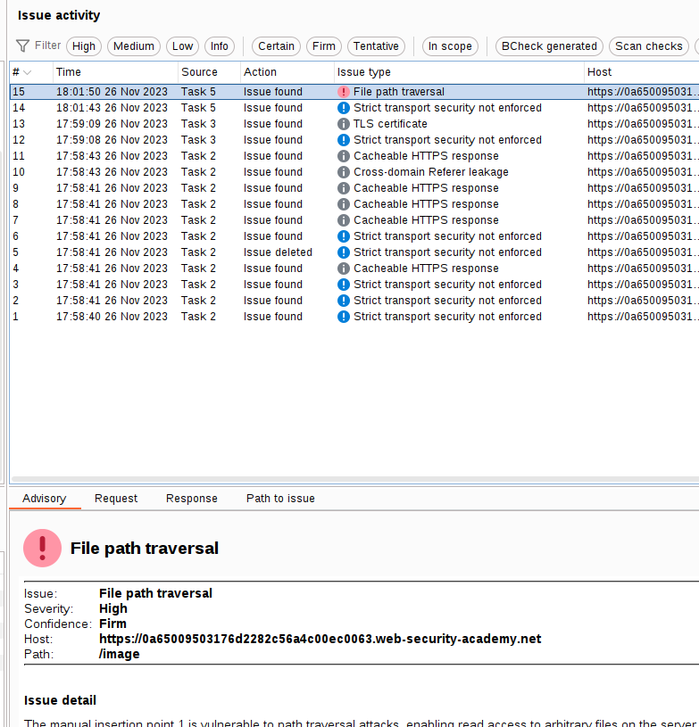
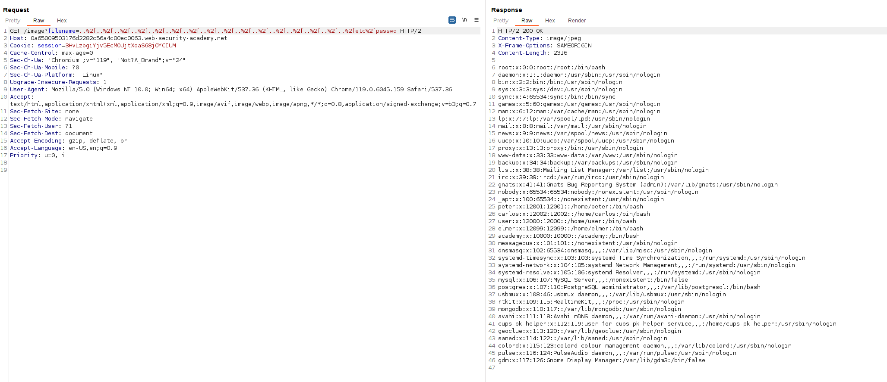

We have to get the contents of `/etc/passwd` file.

Here we can see the possible entry point of a path traversal:

Scanning this insertion point we can see the path traversal vulnerability:

And indeed we can see that we have the path traversal vulnerability exploited:

