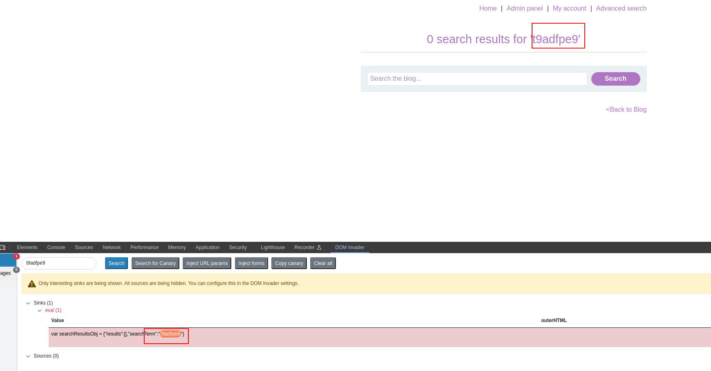
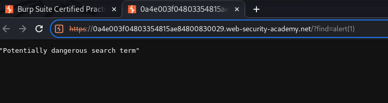
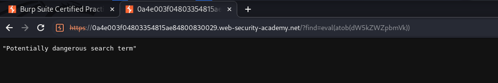

Again, probably reflected XSS on search bar:

Exploiting it manually leads to the following WAF block:

let's use eval + atob(base64): eval(atob(dW5kZWZpbmVk))

We need a way to bypass this. Let's fuzz with intruder the possible tags:

