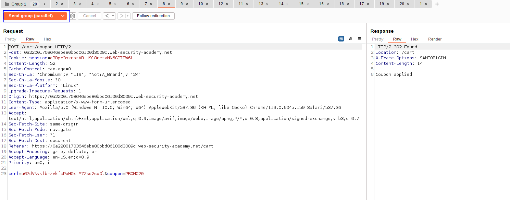
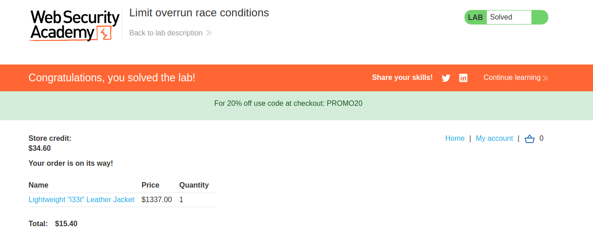

We can put a discount code only one time. 
Nevertheless, the system uses one thread to validate if we have a code and the other to insert the code. 
We can try to submit several requests that attach the code to our cart in a row in order to bypass the limitation of the discount code.

To do this, just take the request that adds the discount code to the cart and send it to the repeater. Send it 20 times.  Add them into a request group and send the requests in parallel:

This way, the discount applies several times until the item reaches a cost of 15 dollars and we can buy it:

sometimes the race condition happens twice but it is not enough to buy the item (aka. it is not happening enough times). In that case, just delete the discount code, and try again sending 20 requests in parallel.

