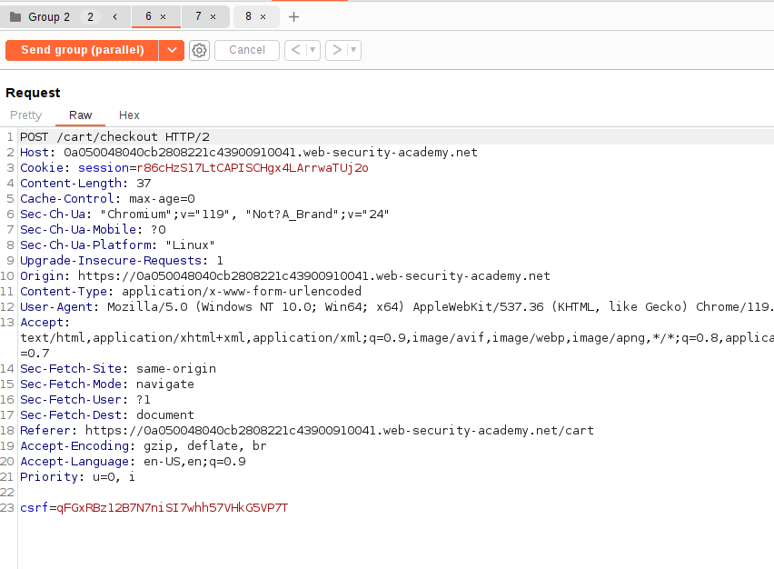
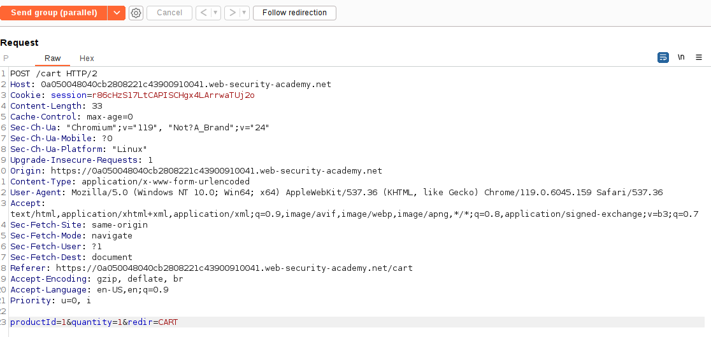
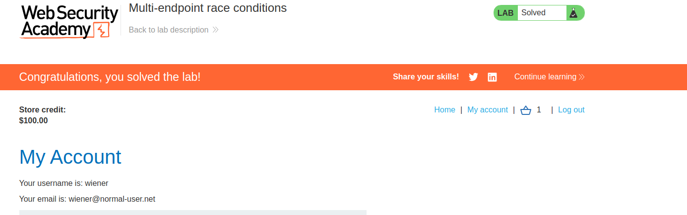

The thing is that in this lab we are going to exploit a race condition interacting with two different endpoints.

One endpoint is the `/checkout`, which, when we send a request to it, it checks if we have funds to buy the item. Then, after the checking operation, the things in the cart are bought.

The thing is that we can send a request to ADD A THING INTO THE CART, AFTER THE CHECKING HAS BEEN DONE, and BEFORE THE SYSTEM BUYS THE THINGS OF THE CART.

Normal behavior:

Money is sufficient, deduce money from account
Things from the cart are bought

Attack:
Money is sufficient, deduce money from account
ADD THING INTO CART
Things from the cart are bought

This results in we adding a thing into a cart AFTER the money has been deducted, resulting in a free item.

In the lab we just add a Secret card, which costs 10 dollars and we can buy.
After that, we add into a Repeater group two requests, that will be performed **in parallel (that is the trick, to EXPLOIT the race condition)**. The first request will be the `checkout` request, to force the checkout, and the second request will be the request to ADD THE JACKET THAT WE CAN'T BUY NORMALLY. If the timing is good, the requests will be sent so the checkout is performed, and the item is added into the cart AFTER EXTRACTING THE MONEY BUT BEFORE GIVING US THE ITEMS IN THE CART, resulting in the lab completed. Here are the parallel requests:

1. Checkout:

2. Add the jacket to the cart:

Trying a few times (remember race conditions are very very tricky) results in the jacket being bought:
